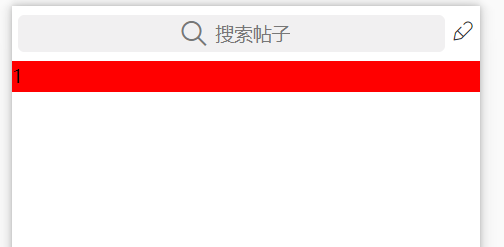
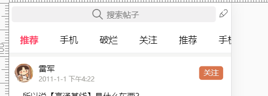

# 首页

## 首页搜索配置



[style](https://uniapp.dcloud.io/collocation/pages?id=style)

图标：

- 下载iconfont,找到ttf文件
- 这里的text格式必须是\u开头

```json
"style": {
	"app-plus":{
		"titleNView":{
			"searchInput":{
				"align":"center",
				"backgroundColor":"#f1f0f1",
				"borderRadius":"5px",
				"placeholder":"搜索帖子",
				"disabled":true
			},
			"buttons":[
				{
					"color":"#333333",
					"colorPressed":"#ff0036",
					"float":"right",
					"fontSrc":"/static/iconfont.ttf",
					"text":"\ue603"  //&#xe603;修改
				}
			]
		}
	}
}

```

## 图文列表配置

没啥坑


## 顶部选项卡



如果想横向，需要scroll-view宽度百分百，不换行,子元素设置为行内块。

```html
<scroll-view scroll-x="true" //横向
             :scroll-into-view="scrollInto" //点击后自动滚动
             class="scroll-row border-bottom" 
             scroll-with-animation //滚动动画
> 
</scroll-view>
```

## 选项卡和图文列表联动


- 使用swiper包裹图文列表

- 监听到swiper的@**change**事件,绑定**current**属性，获取到索引。然后传入写好的changeTab事件，从而实现。swiper切换的同事tabbar也随之切换

- ```js
  //需要设置图文列表高度。
  onLoad() {
    uni.getSystemInfo({
      success: res => {
        //获取到高度 windowHeight是内容高度，非page.json内容。 减去tab的高度就是滚动高度
        this.scrollH = res.windowHeight - uni.upx2px(100);
      }
    });
  },
  ```

## 上拉加载更多


-  监听scroll-view的y轴滚动

  ```html
  <scroll-view @scrolltolower="loadmore"
  ```

  ```js
  loadmore(index) {
  
    // 拿到当前列表
    let item = this.newsList[index]
      // 判断是否处于可加载状态
    if(item.loadmore !=='上拉加载更多'){
      return;
    }
    console.log(1);
    // 修改当前列表加载状态
    item.loadmore = '加载中...';
    // 模拟数据请求
    setTimeout(() => {
      // 加载数据
      item.list = [...item.list, ...item.list];
      // 恢复加载状态
      item.loadmore = '上拉加载更多';
      console.log(item.loadmore);
    }, 10000);
  }
  ```

  ## 无数据页面

  

  


