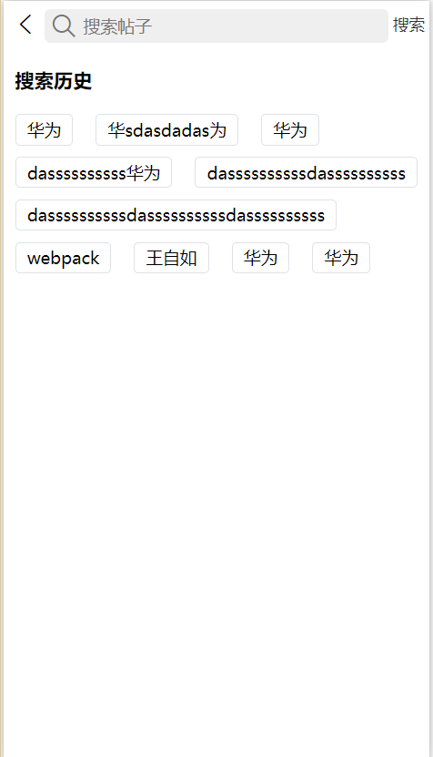
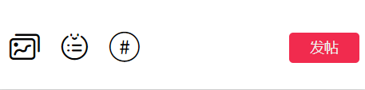
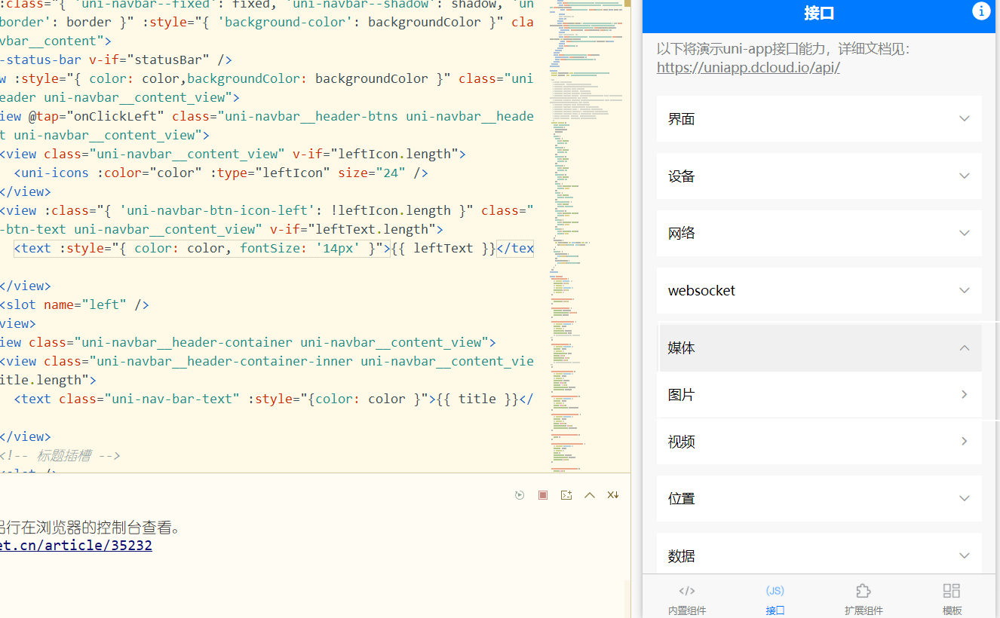

 # 搜索、发帖、动态

[TOC]




## 搜索页配置

- pages.json配置一下搜索页的标题框

- 首页监听输入框的[onNavigationBarSearchInputClicked](https://uniapp.dcloud.io/api/lifecycle?id=%e9%a1%b5%e9%9d%a2%e7%94%9f%e5%91%bd%e5%91%a8%e6%9c%9f)事件

  - 调用路由跳转的[uni.navigateTo(OBJECT)](https://uniapp.dcloud.io/api/router?id=navigateto)事件，进行保留并跳转

- 搜索页监听导航输入onNavigationBarSearchInputChanged事件

  ```js
  		onNavigationBarSearchInputChanged(e){
  			this.searchInfo = e.text;
  		}
  ```

- 搜索页监听button点击

  - e.index===0时说明他被选中

  ```js
  onNavigationBarButtonTap(){
  			
  		}
  ```

  

  

### 路由跳转

https://uniapp.dcloud.io/api/router?id=navigateto

## 发帖页

### 自定义导航-跳转和导航配置

uni-nav-bar

https://ext.dcloud.net.cn/plugin?id=52

- 首页跳转到发帖页

  ```js
  onNavigationBarButtonTap(){
  	uni.navigateTo({
  		url:'../post-page/post-page'
  	})
  },
  ```

- 取消page.json的默认导航

  ```js
  {
    "path" : "pages/post-page/post-page",
      "style" : {
        "app-plus":{
          "titleNView":false //false
        }
      }
  }
  ```

- 引入hello-uni-app模板的导航插件

  - 因为默认状态栏是被覆盖，所以需要添加statusBar属性

    ````html
    <uni-nav-bar statusBar></uni-nav-bar>
    ````

### [文本框组件](https://uniapp.dcloud.io/component/textarea)

```html
<textarea v-model="text" placeholder="开通振金会员发帖6倍经验~" class=" uni-textarea p-2 border-box" />
```

### 底部操作条



- 基本没啥说的

### (重)上传图片开发



- 接口-媒体-图片

- pages/api/image

- 删除没有必要的事件和视图

- 在chooseImage事件里监听选中图片并在成功回调后传给父容器

  ```js
  //upload-Image.vue
  chooseImage(){
    //....
    uni.chooseImage({
      //...
      success: res => {
        this.imageList = this.imageList.concat(res.tempFilePaths);
        // 选择成功通知发帖页
        this.$emit('chooseImg',this.imageList)
      },
    })
  }
  //post-page 发帖页接收
  ```

- this.$emit('chooseImg',this.imageList)

### 上传图片删除

```js
delImg(index) {
			
			//删除提示
			uni.showModal({
				title: '提示',
				content: '是否要删除该图片？',
				showCancel: true,
				cancelText: '否',
				confirmText: '删除',
				success: res => {
					if (res.confirm) {
						this.imageList.splice(index, 1);
						this.$emit('change', this.imageList);
					}
				}
			});
			this.$emit('changeImg', this.imageList);
		},
```

### 保存草稿

- [uni-nav-bar](https://ext.dcloud.net.cn/plugin?id=52)组件绑定事件@clickLeft='xx'

  - ```js
    xx(){
      uni.navigateBack({ delta: 1 });
    }
    ```

- 监听组件生命周期的[onBackPress](https://ask.dcloud.net.cn/article/35120)事件

  - 如果有草稿内容

    - 调用uni.[showModal](https://uniapp.dcloud.io/api/ui/prompt?id=showmodal)

    - 如果确认保存，调用save方法

      ```js
      onBackPress() {  
      if ((this.content !== '' || this.imageList.length > 0) && !this.showBack) {
      			uni.showModal({
      				content: '草稿尚未保存',
      				showCancel: true,
      				cancelText: '不保存',
      				confirmText: '保存',
      				success: res => {
      					// 点击确认
      					if (res.confirm) {
      						this.save();
      					} else {
      						// 点击取消，清除缓存
      						uni.removeStorage({
      							key: 'add-input'
      						});
      					}
      					// 手动执行返回
      					uni.navigateBack({ delta: 1 });
      				}
      			});
      			this.showBack = true;
      			return true;
      		}
      },
      ```

      - ```js
        uni.setStorage({
          key: 'add-input',
          data: JSON.stringify(obj)
        });
        ```

- 加载时

  - ```js
    onLoad() {
    		uni.getStorage({
    			key: 'add-input',
    			success: res => {
    				if (res.data) {
    					let result = JSON.parse(res.data);
    					this.content = result.content;
    					this.imageList = result.imageList;
    				}
    			}
    		});
    	},
    ```

### 上传图片初次不显示

- 需要获取子组件uploadImage的ref并在图片图标调用相应方法。
- 需要使用v-show而不是v-if,否则不会获取子组件ref。

- 在上传图片组件的mounted里接收props

## 动态页

- 分成关注和话题两部分

- 关注页基本等同首页内容
- 话题需要设置
  - 搜索
  - 热门分类
    - 热门分类点击进入话题分类
      - 话题分类页基本等同于首页
  - 最近更新
  - 轮播

## 话题页(重)

- 数据传输方式：
- 在话题列表组件里点击后

### 话题列表传值到话题页

- ```js
  //通过 ?形式parse传参  {detail:this.item}
  open() {
    uni.navigateTo({
      url: '../../pages/topic-detail/topic-detail?detail=' + JSON.stringify(this.item)
    });
  }
  ```

- ```js
  //通过
  onLoad(e) {
    this.detail = JSON.parse(e.detail)
  }
  ```

### 动态修改导航栏标题

```js
uni.setNavigationBarTitle({
  title:this.detail.title
})
```

### 选项卡切换

- 点击选项卡，绑定index

- 计算属性动态管理index

  ```html
  <block v-for="(item, index) in listData" :key="index">
    <CommonList :item="item" :index="index"></CommonList>
  </block>
  ```

  ```js
  computed: {
    listData() {
      if (this.tabIndex === 0) {//默认
        return this.list1;
      }
      return this.list2;  //最新	
    }
  }
  ```

### 上拉加载更多

页面滚动到底部触发[onReachBottom](https://uniapp.dcloud.io/frame?id=%e9%a1%b5%e9%9d%a2%e7%94%9f%e5%91%bd%e5%91%a8%e6%9c%9f)

```html
<loadMore :loadmore='loadText'></loadMore>
```

```js
onReachBottom() {
  this.onloadMore();
},
```

```js
onloadMore(){
  // 存起来防止用户切换影响
  let nowIndex = this.tabIndex;
  if(this.loadText!=='上拉加载更多'){
    return;
  }
  // 
  this['loadText'+(nowIndex+1)] = '加载中...'
  setTimeout(()=>{
    this['list'+(nowIndex+1)] = [...this['list'+(nowIndex+1)],...this['list'+(nowIndex+1)]]
    this['loadText'+(nowIndex+1)] = '上拉加载更多'
  },2000)
}
```