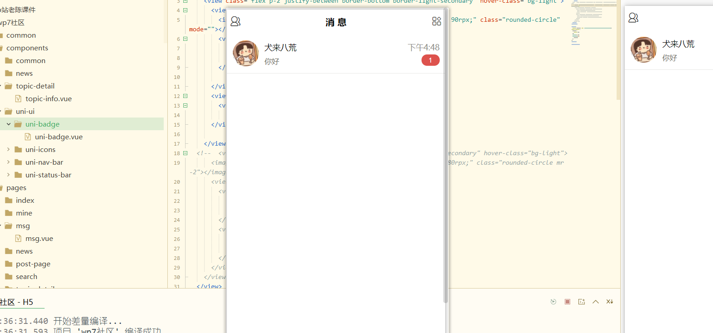
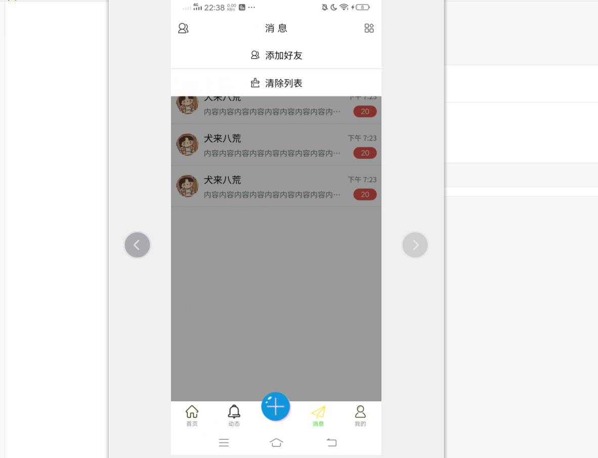
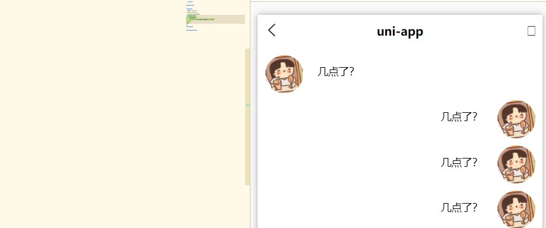
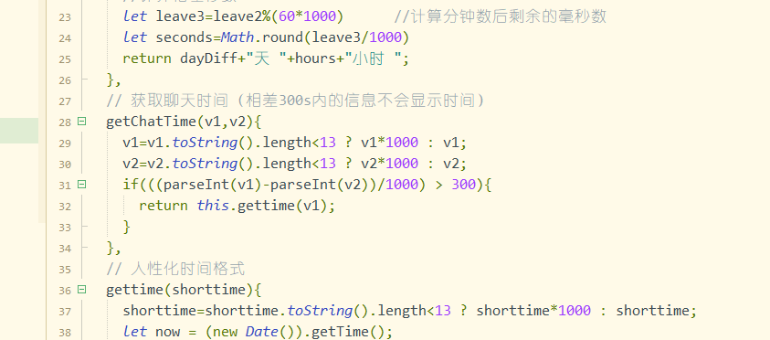
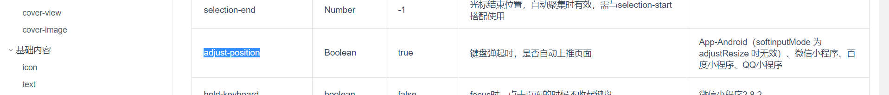
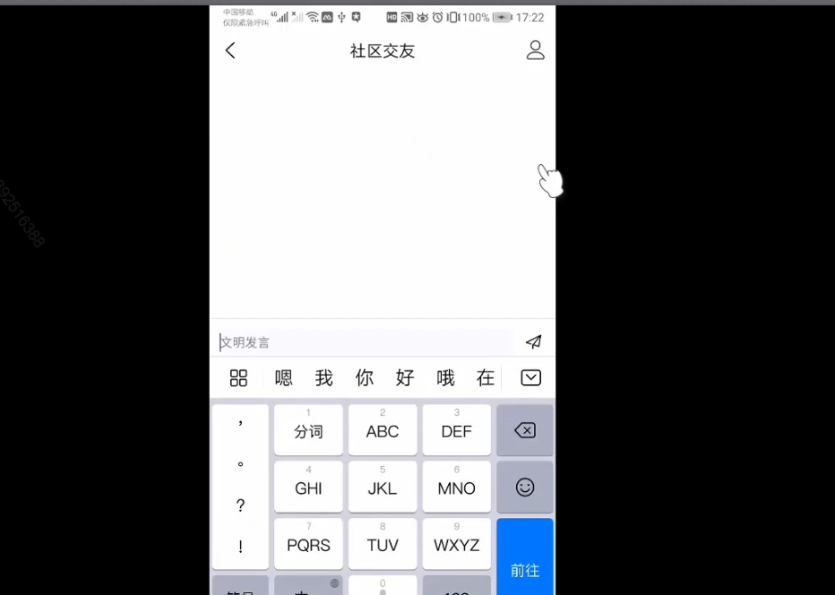

# 消息页开发

基本没啥要说的

### 提示框



uni-badge:

- ```html
  <UniBadge text="1" type="error"></UniBadge>
  ```

### 时间戳过滤

- ```js
  <text>{{item.update_time | formatTime}}</text>
  import $T from '@/common/time.js';
  	filters: {
  			formatTime(value) {
  				return $T.gettime(value);
  			}
  		},
  ```

## 消息页下拉刷新

https://uniapp.dcloud.io/api/ui/pulldown

```js
//page.json
{
			"path": "pages/msg/msg",
			"style": {
				"navigationBarTitleText": "消 息",
				"enablePullDownRefresh":true,//下拉刷新
```

```js
//msg.vue
onPullDownRefresh() {
		setTimeout(() => {
			this.list = demo;
			uni.stopPullDownRefresh();//刷新完需要调用结束事件
		}, 2000);
	},
```

## 消息页弹出层



监听右上角图片点击事件

```html
<uni-popup ref="popup" type="top">
```

```js
onNavigationBarButtonTap(e) {
  if (e.index === 1) {
    this.$refs.popup.open(); //点击时打开弹出层
  }
},

  myEvent(e) {
    switch (e) {
      case 'friend':
        console.log('添加好友');
        break;
      case 'clear':
        console.log('清除列表');
        break;
    }
    // 关闭弹出层
    this.$refs.popup.close();
  }
```

## 我的好友页面开发

- 点击左上角进入我的好友
- 

## 聊天页开发

### 底部操作条

没啥

### 聊天列表

- 计算属性判断userId,然后使用flex-direction:row-reverse



```html
<view class="flex align-start px-2 my-2" :style="isUser?'flex-direction:row-reverse':''">
```

```js
computed:{
		isUser(){
			return this.item.user_id === uid
		}
	}
```

#### 聊天页间隔时间

判断时间戳 如果间隔超过指定的数目，就显示.

- 使用time.js里提供的时间库

  

### (重)bug解决

聚焦的时候聊天列表也会上移。如图会把写的内容顶没。我们需要 

```html
<input :adjust-position='false' 
```

我们想让输入框也跟着上移，而不是一直固定底部，监听键盘高度

```js
:style="'bottom:'+inputBottom +'px'"
uni.onKeyboardHeightChange((res)=>{
  this.inputBottom = res.height
})
```

我们想让点击软键盘的开始也会发送。

```html
<input @confirm="xsubmit"
     
```

```js
xsubmit(){//xsubmit就是点击发送的那个实践
	//。。。一堆代码
  this.content = '';
	uni.hideKeyboard() //点击收键盘
}  
```


[input](https://uniapp.dcloud.io/component/input):



 

### 点击自动滚动底部

1. 一开始进入聊天页，会自动聚焦到最底部

2. 输入完内容，自动聚焦最底部.需要给chatList下面添加一个站位元素。这样聚焦时候就可以滚动底部了

```html
<scroll-view scroll-y="true" :scroll-into-view="scrollInto"  scroll-with-animation
 	<chatList></chatList>
  <view :id="'chat' + index">
```

```js
pageToBottom() {
  //最后一个list的索引
  let lastIndex = this.list.length - 1;
  if (lastIndex < 0) return;
  this.scrollInto = 'chat' + lastIndex;
}
onReady() {
  this.pageToBottom();
},
```

## 搜索用户页开发

- index页点击进入时传入

  ```js
  onNavigationBarSearchInputClicked() {
    uni.navigateTo({
      url: '../search/search?type=post'
    });
  },
  ```

- news页的话题分页点击进入

  ```js
  methods:{
    openSearch(){
      uni.navigateTo({
        url:'../search/search?type=topic'
      })
    }
  ```

- friend-list页

  ```js
  	onNavigationBarSearchInputClicked() {
  			uni.navigateTo({
  				url: '../search/search?type=user',
  			});
  		},
  ```

- 消息页添加好友

  ```js
  	myEvent(e) {
  			switch (e) {
  				case 'friend':
  					uni.navigateTo({
  						url:'../search/search?type=user'
  					})
  ```

### search页配置  h5+

```js
onLoad(e){
  clog(e.type) //user post topic
}
```

## 帖子详情页开发

- 使用common-list组件配合插槽实现

### 图片预览

```html
<image v-for="(item, index) in info.images" @click="preview(index)"
```

```js
computed: {
  imagesList() {
    return this.info.images.map(item=>item.url) 
  }
},
  preview(index) {
    // 预览图片
    uni.previewImage({
      current: index,
      urls: this.imagesList
    });
  },
```

### 评论输入框

### 分享

调用share组件进行分享

