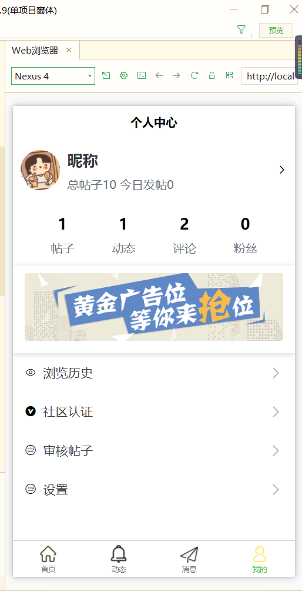
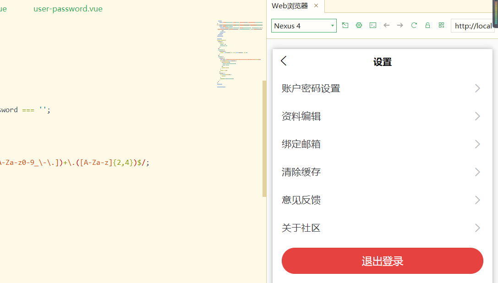
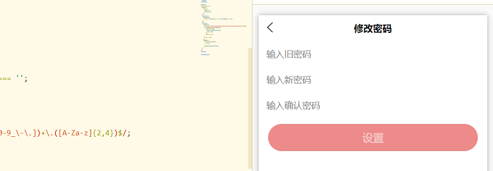
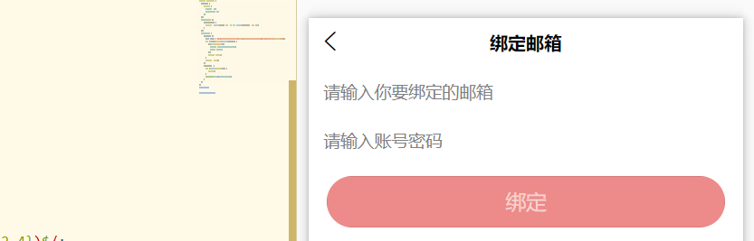
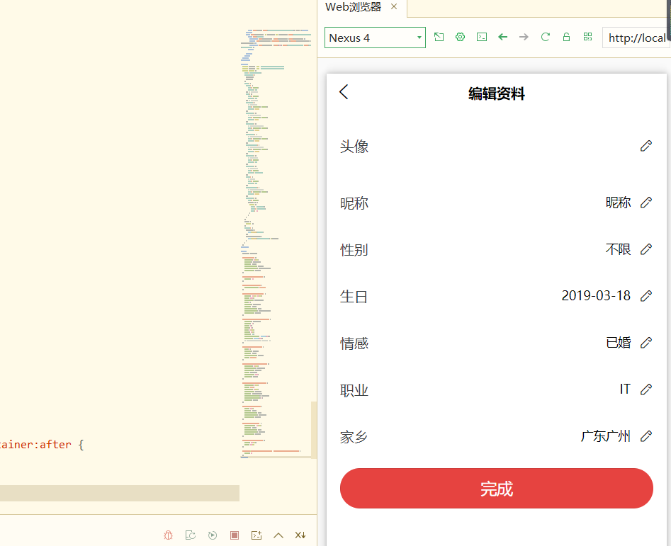
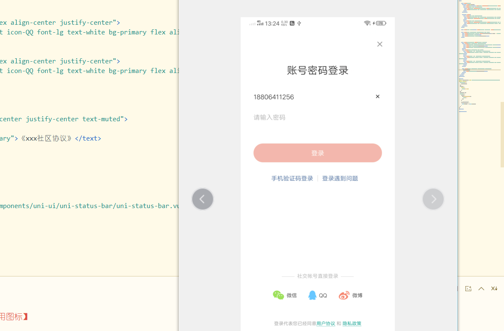
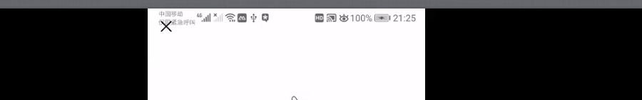

# 我的

## 个人中心页



## 设置页开发

- 基本没什么技术点。



### 账号密码页开发



### 绑定邮箱页开发



### (重)资料编辑

- 布局使用官方提供uni-listitem
- 注意：uni-listitem右侧宽度过短，只有25%，需要自己手动修改



#### 修改头像

-  官方API-uni.[chooseImage](https://uniapp.dcloud.io/api/media/image)

  ```js
  methods: {
    // 修改头像
    changeUserpic(){
      uni.chooseImage({
        count:1, //最多选几个
        sizeType:["compressed"],  //压缩图
        sourceType:["album","camera"],	//相册，相机
        success: (res) => {
          this.userpic = res.tempFilePaths[0] //路径选择。
        }
      })
    }
  }
  ```

#### showActionSheet-修改性别-修改婚姻状态

修改性别

```js
changeSex(){
				uni.showActionSheet({
				    itemList: sexArray,
				    success:(res)=>{
				        this.sex = res.tapIndex
				    }
				});
			},
```

#### 修改生日

官方提供的[pick](https://uniapp.dcloud.io/component/picker)组件

```html
<picker mode="date" :value="birthday" @change="onDateChange">
  <uni-list-item title="生日">
    <view class="flex align-center" slot="right">
      <text>{{birthday}}</text>
      <text class="iconfont icon-bianji1 ml-2"></text>
    </view>
  </uni-list-item>
</picker>
```

```js
onDateChange(e){
  this.birthday = e.detail.value
},
```

#### 家乡-三级联动

```js
import mpvueCityPicker from '@/components/uni-ui/mpvue-citypicker/mpvueCityPicker.vue';
```

```html
<uni-list-item title="家乡" @click="showCityPicker">
  <view class="flex align-center" slot="right">
    <text>{{pickerText}}</text>
    <text class="iconfont icon-bianji1 ml-2"></text>
  </view>
</uni-list-item>
```

```html
<mpvue-city-picker 
:themeColor="themeColor" 
ref="mpvueCityPicker"
:pickerValueDefault="cityPickerValueDefault" 
@onConfirm="onConfirm"></mpvue-city-picker>
```

```js
//三级联动展示事件
showCityPicker(){
  this.$refs.mpvueCityPicker.show()
},
  // 三级联动提交事件
  onConfirm(e) {
    this.pickerText = e.label
  },
```

```js
// 监听返回
onBackPress() {
  if (this.$refs.mpvueCityPicker.showPicker) {
    this.$refs.mpvueCityPicker.pickerCancel();
    return true;
  }
},
  // 监听页面卸载
  onUnload() {
    if (this.$refs.mpvueCityPicker.showPicker) {
      this.$refs.mpvueCityPicker.pickerCancel()
    }
  },
```

## 登录页(参照简书)



暂时先从设置的退出登录进入，把后台联动完再写

```html
//user-set
<view class="py-2 px-3">
  <navigator url="../login/login">
    <button class="bg-main text-white" style="border-radius: 50rpx;border: 0;" type="warn" 退出登录</button>
  </navigator>
</view>
```

### **状态栏被覆盖解决方法**



获取导航栏高度statusBarHeight

```js
onLoad() {
  let {statusBarHeight} = uni.getSystemInfoSync()
  this.statusBarHeight = statusBarHeight
},
```

### (重，坑)跳转回首页,tabBar页面

跳转到 tabBar 页面，并关闭其他所有非 tabBar 页面。

https://uniapp.dcloud.io/api/router?id=switchtab

```js
goIndex() {
			uni.switchTab({
				url: '../index/index'
			})
		}
```

### 第三方登录

