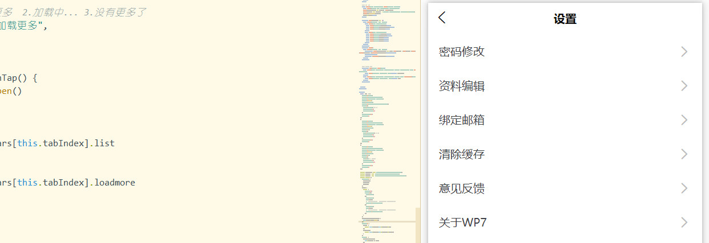

# 全局优化

## 清除缓存

- 



```html
//user-set.vue
<uni-list-item title="清除缓存" @click='clear'>
	<view slot='right' class="text-muted pr-2">{{currentSize|format}}</view>
</uni-list-item>
```

```js
export default{
  filters:{
    format:function(val){
      return val>1024?(value/1024).toFixed(2)+'MB':val.toFixed(2)+'kb'
    }
  },
  mounted() {
    this.getStorageInfo()
  }
  methods: {
  //更新currentSize
  getStorageInfo(){
    this.currentSize=  uni.getStorageInfoSync().currentSize;//当前缓存大小
  },
    clear(){
      uni.showModal({
        title: '提示',
        content: '是否要清除缓存',
        showCancel: false,
        cancelText: '取消',
        confirmText: '清除',
        success: res => {
          if(res.confirm){
            uni.clearStorageSync()
            this.getStorageInfo()
            uni.showToast({
              title:'清除成功'
            })
          }
        },
        fail: () => {},
        complete: () => {}
      });
    }
}  
}
```

## 全局API配置

```JS
//common/config.js
export default {
	// api请求前缀
	webUrl:'https://ceshi2.czw.cn/api/v1',
	// websocket地址
	websocketUrl:"wss://ceshi2.czw.cn/wss"
}
```

```js
//main.js
import $C from './common/config.js'
Vue.prototype.$C = $C
//其他vue文件
console.log(this.$C.webUrl);
//https://ceshi2.czw.cn/api/v1  at pages/index/index.vue:173

```

- 很多地方需要用到固定接口。比如API接口，使用vuex封装。

## 全局监听网络状态

[网络状态](https://uniapp.dcloud.io/api/system/network)

监听4G还是wifi	

需要定义一个全局的助理函数util.js

```js
//util.js
export default{
	onNetWork(){
			let func = (res)=>{
				if (res.networkType === 'none') {
					uni.showToast({
						title: '未检测到网络',
						icon: 'none'
					});
				}
			}
			uni.getNetworkType({
			    success:func
			});
			uni.onNetworkStatusChange(func);
		},
}
//main.js
import $U from './common/js/util.js'
Vue.prototype.$U = $U
```

```js
//App.vue
onLaunch: function() {
	//一开始加载时
 	this.$U.onNetWork()
},

```

## 热更新

- 热更新使用场景
  - app启动时
  - 关于社区里的更新


