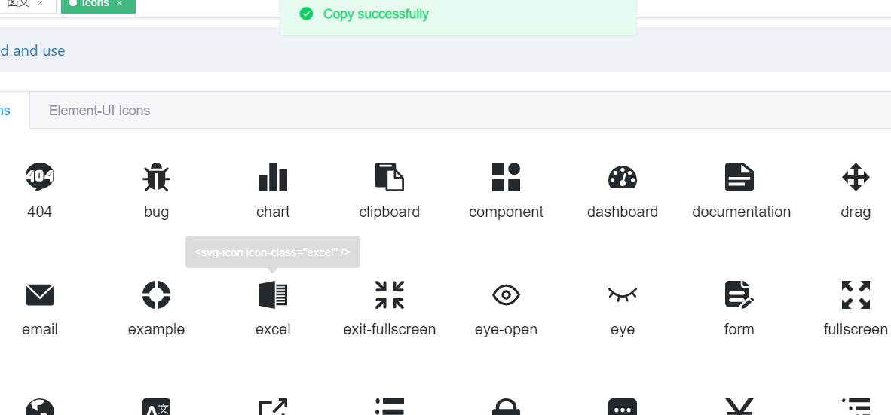
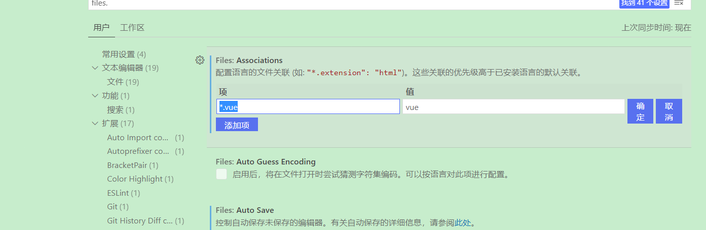

# 基础

## vue-element-admin安装

```js
# 克隆项目
git clone https://github.com/PanJiaChen/vue-element-admin.git

# 进入项目目录
cd vue-element-admin

# 安装依赖
npm install

# 建议不要用 cnpm 安装 会有各种诡异的bug 可以通过如下操作解决 npm 下载速度慢的问题
npm install --registry=https://registry.npm.taobao.org

# 本地开发 启动项目 地址栏cmd
npm run dev
```

```json
lintOnSave:false,
```

## 侧边路由配置

[官方文档](https://panjiachen.gitee.io/vue-element-admin-site/zh/guide/essentials/router-and-nav.html#%E9%85%8D%E7%BD%AE%E9%A1%B9)

配置项

```js
// 当设置 true 的时候该路由不会在侧边栏出现 如401，login等页面，或者如一些编辑页面/edit/1
hidden: true // (默认 false)

//当设置 noRedirect 的时候该路由在面包屑导航中不可被点击
redirect: 'noRedirect'

// 当你一个路由下面的 children 声明的路由大于1个时，自动会变成嵌套的模式--如组件页面
// 只有一个时，会将那个子路由当做根路由显示在侧边栏--如引导页面
// 若你想不管路由下面的 children 声明的个数都显示你的根路由
// 你可以设置 alwaysShow: true，这样它就会忽略之前定义的规则，一直显示根路由
alwaysShow: true

name: 'router-name' // 设定路由的名字，一定要填写不然使用<keep-alive>时会出现各种问题
meta: {
  roles: ['admin', 'editor'] // 设置该路由进入的权限，支持多个权限叠加
  title: 'title' // 设置该路由在侧边栏和面包屑中展示的名字
  icon: 'svg-name' // 设置该路由的图标，支持 svg-class，也支持 el-icon-x element-ui 的 icon
  noCache: true // 如果设置为true，则不会被 <keep-alive> 缓存(默认 false)
  breadcrumb: false //  如果设置为false，则不会在breadcrumb面包屑中显示(默认 true)
  affix: true // 若果设置为true，它则会固定在tags-view中(默认 false)

  // 当路由设置了该属性，则会高亮相对应的侧边栏。
  // 这在某些场景非常有用，比如：一个文章的列表页路由为：/article/list
  // 点击文章进入文章详情页，这时候路由为/article/1，但你想在侧边栏高亮文章列表的路由，就可以进行如下设置
  activeMenu: '/article/list'
}
```

### 清理路由

```js
//src\router\index.js

//不需要权限验证的路由
export const constantRoutes = [
    //...
    {
        path: '/',
        component: Layout,
        redirect: '/dashboard',
        children: [
            {
                path: 'dashboard',
                component: () => import('@/views/dashboard/index'),
                name: 'Dashboard',
                meta: { title: '概览', icon: 'dashboard', affix: true }
            }
        ]
    },
    //... documentation和guide删除
]

//需要进行权限验证的路由，只有指定权限用户才能配置
export const asyncRoutes = [
    //只保留404
    { path: '*', redirect: '/404', hidden: true }
]
```

### 路由修改

```
views
|----Course(课程)
	  |---图文(media)
	  |---音频(audio)
	  |---视频(video)
	  |---专栏(column)
|----工具
|----用户
|----交易
|----营销
|----设置
|----可视化
```

```js
export const asyncRoutes = [
  {
    path: '/course',
    component: Layout,
    redirect: '',
    name: "Course",
    alwaysShow: true, //当子路由为1个时也显示他
    meta: {
      title: '课程',
      icon: 'education',
      roles: ['admin', 'editor'] // 权限配置you can set roles in root nav
    },
    children: [
      {
        path: 'media',
        name: 'Media',
        component: () => import('@/views/course/media'),
        meta: {
          title: '图文'
        }
      },
      {
        path: 'audio',
        name: 'Audio',
        // hidden:true,//不显示这个菜单
        component: () => import('@/views/course/audio'),
        meta: {
          title: '音频'
        }
      }, {
        path: 'video',
        name: 'Video',
        component: () => import('@/views/course/video'),
        meta: {
          title: '视频'
        }
      }, {
        path: 'column',
        name: 'Column',
        component: () => import('@/views/course/column'),
        meta: {
          title: '图文'
        }
      }
    ]
  },
]
```

### 路由图标

在icon页查找图标

```js
  {//激活icon页，然后查找即可
    path: '/icon',
    component: Layout,
    children: [
      {
        path: 'index',
        component: () => import('@/views/icons/index'),
        name: 'Icons',
        meta: { title: 'Icons', icon: 'icon', noCache: true }
      }
    ]
  },
```

点击一下就可复制。



### 路由宽度配置

```js
所有的 css 都可以在 @/styles/sidebar.scss 中找到，你也可以根据自己的需求进行修改。

variables.css:
$sideBarWidth: 210px;
```

### css优先级配置



