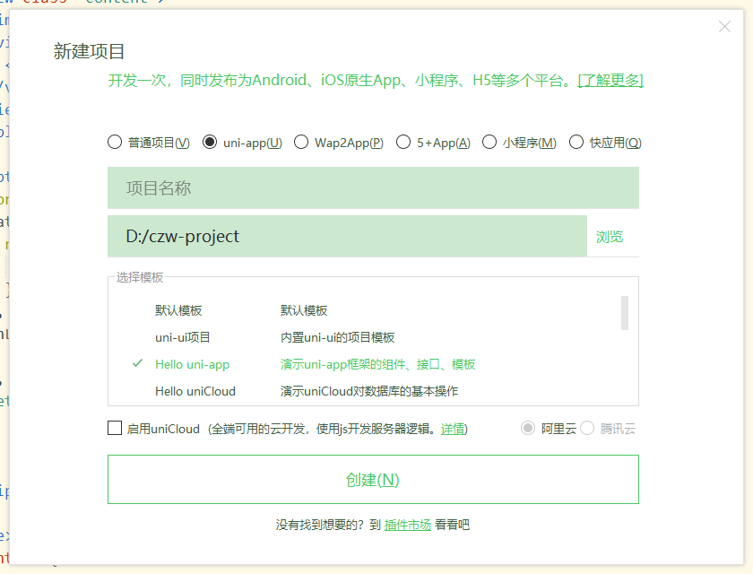

# 项目初始化配置

- 项目参照简书，糗百，百度贴吧等多个社区论坛。

## iqoo调试问题

- iqoo必须**打开开发者选项，打开USB设置，把默认USB选项改成MIDI模式（这是个什么鬼模式），就可以检测到手机了......**

## 引入官方css样式

创建演示模板，然后引入common/util.js static/uni.ttf,否则报错。



## 引入inconfont

在线使用：

```html
<style>
	@import url("https://at.alicdn.com/t/font_1271853_buzva1kgrvr.css");
</style>
```

## uni-app标签说明

- text标签：相当于span
- view标签：相当于div

## 动画

```html
@import "./common/animate.min.css"
<button class="animate__animated" hover-class="animate__bounceIn">按钮</button>
```

动画使用方式1点击效果

动画使用方式2v-if

动画使用方式3列表渲染

## 全局属性设置globalStyle

用于设置应用的状态栏、导航条、标题、窗口背景色等。

| 属性                         | 类型     | 默认值   | 描述                                                         | 平台差异说明                                     |
| :--------------------------- | :------- | :------- | :----------------------------------------------------------- | :----------------------------------------------- |
| navigationBarBackgroundColor | HexColor | #F7F7F7  | 导航栏背景颜色（同状态栏背景色）                             | APP与H5为#F7F7F7，小程序平台请参考相应小程序文档 |
| navigationBarTextStyle       | String   | white    | 导航栏标题颜色及状态栏前景颜色，仅支持 black/white           |                                                  |
| navigationBarTitleText       | String   |          | 导航栏标题文字内容                                           |                                                  |
| navigationStyle              | String   | default  | 导航栏样式，仅支持 default/custom。custom即取消默认的原生导航栏，需看[使用注意](https://uniapp.dcloud.io/collocation/pages?id=customnav) | 微信小程序 7.0+、百度小程序、H5、App（2.0.3+）   |
| backgroundColor              | HexColor | #ffffff  | 下拉显示出来的窗口的背景色                                   | 微信小程序                                       |
| backgroundTextStyle          | String   | dark     | 下拉 loading 的样式，仅支持 dark / light                     | 微信小程序                                       |
| enablePullDownRefresh        | Boolean  | false    | 是否开启下拉刷新，详见[页面生命周期](https://uniapp.dcloud.io/use?id=页面生命周期)。 |                                                  |
| onReachBottomDistance        | Number   | 50       | 页面上拉触底事件触发时距页面底部距离，单位只支持px，详见[页面生命周期](https://uniapp.dcloud.io/use?id=页面生命周期) |                                                  |
| backgroundColorTop           | HexColor | #ffffff  | 顶部窗口的背景色（bounce回弹区域）                           | 仅 iOS 平台                                      |
| backgroundColorBottom        | HexColor | #ffffff  | 底部窗口的背景色（bounce回弹区域）                           | 仅 iOS 平台                                      |
| titleImage                   | String   |          | 导航栏图片地址（替换当前文字标题），支付宝小程序内必须使用https的图片链接地址 | 支付宝小程序、H5、APP                            |
| transparentTitle             | String   | none     | 导航栏透明设置。支持 always 一直透明 / auto 滑动自适应 / none 不透明 | 支付宝小程序、H5、APP                            |
| titlePenetrate               | String   | NO       | 导航栏点击穿透                                               | 支付宝小程序、H5                                 |
| pageOrientation              | String   | portrait | 横屏配置，屏幕旋转设置，仅支持 auto / portrait / landscape 详见 [响应显示区域变化](https://developers.weixin.qq.com/miniprogram/dev/framework/view/resizable.html) | App 2.4.7+、微信小程序                           |
| animationType                | String   | pop-in   | 窗口显示的动画效果，详见：[窗口动画](https://uniapp.dcloud.io/api/router?id=animation) | App                                              |
| animationDuration            | Number   | 300      | 窗口显示动画的持续时间，单位为 ms                            | App                                              |
| app-plus                     | Object   |          | 设置编译到 App 平台的特定样式，配置项参考下方 [app-plus](https://uniapp.dcloud.io/collocation/pages?id=app-plus) | App                                              |
| h5                           | Object   |          | 设置编译到 H5 平台的特定样式，配置项参考下方 [H5](https://uniapp.dcloud.io/collocation/pages?id=h5) | H5                                               |
| mp-alipay                    | Object   |          | 设置编译到 mp-alipay 平台的特定样式，配置项参考下方 [MP-ALIPAY](https://uniapp.dcloud.io/collocation/pages?id=mp-alipay) | 支付宝小程序                                     |
| mp-weixin                    | Object   |          | 设置编译到 mp-weixin 平台的特定样式                          | 微信小程序                                       |
| mp-baidu                     | Object   |          | 设置编译到 mp-baidu 平台的特定样式                           | 百度小程序                                       |
| mp-toutiao                   | Object   |          | 设置编译到 mp-toutiao 平台的特定样式                         | 字节跳动小程序                                   |
| mp-qq                        | Object   |          | 设置编译到 mp-qq 平台的特定样式                              | QQ小程序                                         |
| usingComponents              | Object   |          | 引用小程序组件，参考 [小程序组件](https://uniapp.dcloud.io/frame?id=小程序组件支持) |                                                  |
| renderingMode                | String   |          | 同层渲染，webrtc(实时音视频) 无法正常时尝试配置 seperated 强制关掉同层 | 微信小程序                                       |

## 目录结构

```
┌─components            uni-app组件目录
│  └─comp-a.vue         可复用的a组件
├─hybrid                存放本地网页的目录，详见
├─platforms             存放各平台专用页面的目录，详见
├─pages                 业务页面文件存放的目录
│  ├─index
│  │  └─index.vue       index页面
│  └─list
│     └─list.vue        list页面
├─static                存放应用引用静态资源（如图片、视频等）的目录，注意：静态资源只能存放于此
├─wxcomponents          存放小程序组件的目录，详见
├─main.js               Vue初始化入口文件
├─App.vue               应用配置，用来配置App全局样式以及监听 应用生命周期
├─manifest.json         配置应用名称、appid、logo、版本等打包信息，详见
└─pages.json            配置页面路由、导航条、选项卡等页面类信息，详见
```

## tabbar配置

```json
//pages.json
{ 
	"tabBar": {
		"color": "#7A7E83",
		"selectedColor": "#3cc51f",
		"borderStyle": "black",
		"backgroundColor": "#ffffff",
		"list": [{
			"pagePath": "pages/index/index",
			"iconPath": "static/tabbar/index.png",
			"selectedIconPath": "static/tabbar/indexed.png",
			"text": "首页"
		}, {
			"pagePath": "pages/news/news",
			"iconPath": "static/tabbar/news.png",
			"selectedIconPath": "static/tabbar/newsed.png",
			"text": "动态"
		}, {
			"pagePath": "pages/msg/msg",
			"iconPath": "static/tabbar/paper.png",
			"selectedIconPath": "static/tabbar/papered.png",
			"text": "消息"
		}, {
			"pagePath": "pages/mine/mine",
			"iconPath": "static/tabbar/personal.png",
			"selectedIconPath": "static/tabbar/personaled.png",
			"text": "我的"
		}]
	}
}

```

