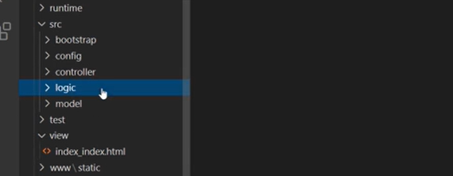
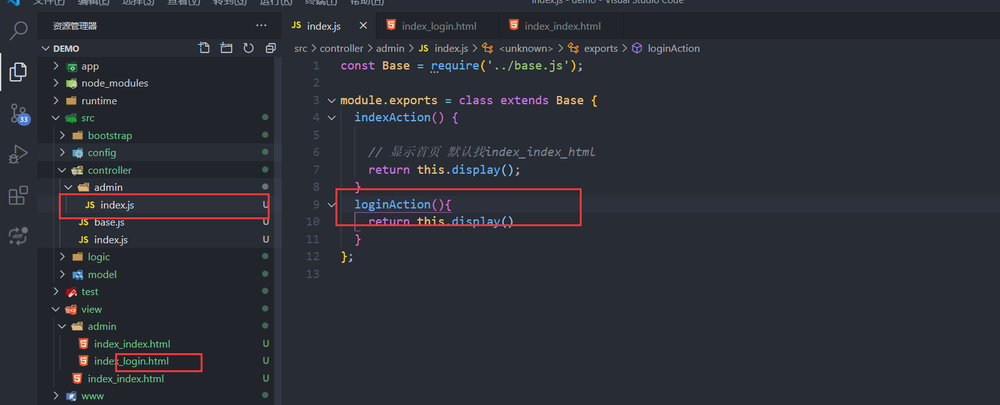
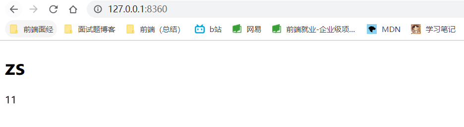
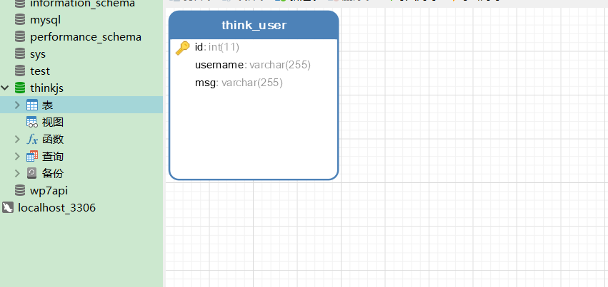
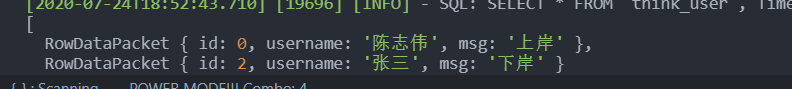
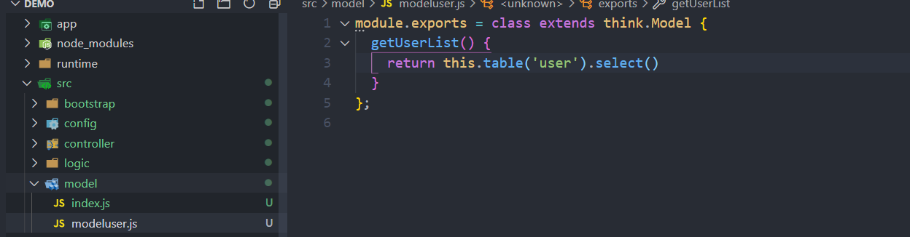
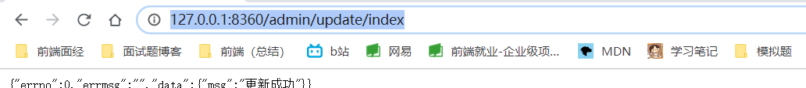
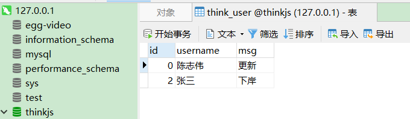

# thinkJs学习笔记

https://thinkjs.org/doc/index.html

## 快速入门

### 安装 ThinkJS 命令

```sh
npm install -g think-cli
```

安装完成后，系统中会有 `thinkjs` 命令（可以通过 `thinkjs -V` 查看 think-cli 的版本号，此版本号非 thinkjs 的版本号）。如果找不到这个命令，请确认环境变量是否正确。

如果是从 `2.x` 升级，需要将之前的命令删除，然后重新安装。

### 卸载旧版本命令

```sh
npm uninstall -g thinkjs
```

### 创建项目

执行 `thinkjs new [project_name]` 来创建项目，如：

```shell
thinkjs new demo
cd demo;
npm install; 
npm start; 
```

执行完成后，控制台下会看到类似下面的日志：

```accesslog
[2017-06-25 15:21:35.408] [INFO] - Server running at http://127.0.0.1:8360
[2017-06-25 15:21:35.412] [INFO] - ThinkJS version: 3.0.0-beta1
[2017-06-25 15:21:35.413] [INFO] - Enviroment: development
[2017-06-25 15:21:35.413] [INFO] - Workers: 8
```

打开浏览器访问 `http://127.0.0.1:8360/`，如果是在远程机器上创建的项目，需要把 IP 换成对应的地址。

### 项目结构

默认创建的项目结构如下：

```text
|--- development.js   //开发环境下的入口文件
|--- nginx.conf  //nginx 配置文件
|--- package.json
|--- pm2.json //pm2 配置文件
|--- production.js //生产环境下的入口文件
|--- README.md
|--- src
| |--- bootstrap  //启动自动执行目录 
| | |--- master.js //Master 进程下自动执行
| | |--- worker.js //Worker 进程下自动执行
| |--- config  //配置文件目录
| | |--- adapter.js  // adapter 配置文件 
| | |--- config.js  // 默认配置文件 
| | |--- config.production.js  //生产环境下的默认配置文件，和 config.js 合并 
| | |--- extend.js  //extend 配置文件 
| | |--- middleware.js //middleware 配置文件 
| | |--- router.js //自定义路由配置文件
| |--- controller  //控制器目录 
| | |--- base.js
| | |--- index.js
| |--- logic //logic 目录
| | |--- index.js
| |--- model //模型目录
| | |--- index.js
|--- view  //模板目录
| |--- index_index.html
```

## 渲染流程



先在logic，然后controller。

logic对用户校验。

controller决定要展示的内容、获取的数据。

## 路由和controller

controller/文件夹/文件名.js/方法名Action

view/文件夹/文件名_方法名.html 一一对应




## thinkJs把数据渲染到视图

使用的模板语法是nunjucks

**渲染到默认页面**

```url
http://127.0.0.1:8360/
```

```html
//	view/index_index.html
<h1>{{username}}</h1>
```

```js
//	src\controller\index.js
const Base = require('./base.js');
module.exports = class extends Base {
  indexAction() {
    let user = {
      username:'zs',
      age:'18'
    }
    this.assign(user);
    return this.display();
  }
};
```

**渲染模板指定**

url路径不变

```url
http://127.0.0.1:8360/
```

```html
//	view\czw.html
<h1>{{username}}</h1>11
```

```js
//	src\controller\index.js

const Base = require('./base.js');

module.exports = class extends Base {
  indexAction() {
    let user = {
      username:'zs',
      age:'18'
    }

    this.assign(user);

    // 渲染到view/czw
    return this.display('czw');
    //渲染到view/admin/czw
    return this.display('admin/czw');
  }
};

```




## 操作mysql数据库

**创建数据库thinkjs,添加一张think_user表**



### 获取数据

```js
//src\config\adapter.js
exports.model = {
  type: 'mysql',
  common: {
    logConnect: isDev,
    logSql: isDev,
    logger: msg => think.logger.info(msg)
  },
  mysql: {
    handle: mysql,
    database: 'thinkjs',
    prefix: 'think_',
    encoding: 'utf8',
    host: '127.0.0.1',
    port: '', //默认3306
    user: 'root',
    password: 'root',
    dateStrings: true
  }
```

**控制器里取数据**



```js
//src\controller\index.js

const Base = require('./base.js');

module.exports = class extends Base {
  async indexAction() {
    let user = {
      username: 'zs',
      age: '18'
    }
    // orm映射 object relation model
    let userList = await this.model().table('user').select()

    this.assign(userList[0]);

    // 显示首页 默认找index_index_html 
    return this.display('czw');
  }
};

```

**model文件夹里写方法**

```
//src\model\modeluser.js
```



```js
//src\controller\index.js

const Base = require('./base.js');

module.exports = class extends Base {
  async indexAction() {
    let user = {
      username: 'zs',
      age: '18'
    }
    // orm映射 object relation model
    // let userList = await this.model().table('user').select()

    // 利用模型
    let userList = await this.model('modeluser').getUserList()

		//数据传入到模板。
    this.assign(userList[0]);

    // 显示首页 默认找index_index_html 
    return this.display('czw');
  }
};

```

### 更新数据

src\controller\admin\update.js

```js
const Base = require('../base.js');

module.exports = class extends Base {
  indexAction() {
    this.model('user').where({
      username:'陈志伟'
    }).update({
      msg:'更新'
    })
    this.success({msg:"更新成功"})
  }

};

```





## thinkjs前端渲染和后端渲染

后端渲染：数据插入模板，返回给浏览器的

前端渲染：前端源代码看不见数据，

```js
src\controller\api

const Base = require('../base.js');

module.exports = class extends Base {
  async userListAction() {
    let userList = await this.model('user').select()
    this.json(userList)
    this.success(userList)
    this.fail({msg:'数据获取失败'})
  }
};

```

