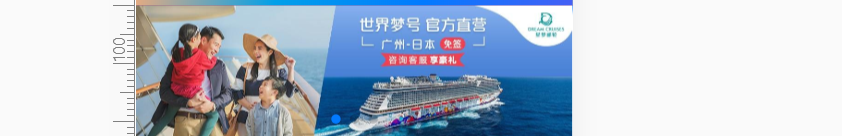
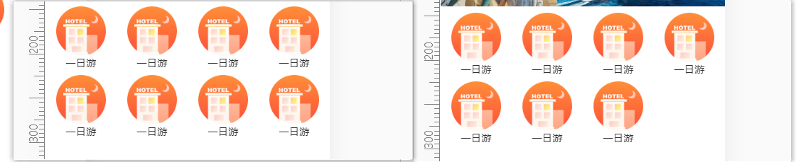
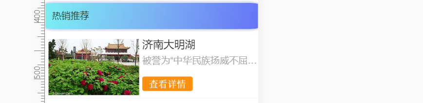

# 项目笔记

## 坑点汇总

- 忘记就看一下：
  - scrollHeight（文档内容实际高度，*包括超出视窗的溢出部分*）、
    scrollTop（滚动条滚动距离）、
    clientHeight（窗口可视范围高度）。
  - 当 `clientHeight + scrollTop >= scrollHeight` 时，表示已经抵达内容的底部了，可以加载更多内容

**better-scroll坑**

- [黄轶](<https://zhuanlan.zhihu.com/p/27407024>)大佬的vue+better-scroll
- better-scroll,wrapper时必须要overflow:hidden,这个工具内部并未进行处理，并且不支持粘性定位

**轮播坑**

- 轮播大部分坑通过v-if的惰性加载都可以解决

- 解决swiper首次加载时异步引入图片导致每次都从最后一张加载：
  - 利用v-if惰性
  - v-if条件为图片数组长度是否为0，默认图片数组为空，获取ajax数据后,数组非空，然后显示即可解决。

- 轮播遇到keep-alive,需要通过生命周期钩子设置

  ```js
  v-if="showSwiper &&isKeep"
  showSwiper() {
  	return this.list.length;
  }
  activated() {
  	this.isKeep = true;
  },
  deactivated() {
  	this.isKeep = false;
  }
  ```

**v-lazy坑**

- v-lazy配合轮播有bug，首屏显示错误,需要设置一个默认初始Img,**暂时未找到其他解决方法**，后续补充
- v-lazy引入loading,dist打包时使用require，否则路径出错。

- ```js
  Vue.use(VueLazyLoad, {
    loading: require('./assets/loading-bars.svg')
  })
  ```

**其他坑**

- flex布局时内部要想有省略号,需要给他的外层容器宽度置0或者overflow:hidden;

  ```scss
  .item-info {
      flex: 1;
      min-width: 0;
      .item-desc {  //desc需要省略，
          @include ellipsis();
      }
  }
  ```

- 循环输出的ref是个数组，取$refs[key]\[0]才是获取DOM。

- 通过设置padding-bottom，根据父元素宽度百分比。

- rem.js

**fastclick**

**fastclick**

- 

```
1、vue项目搭建好后，下载第三方库 cnpm install fastclick --save ;保存依赖包；
2、在main.js里面引入 使用 import fastclick from"fastclick";
3、fastclick.attach(document.body)
```

## 性能优化

### 图片懒加载

```
npm install vue-lazyload --save-dev
import VueLazyload from 'vue-lazyload'
Vue.use(VueLazyLoad, {
  loading: '/imgs/loading-bars.svg'
})

```

### 组件keep-alive

- 如果我们从一个地方切换到另一个地方，首页需要重新发送ajax请求加载相应地方的推荐。可以保存上次的city状态，然后判断两次的city是否不同，如果不同，就在actived里发送请求，并把保留的上次city替换成新的city状态

## 动画效果

- 在router-view外面包裹。

## 首页开发

### 首页顶部开发


### 首页轮播开发



首次加载高度防塌陷

```
width: 100%;
height: 0;
overflow: hidden;
padding-bottom: 31.25%;  //高度相对父级的宽度，子宽度和父宽度相同。相当于固定宽高
```

```
width: 100%;
height: 31.25vw;  //相对于视口
```

### 首页图标区域开发



```
        swiperOptions: {
          slidesPerView: 4,
          slidesPerColumn: 2,
          slidesPerColumnFill: "row"
        },
```

```
      overflow: hidden; /*超出部分隐藏*/
      text-overflow: ellipsis; /* 超出部分显示省略号 */
      white-space: nowrap; /*规定段落中的文本不进行换行 */
```

### 首页推荐开发



**flex布局保证内容不超出外层容器方式:父元素min-width:0**

## proxy代理转发

- swiper获取的数据是最后一个;初始化是根据空数组的宽度，解决方法是给它设置v-if,通过计算属性获取宽度

## 城市选择页面

点击右上角城市跳转城市选择页面

```
this.$router.push("city");
```

## 侧边字母检索

$bus

侧边组件

```
this.$bus.$emit("changeCode", e.target.innerHTML);
```

列表组件

```js
mounted() {
    this.$bus.$on('changeCode',(letter)=>{
        this.letter = letter;
    })
},
```

```js
watch: {
    letter() {
        if (this.letter) {
            let element = this.$refs[this.letter][0];
            this.scroll.scrollToElement(element);
        }
    }
}
```

**右侧字母表滚动事件监听**

MDN事件<https://developer.mozilla.org/zh-CN/docs/Web/API/Element>

详细步骤<https://www.cnblogs.com/cckui/p/10265833.html>

```
  <ul class="list">
    <li
      @click="charClick"
      @touchstart="startTouch"
      @touchmove="moveTouch"
      @touchend="endTouch"
```

添加标志位touchStatus

```
        touchStatus: false
```

A到顶部高度:offsetTop

```js
const startY = this.$refs['A'][0].offsetTop
```

手指到顶部的位置

```js
const touchY = e.touches[0].clientY;
```


## better-scroll使用

```
import BScroll from 'better-scroll'
let wrapper = document.querySelector('.wrapper')
let scroll = new BScroll(wrapper)
```

```js
mounted() {
    this.$nextTick(() => {
        this.scroll = new BScroll(this.$refs.wrapper);
        this.$bus.$on("changeCode", letter => {
            this.letter = letter;
        });
    });
}
```

## 搜索

lodash配合watch

better-scroll配合滚动:

better-scroll要配合v-show

## vuex实现数据共享

but刷新后他不能保存

使用localStorage;

## detail

点击首页进入detail，query传参。刷新后不失效。

下滑时顶部导航渐显效果：

## 解绑全局事件

```js
activated() {
	window.addEventListener("scroll", this.handleScroll);
},
```

```
 deactivated () {
    window.removeEventListener('scroll', this.handleScroll)
  }
```

## 递归组件实现列表

## 全局动画组件

```vue
<template>
  <transition>
    <slot></slot>
  </transition>
</template>

<script>
export default {
  name: 'FadeAnimation'
}
</script>

<style lang="stylus" scoped>
  .v-enter, .v-leave-to
    opacity: 0
  .v-enter-active, .v-leave-active
    transition: opacity .5s
</style>
```

## 自制的一键部署命令

仿照vuepress官网。

```sh
#!/usr/bin/env sh

# 确保脚本抛出遇到的错误
set -e

# 生成静态文件
npm run docs:build

# 进入生成的文件夹
cd docs/.vuepress/dist

# 如果是发布到自定义域名
# echo 'www.example.com' > CNAME

git init
git add -A
git commit -m 'deploy'

# 如果发布到 https://<USERNAME>.github.io
# git push -f git@github.com:<USERNAME>/<USERNAME>.github.io.git master

# 如果发布到 https://<USERNAME>.github.io/<REPO>
git push -f git@github.com:chenzhiwei0109/cilicili.git master:gh-pages

cd -
```


