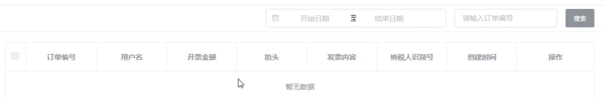

# 订单部分

views下创建order目录

## 订单列表页

- 商品列表页整体架构类似
- 查看每一个订单的状态。

```html
<template>
    <div class="bg-white px-3" style="margin: -20px;margin-top: -1rem;margin-bottom: 0!important;">

        <el-tabs v-model="tabIndex" @tab-click="handleClick">
            <el-tab-pane :label="tab.name" :key="tabI"
                         v-for="(tab,tabI) in tabbars">

                <button-search ref="buttonSearch" 
                               placeholder="要搜索的订单编号" 
                               @search="searchEvent">
                    <!-- 左边 -->
                    <template #left>
                        <el-button type="success"
                                   size="mini">导出数据</el-button>
                        <el-button type="danger" 
                                   size="mini">批量删除</el-button>
                    </template>
                    <!-- 高级搜索表单 -->
                    <template #form>
                        <el-form inline ref="form" :model="form"
                                 label-width="80px">
                            <el-form-item label="订单编号" class="mb-0">
                                <el-input v-model="form.code" 
                                          placeholder="订单编号"
                                          size="mini"></el-input>
                            </el-form-item>
                            <el-form-item label="订单状态" class="mb-0">
                                <el-select v-model="form.type" size="mini"
                                           placeholder="请选择订单状态">
                                    <el-option label="区域一" 
                                               value="shanghai"></el-option>
                                    <el-option label="区域二" 
                                               value="beijing"></el-option>
                                </el-select>
                            </el-form-item>
                            <el-form-item label="下单时间" class="mb-0">
                                <el-date-picker size="small"
                                                v-model="form.time"
                                                type="daterange"
                                                range-separator="至"
                                                start-placeholder="开始日期"
                                                end-placeholder="结束日期">
                                </el-date-picker>
                            </el-form-item>

                            <el-form-item label="收货人" class="mb-0">
                                <el-input v-model="form.username" 
                                          placeholder="收货人"
                                          size="mini"></el-input>
                            </el-form-item>
                            <el-form-item label="手机号" class="mb-0">
                                <el-input v-model="form.phone" 
                                          placeholder="手机号"
                                          size="mini"></el-input>
                            </el-form-item>
                            <el-form-item class="mb-0">
                                <el-button type="info" size="mini"
                                           @click="searchEvent">
                                    搜索</el-button>
                                <el-button size="mini"
                                           @click="clearSearch">清空筛选条件</el-button>
                            </el-form-item>
                        </el-form>
                    </template>
                </button-search>

                <el-table border class="mt-3"
                          :data="tableData[tabI].list"
                          style="width: 100%"
                          @selection-change="handleSelectionChange">
                    <el-table-column
                                     type="selection"
                                     width="45"
                                     align="center">
                    </el-table-column>

                    <el-table-column
                                     label="商品"
                                     width="350">
                        <template slot-scope="scope">
                            <div class="media">
                                
                                <div class="media-body">
                                    <p class="mt-0">
                                        <a class="text-primary">{{scope.row.title}}</a>
                                    </p>
                                </div>
                            </div>
                            <div class="d-flex">
                                <div style="flex: 1;">
                                    <p class="mb-1">订单编号：</p>
                                    <p class="mb-1">
                                        <small>2018080298545157</small>
                                    </p>
                                </div>
                                <div style="flex: 1;">
                                    <p class="mb-1">下单时间：</p>
                                    <p class="mb-1">
                                        <small>2018080298545157</small>
                                    </p>
                                </div>
                            </div>

                        </template>
                    </el-table-column>
                    <el-table-column
                                     align="center"
                                     width="120"
                                     label="实付款">
                        <template slot-scope="scope">
                            <span>￥20</span>
                            <p><small>(含运费：￥0.00)</small></p>
                        </template>
                    </el-table-column>
                    <el-table-column
                                     align="center"
                                     label="买家"
                                     width="120">
                        <template slot-scope="scope">
                            <span>用户名</span>
                            <p><small>(用户id：11)</small></p>
                        </template>
                    </el-table-column>
                    <el-table-column
                                     prop="status"
                                     align="center"
                                     label="支付方式">
                        <template slot-scope="scope">
                            <span class="badge badge-success">微信支付</span>
                        </template>
                    </el-table-column>
                    <el-table-column
                                     prop="stock"
                                     align="center"
                                     label="配送方式">
                    </el-table-column>
                    <el-table-column
                                     align="center"
                                     width="170"
                                     label="交易状态"
                                     >
                        <template slot-scope="scope">
                            <div>付款状态: 
                                <span class="badge badge-success">已付款</span>
                            </div>
                            <div>发货状态: 
                                <span class="badge badge-success">待发货</span>
                            </div>
                            <div>收货状态: 
                                <span class="badge badge-success">待收货</span>
                            </div>
                        </template>
                    </el-table-column>
                    <el-table-column
                                     align="center"
                                     label="操作"
                                     width="150">
                        <template slot-scope="scope">
                            <el-button type="primary" size="mini"
                                       plain>订单详情</el-button>
                        </template>
                    </el-table-column>
                </el-table>
                <div style="height: 60px;"></div>
                <el-footer class="border-top d-flex align-items-center px-0 position-fixed bg-white" style="bottom: 0;left: 200px;right: 0;z-index: 100;">
                    <div style="flex: 1;" class="px-2">
                        <el-pagination
                                       :current-page="tableData[tabI].currentPage"
                                       :page-sizes="[100, 200, 300, 400]"
                                       :page-size="100"
                                       layout="total, sizes, prev, pager, next, jumper"
                                       :total="400">
                        </el-pagination>
                    </div>
                </el-footer>

            </el-tab-pane>
        </el-tabs>

    </div>
</template>

<script>
    import buttonSearch from "@/components/common/button-search.vue"
    export default {
        components: {
            buttonSearch
        },
        data() {
            return {
                tabIndex: 0,
                tabbars:[
                    { name:"全部"},
                    { name:"待付款" },
                    { name:"待发货"},
                    { name:"已发货" },
                    { name:"已收货" },
                    { name:"已完成" },
                    { name:"已关闭" },
                    { name:"退款中" },
                ],
                form:{
                    code:"",
                    type:"",
                    time:"",
                    username:"",
                    phone:"",
                },
                tableData: [],
                multipleSelection: []
            }
        },
        created() {
            this.__getData()
        },
        methods: {
            // 生成数据
            __getData(){
                for (let i = 0; i < this.tabbars.length; i++) {
                    this.tableData.push({
                        currentPage:1,
                        list:[]
                    })
                    for (let j = 0; j < 20; j++) {
                        this.tableData[i].list.push({
                            id:j,
                            title: '荣耀 V10全网通 标配版'+i+'-'+j,
                            cover: 'http://static.yoshop.xany6.com/2018071718294208f086786.jpg',
                            create_time: '2019-07-17 18:34:14',
                            category:"手机",
                            type:"普通商品",
                            sale_count:20,
                            order:100,
                            status:1, 
                            stock:200,
                            pprice:1000,
                            ischeck:1
                            // 0未审核，1通过，2不通过
                        })
                    }
                }
            },
            // 上下架
            changeStatus(item){
                item.status = item.status === 1 ?  0 : 1
            },
            // 删除当前商品
            deleteItem(index){
                this.$confirm('此操作将永久删除该文件, 是否继续?', '提示', {
                    confirmButtonText: '确定',
                    cancelButtonText: '取消',
                    type: 'warning'
                }).then(() => {
                    this.tableData[this.tabIndex].list.splice(index,1)
                })
            },
            // 选中
            handleSelectionChange(val) {
                this.multipleSelection = val;
            },
            // 加载数据
            handleClick(tab,event) {
                console.log(tab.index);
            },
            // 清空筛选条件
            clearSearch(){
                this.form = {
                    code:"",
                    type:"",
                    time:"",
                    username:"",
                    phone:"",
                }
                this.$refs.buttonSearch[this.tabIndex].closeSuperSearch()
            },
            // 搜索事件
            searchEvent(e = false){
                // 简单搜索
                if (typeof e === 'string') {
                    return console.log('简单搜索',e);
                }
                // 高级搜索
                console.log('搜索事件');
            }
        },
    }
</script>

<style>
</style>

```


## 发票管理页



```html
<template>
	<div class="bg-white px-3" style="margin: -20px;margin-top: -1rem;margin-bottom: 0!important;">
		<button-search class="pt-3">
			<template #right>
				<div class="d-flex align-items-center">
					<el-date-picker size="medium"
					  v-model="search.time"
					  type="daterange"
					  range-separator="至"
					  start-placeholder="开始日期"
					  end-placeholder="结束日期">
					</el-date-picker>
					<el-input v-model="search.keyword" size="medium" placeholder="请输入订单号" style="width: 200px;" class="mx-2"></el-input>
					<el-button type="info" size="medium">搜索</el-button>
				</div>
			</template>
		</button-search>
	
	
		<el-table border class="mt-3"
		  :data="tableData"
		  style="width: 100%"
		   @selection-change="handleSelectionChange">
		  <el-table-column
			type="selection"
			width="45"
			align="center">
		  </el-table-column>
		  
		  <el-table-column
			label="订单编号"
			prop="name">
		  </el-table-column>
		 
		  <el-table-column
			align="center"
			prop="username"
			label="用户名">
		  </el-table-column>
		  
		  <el-table-column
			align="center"
			prop="price"
			label="开票金额">
		  </el-table-column>
		  
		  <el-table-column
			align="center"
			prop="price"
			label="抬头">
		  </el-table-column>
		  
		  <el-table-column
			align="center"
			prop="content"
			label="发票内容">
		  </el-table-column>
		  
		  <el-table-column
			align="center"
			prop="code"
			label="纳税人识别号">
		  </el-table-column>
		  
		  <el-table-column
			align="center"
			prop="create_time"
			label="创建时间">
		  </el-table-column>
		  
		  <el-table-column
			align="center"
			label="操作"
			width="150">
			<template slot-scope="scope">
				<el-button-group>
				  <el-button type="danger" size="mini" 
				  plain @click="deleteItem(scope)"
				  >删除</el-button>
				</el-button-group>
			</template>
		  </el-table-column>
		</el-table>
		<div style="height: 60px;"></div>
		<el-footer class="border-top d-flex align-items-center px-0 position-fixed bg-white" style="bottom: 0;left: 200px;right: 0;z-index: 100;">
		  <div style="flex: 1;" class="px-2">
			  <el-pagination
			  :current-page="currentPage"
			  :page-sizes="[100, 200, 300, 400]"
			  :page-size="100"
			  layout="total, sizes, prev, pager, next, jumper"
			  :total="400">
			</el-pagination>
		  </div>
		</el-footer>
	</div>
</template>

<script>
	import buttonSearch from "@/components/common/button-search.vue"
	export default {
		components: {
			buttonSearch
		},
		data() {
			return {
				tableData: [],
				currentPage:1,
				multipleSelection: [],
				
				search:{
					time:"",
					keyword:""
				}
			}
		},
		created() {

		},
		methods: {
			// 选中
			handleSelectionChange(val) {
				this.multipleSelection = val;
			},
			// 删除单个
			deleteItem(scope){
				this.$confirm('是否要删除该规格?', '提示', {
					confirmButtonText: '删除',
					cancelButtonText: '取消',
					type: 'warning'
				}).then(() => {
					this.tableData.splice(scope.$index,1)
					this.$message({
						message: '删除成功',
						type: 'success'
					});
				})
			}
		},
	}
</script>

<style>
.sku-list-item>i{
	display: none;
	cursor: pointer;
}
.sku-list-item:hover{
	background-color: #f4f4f4;
}
.sku-list-item:hover>font{
	display: none;
}
.sku-list-item:hover>i{
	display: inline-block;
}
</style>

```

## 售后服务页

```html
//src/views/order/after-sale/list.vue
<template>
	<div class="bg-white px-3" style="margin: -20px;margin-top: -1rem;margin-bottom: 0!important;">
		<button-search class="pt-3">
			<template #right>
				<div class="d-flex align-items-center">
					<el-date-picker size="medium"
					  v-model="search.time"
					  type="daterange"
					  range-separator="至"
					  start-placeholder="开始日期"
					  end-placeholder="结束日期">
					</el-date-picker>
					<el-input v-model="search.keyword" size="medium" placeholder="请输入订单号" style="width: 200px;" class="mx-2"></el-input>
					<el-button type="info" size="medium">搜索</el-button>
				</div>
			</template>
		</button-search>
	
	
		<el-table border class="mt-3"
		  :data="tableData"
		  style="width: 100%"
		   @selection-change="handleSelectionChange">
		  <el-table-column
			type="selection"
			width="45"
			align="center">
		  </el-table-column>
		  
		  <el-table-column
			label="商品信息"
			prop="name">
		  </el-table-column>
		 
		  <el-table-column
			align="center"
			prop="username"
			label="商品清单">
		  </el-table-column>
		  
		  <el-table-column
			align="center"
			prop="price"
			label="订单金额">
		  </el-table-column>
		  
		  <el-table-column
			align="center"
			prop="price"
			label="收货信息">
		  </el-table-column>
		  
		  <el-table-column
			align="center"
			prop="content"
			label="买家">
		  </el-table-column>
		  
		  <el-table-column
			align="center"
			prop="code"
			label="交易状态">
		  </el-table-column>
		  
		  <el-table-column
			align="center"
			prop="create_time"
			label="创建时间">
		  </el-table-column>
		  
		  <el-table-column
			align="center"
			label="操作"
			width="150">
			<template slot-scope="scope">
				<el-button-group>
				  <el-button type="danger" size="mini" 
				  plain @click="deleteItem(scope)"
				  >删除</el-button>
				</el-button-group>
			</template>
		  </el-table-column>
		</el-table>
		<div style="height: 60px;"></div>
		<el-footer class="border-top d-flex align-items-center px-0 position-fixed bg-white" style="bottom: 0;left: 200px;right: 0;z-index: 100;">
		  <div style="flex: 1;" class="px-2">
			  <el-pagination
			  :current-page="currentPage"
			  :page-sizes="[100, 200, 300, 400]"
			  :page-size="100"
			  layout="total, sizes, prev, pager, next, jumper"
			  :total="400">
			</el-pagination>
		  </div>
		</el-footer>
	</div>
</template>

<script>
	import buttonSearch from "@/components/common/button-search.vue"
	export default {
		components: {
			buttonSearch
		},
		data() {
			return {
				tableData: [],
				currentPage:1,
				multipleSelection: [],
				
				search:{
					time:"",
					keyword:""
				}
			}
		},
		created() {

		},
		methods: {
			// 选中
			handleSelectionChange(val) {
				this.multipleSelection = val;
			},
			// 删除单个
			deleteItem(scope){
				this.$confirm('是否要删除该规格?', '提示', {
					confirmButtonText: '删除',
					cancelButtonText: '取消',
					type: 'warning'
				}).then(() => {
					this.tableData.splice(scope.$index,1)
					this.$message({
						message: '删除成功',
						type: 'success'
					});
				})
			}
		},
	}
</script>

<style>
.sku-list-item>i{
	display: none;
	cursor: pointer;
}
.sku-list-item:hover{
	background-color: #f4f4f4;
}
.sku-list-item:hover>font{
	display: none;
}
.sku-list-item:hover>i{
	display: inline-block;
}
</style>

```

