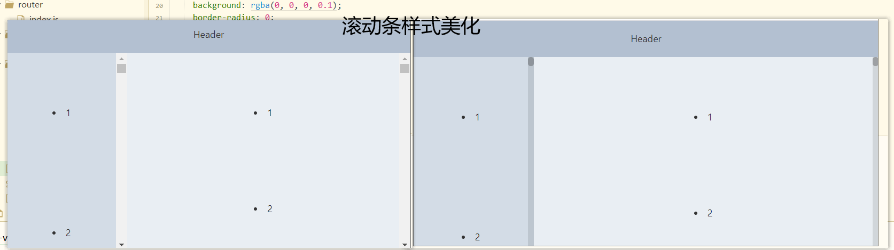

# 布局开发

## 滚动条美化



```html
//app.vue
<style>
::-webkit-scrollbar-track
{
  background: rgba(0,0,0,.1);
  border-radius: 0;
}

::-webkit-scrollbar
{
  -webkit-appearance: none;
  width: 10px;
  height: 10px;
}

::-webkit-scrollbar-thumb
{
    cursor: pointer;
    border-radius: 5px;
    background: rgba(0,0,0,.25);
    transition: color .2s ease;
}
</style>

```

## 布局设置 

```html
<el-container style="position: absolute;left: 0;top: 0;bottom: 0;right: 0; overflow: hidden;">
    <el-header>Header</el-header>
    <el-container style="height: 100%;padding-bottom: 60px;">
        <!-- 侧边布局 -->
        <el-aside width="200px">
            <li v-for="i in 100" :key="i">{{i}}</li>
        </el-aside>
        <!-- 主布局 -->
        <el-main style='position:relative'>
            <li v-for="i in 100" :key="i">{{i}}</li>
        </el-main>
    </el-container>
</el-container>
```

## 顶部导航

https://element.eleme.cn/#/zh-CN/component/menu#ding-lan

- flex布局子项mr-auto，就会把他右侧元素移动到另外一边 

  ```html
  <el-header class="d-flex">
      <a class="h5 text-light mb-0 mr-auto">UNI-ADMIN</a>
  </el-header>
  ```

```html
<el-container style="position: absolute;left: 0;top: 0;bottom: 0;right: 0; overflow: hidden;">
		  <el-header class="d-flex align-items-center" 
		  style="background: #545c64;">
			  <a class="h5 text-light mb-0 mr-auto">UNI-ADMIN</a>
			  <el-menu
			    :default-active="navBarIndex"
			    mode="horizontal"
			    @select="handleSelect"
			    background-color="#545c64"
			    text-color="#fff"
			    active-text-color="#ffd04b">
			    <el-menu-item index="1">首页</el-menu-item>
			    <el-menu-item index="2">商品</el-menu-item>
			    <el-menu-item index="3">订单</el-menu-item>
			    <el-menu-item index="4">会员</el-menu-item>
			    <el-menu-item index="5">设置</el-menu-item>
				 <el-submenu index="100">
				<template slot="title">
					 <el-avatar size="small" 
					 src="https://cube.elemecdn.com/3/7c/3ea6beec64369c2642b92c6726f1epng.png"></el-avatar>
					summer
				</template>
				<el-menu-item index="100-1">修改</el-menu-item>
				<el-menu-item index="100-2">退出</el-menu-item>
				</el-submenu>
				
			  </el-menu>
			  
		  </el-header>
		  <el-container style="height: 100%;padding-bottom: 60px;">
			<!-- 侧边布局 -->
			<el-aside width="200px">
				
				
				
				
			</el-aside>
			<!-- 主布局 -->
			<el-main>
			</el-main>
		  </el-container>
		</el-container>

    methods: {
    handleSelect(key, keyPath) {
        console.log(key, keyPath);
        }
    }
```

## 侧边导航

```html
<el-container style="position: absolute;left: 0;top: 0;bottom: 0;right: 0; overflow: hidden;">
    <el-header>Header</el-header>
    <el-container style="height: 100%;padding-bottom: 60px;">
        <!-- 侧边布局 -->
        <el-aside width="200px">


            <el-menu default-active="0" @select="slideSelect">
                <el-menu-item :index="index|numToString" :key="index"
                              v-for="(item,index) in slideMenus">
                    <i :class="item.icon"></i>
                    <span slot="title">{{item.name}}</span>
                </el-menu-item>
            </el-menu>


        </el-aside>
        <!-- 主布局 -->
        <el-main>
            <li v-for="i in 100" :key="i">{{i}}</li>
        </el-main>
    </el-container>
</el-container>
```

```js
export default {
    mixins:[common],
    data() {
        return {
            navBar:{
                active:'0',
                list:[
                    { 
                        name:"首页",
                        subActive:'0',
                        submenu:[
                            {
                                icon:"el-icon-s-home",
                                name:"后台首页"
                            },
                            {
                                icon:"el-icon-s-claim",
                                name:"商品列表"
                            }
                        ]
                    },
                    { 
                        name:"商品",
                        subActive:'0',
                        submenu:[
                            {
                                icon:"el-icon-s-claim",
                                name:"商品列表"
                            }
                        ]
                    },
                    { name:"订单" },
                    { name:"会员" },
                    { name:"设置" },
                ]
            }
        }
    },
    computed: {
        slideMenuActive:{
            get(){
                return this.navBar.list[this.navBar.active].subActive || '0'
            },
            set(val){
                this.navBar.list[this.navBar.active].subActive = val
            }
        },
        slideMenus() {
            return this.navBar.list[this.navBar.active].submenu || []
        }
    },
    methods: {
        handleSelect(key, keyPath) {
            this.navBar.active = key
        },
        slideSelect(key, keyPath) {
            this.slideMenuActive = key
        },
    }
}
```


## 数据分离

分离数据

```js
//src/common/config/config.js
export default {
	logo: 'CiLi-ADMIN',
	navBar: {
		active: '0',
		list: [{
				name: "首页",
				subActive: '0',
				submenu: [{
						icon: "el-icon-s-home",
						name: "后台首页"
					},
					{
						icon: "el-icon-s-claim",
						name: "商品列表"
					}
				]
			},
			{
				name: "商品",
				subActive: '0',
				submenu: [{
					icon: "el-icon-s-claim",
					name: "商品列表"
				}]
			},
			{
				name: "订单"
			},
			{
				name: "会员"
			},
			{
				name: "设置"
			},
		]
	}
}

```

```js
//main.js
import $conf from "./common/config/config.js"
Vue.prototype.$conf = $conf
```

```vue
layout.vue
<template>
<div>
    <a class="h5 text-light mb-0 mr-auto">
        {{$conf.logo}}
    </a>
    </div>
</template>

<script>
    import common from "@/common/mixins/common.js"
    export default {
        mixins:[common],
        data() {
            return {
                navBar:[]
            }
        },
        created() {
            // 初始化菜单
            this.navBar = this.$conf.navBar
        },

    }
</script>

<style>

</style>

```

## 面包屑

- 首页不需要面包屑导航

- 监听路由变化

```js
export default = {
    watch: {
        '$route'(to, from) {
            // 本地存储
            localStorage.setItem('navActive',JSON.stringify({
                top:this.navBar.active || '0',
                left:this.slideMenuActive || '0'
            }))
            this.getRouterBran()
        }
    },
    methods: {
        __initNavBar() {
            let r = localStorage.getItem('navActive');
            if (r) {
                r = JSON.parse(r);
                this.navBar.active = r.top;
                this.slideMenuActive = r.left;
            }
        },
        // 获取面包屑导航
        getRouterBran() {
            let b = this.$route.matched.filter(v => v.name);
            let arr = [];
            b.forEach((v, k) => {
                // 过滤layout和index
                if (v.name === 'index' || v.name === 'layout') return;
                arr.push({
                    name: v.name,
                    path: v.path,
                    title: v.meta.title
                });
            });
            if (arr.length > 0) {
                arr.unshift({ name: 'index', path: '/index', title: '后台首页' });
            }
            this.bran = arr;
        },
        handleSelect(key, keyPath) {
            this.navBar.active = key;
            // 默认选中跳转到当前激活
            this.slideMenuActive = '0';
            if (this.slideMenus.length > 0) {
                this.$router.push({
                    name: this.slideMenus[this.slideMenuActive].pathname
                });
            }
        },
        slideSelect(key, keyPath) {
            this.slideMenuActive = key;
            // 跳转到指定页面
            this.$router.push({
                name: this.slideMenus[key].pathname
            });
        }
    }    
}
```

## 全局回到顶部

- 选中.el-main作为回到顶部的父级
- el-main颜色改为浅灰，这样当前选中的路由页面背景就浅灰，然后面包屑导航需要白色

```html
<el-main class="bg-light">
    <!-- 面包屑导航 -->
		

    <!-- 主内容 -->
    <router-view></router-view>
    <div style="height: 1000px;"></div>

    
    
        <!-- 回到顶部 -->
		
    <el-backtop target=".el-main" :bottom="100">
        <div
             style="height: 100%; width: 100%; background-color: #f2f5f6; box-shadow: 0 0 6px rgba(0,0,0, .12); text-align: center;  line-height: 40px; color: #1989fa;"
             class="rounded-circle"
             >
            <i class="el-icon-top"></i>
        </div>
    </el-backtop>
</el-main>
```

