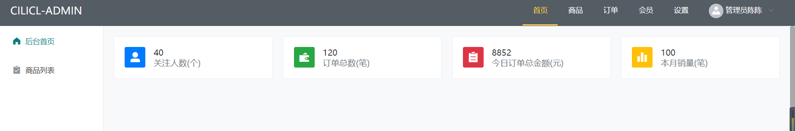
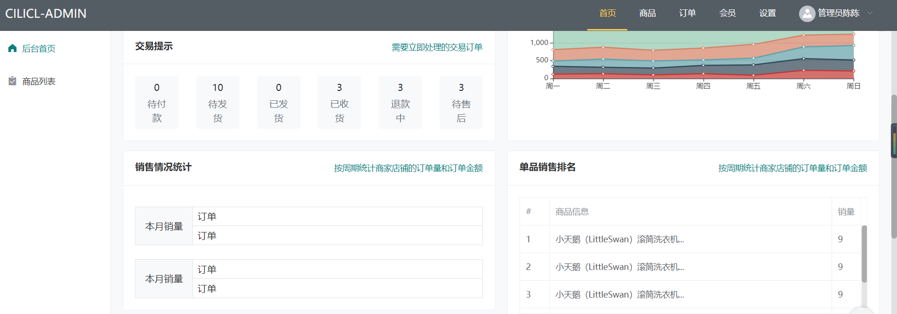
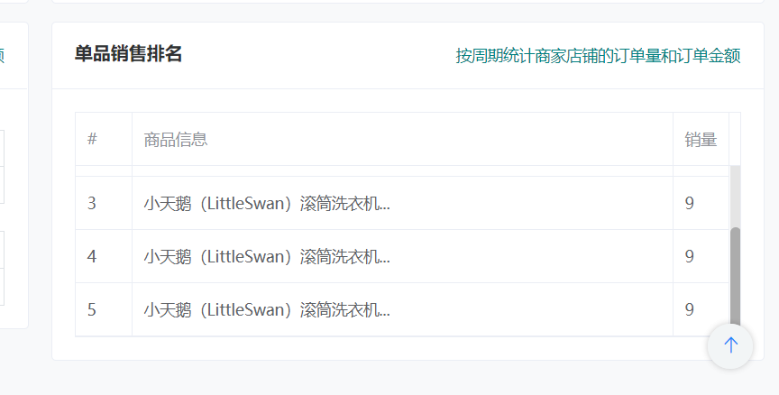

# 首页开发

## 数据统计卡片部分



- 栅格布局四个，内部由card布局，card在hover时会显示阴影

  ```html
  <el-row :gutter="20">
      <el-col :span="6"><el-card class="box-card" shadow="hover"></el-card></el-col>
      <el-col :span="6"><el-card class="box-card" shadow="hover"></el-card></el-col>
      <el-col :span="6"><el-card class="box-card" shadow="hover"></el-card></el-col>
      <el-col :span="6"><el-card class="box-card" shadow="hover"></el-card></el-col>
  </el-row>
  ```

## 店铺交易

```html
<el-row :gutter="20" class="mt-3">
    <!-- 店铺、订单提示 -->
    <el-col :span="12" class="d-flex flex-column" style="height: 370px;">
        <el-card class="box-card mb-auto" shadow="never">
            <div slot="header" class="clearfix">
                <span>店铺及商品提示</span>
                <el-button style="float: right; padding: 3px 0" type="text">操作按钮</el-button>
            </div>
            <div class="row">
                <div class="col-3">
                    <button class="btn btn-light w-100">
                        <h4 class="mb-1">64</h4>
                        <small class="text-muted">出售中</small>
                    </button>
                </div>
                <div class="col-3">
                    <button class="btn btn-light w-100">
                        <h4 class="mb-1">64</h4>
                        <small class="text-muted">出售中</small>
                    </button>
                </div>
                <div class="col-3">
                    <button class="btn btn-light w-100">
                        <h4 class="mb-1">64</h4>
                        <small class="text-muted ">出售中</small>
                    </button>
                </div>
                <div class="col-3">
                    <button class="btn btn-light w-100">
                        <h4 class="mb-1">64</h4>
                        <small class="text-muted">出售中</small>
                    </button>
                </div>
            </div>
        </el-card>
        <el-card class="box-card" shadow="never">
            <div slot="header" class="clearfix">
                <span>交易提示</span>
                <el-button style="float: right; padding: 3px 0" type="text">操作按钮</el-button>
            </div>
            <div class="row">
                <div class="col-2" v-for="i in 10">
                    <button class="btn btn-light w-100">
                        <h4 class="mb-1">64</h4>
                        <small class="text-muted small">出售中</small>
                    </button>
                </div>
            </div>
        </el-card>
    </el-col>
    <!-- 统计图 -->
    <el-col :span="12">
        <el-card class="box-card" style="height: 370px;" 
                 shadow="never">
            <div slot="header" class="clearfix">
                <span>卡片名称</span>
                <el-button style="float: right; padding: 3px 0" type="text">操作按钮</el-button>
            </div>
            <div class="text item"></div>
        </el-card>
    </el-col>
</el-row>
```

## echart统计图

```bash
cnpm install echarts --save
```

```html
<div ref="myChart" style="width: 100%;height: 270px;"></div>
```

```js
import echarts from "echarts"
export default {
    data(){
        return {

        }
    },
    //dom渲染完毕
    mounted() {
        // 画统计图
        this.drawLine()
    },
    methods: {
        drawLine() {
            // 初始化echarts实例
            let myChart = echarts.init(this.$refs.myChart)
            // 配置参数
            myChart.setOption({
                title: {},
                tooltip : {
                    trigger: 'axis',
                    axisPointer: {
                        type: 'cross',
                        label: {
                            backgroundColor: '#6a7985'
                        }
                    }
                },
                legend: {
                    data:['邮件营销','联盟广告','视频广告','直接访问','搜索引擎']
                },
                toolbox: {
                    feature: {
                        saveAsImage: {}
                    }
                },
                grid: {
                    left: '3%',
                    right: '4%',
                    bottom: '3%',
                    containLabel: true
                },
                xAxis : [
                    {
                        type : 'category',
                        boundaryGap : false,
                        data : ['周一','周二','周三','周四','周五','周六','周日']
                    }
                ],
                yAxis : [
                    {
                        type : 'value'
                    }
                ],
                series : [
                    {
                        name:'邮件营销',
                        type:'line',
                        stack: '总量',
                        areaStyle: {},
                        data:[120, 132, 101, 134, 90, 230, 210]
                    },
                    {
                        name:'联盟广告',
                        type:'line',
                        stack: '总量',
                        areaStyle: {},
                        data:[220, 182, 191, 234, 290, 330, 310]
                    },
                    {
                        name:'视频广告',
                        type:'line',
                        stack: '总量',
                        areaStyle: {},
                        data:[150, 232, 201, 154, 190, 330, 410]
                    },
                    {
                        name:'直接访问',
                        type:'line',
                        stack: '总量',
                        areaStyle: {normal: {}},
                        data:[320, 332, 301, 334, 390, 330, 320]
                    },
                    {
                        name:'搜索引擎',
                        type:'line',
                        stack: '总量',
                        label: {
                            normal: {
                                show: true,
                                position: 'top'
                            }
                        },
                        areaStyle: {normal: {}},
                        data:[820, 932, 901, 934, 1290, 1330, 1320]
                    }
                ]
            })
        }
    },
}
```

## 销售情况统计



```html
<el-row :gutter="20" class="my-3">
    <el-col :span="12">
        <el-card class="box-card" shadow="never">
            <div slot="header" class="clearfix">
                <span class="font-weight-bold">销售情况统计</span>
                <el-button style="float: right; padding: 3px 0" type="text">按周期统计商家店铺的订单量和订单金额</el-button>
            </div>

            <div class="border d-flex mt-3">
                <div class="py-4 px-3 bg-light border-right">本月销量</div>
                <div class="d-flex flex-column  flex-grow-1 ">
                    <div class="pl-2 border-bottom  flex-grow-1 d-flex align-items-sm-center">订单</div>
                    <div class="pl-2   flex-grow-1 d-flex align-items-sm-center">订单</div>
                </div>
            </div>

            <div class="border d-flex mt-4">
                <div class="py-4 px-3 bg-light border-right">本月销量</div>
                <div class="d-flex flex-column  flex-grow-1 ">
                    <div class="pl-2 border-bottom  flex-grow-1 d-flex align-items-sm-center">订单</div>
                    <div class="pl-2   flex-grow-1 d-flex align-items-sm-center">订单</div>
                </div>
            </div>
        </el-card>
    </el-col>
    <el-col :span="12">
        <el-card class="box-card" shadow="never">
            <div slot="header" class="clearfix">
                <span class="font-weight-bold">单品销售排名</span>
                <el-button style="float: right; padding: 3px 0" type="text">按周期统计商家店铺的订单量和订单金额</el-button>
            </div>

            <el-table :data="tableData" height="200" border style="width: 100%">
                <el-table-column type="index" label="#" width="50"></el-table-column>

                <el-table-column prop="name" label="商品信息"></el-table-column>

                <el-table-column prop="num" label="销量" width="50"></el-table-column>
            </el-table>
        </el-card>
    </el-col>
</el-row>
```

## 销量排名

- 使用el-table组件配合滚动条效果：需要给el-table添加height属性



```html
<el-col :span="12">
    <el-card class="box-card" shadow="never">
        <div slot="header" class="clearfix">
            <span class="font-weight-bold">单品销售排名</span>
            <el-button style="float: right; padding: 3px 0" type="text">按周期统计商家店铺的订单量和订单金额</el-button>
        </div>

        <el-table :data="tableData" height="200" border style="width: 100%">
            <el-table-column type="index" label="#" width="50"></el-table-column>

            <el-table-column prop="name" label="商品信息"></el-table-column>

            <el-table-column prop="num" label="销量" width="50"></el-table-column>
        </el-table>
    </el-card>
</el-col>
```

```html
data() {
		return {
			tableData: [
				{
					name: '小天鹅（LittleSwan）滚筒洗衣机...',
					num: '9'
				},
				{
					name: '小天鹅（LittleSwan）滚筒洗衣机...',
					num: '9'
				},
				{
					name: '小天鹅（LittleSwan）滚筒洗衣机...',
					num: '9'
				},
				{
					name: '小天鹅（LittleSwan）滚筒洗衣机...',
					num: '9'
				},
				{
					name: '小天鹅（LittleSwan）滚筒洗衣机...',
					num: '9'
				}
			]
		};
	},
```

