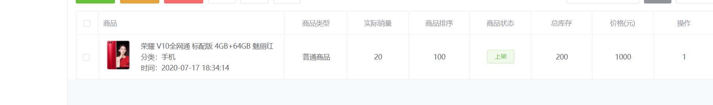

# 商品列表页

>此页面会有一个选项卡，每个选项卡都有对应内容，比如审核，库存，下架，发售等等

## tab标签设置

https://element.eleme.cn/#/zh-CN/component/tabs#tabs-biao-qian-ye

```html
<el-tabs v-model="tabIndex" @tab-click="handleClick">
    <el-tab-pane :label="tab.name" :key="tabI" v-for="(tab, tabI) in tabbars">
    列表操作栏站位
    </el-tab-pane>
</el-tabs>
```

## 列表操作栏配置

```html
<el-tabs v-model="tabIndex" @tab-click="handleClick">
    <el-tab-pane :label="tab.name" :key="tabI"
                 v-for="(tab,tabI) in tabbars">
        <div class="d-flex ">
            <!-- 左边 -->
            <el-button type="success" size="mini">发布商品</el-button>
            <el-button type="danger" size="mini">批量删除</el-button>
            <!-- 右边 -->
            <div class="ml-auto" v-show="!superSearch">
                <el-input v-model="form.keyword" placeholder="要搜索的商品名称" size="mini" style="width:150px;" class="mr-2"></el-input>
                <el-button type="info" size="mini">搜索</el-button>
                <el-button size="mini" 
                           @click="superSearch = true">高级搜索</el-button>
            </div>

        </div>
        <el-card class="box-card bg-light my-3" v-show="superSearch">
            <div slot="header" class="clearfix" style="margin: -10px;">
                <span>高级搜索</span>
                <el-button style="float: right; padding: 3px 0" 
                           type="text" @click="superSearch = false"
                           >收起</el-button>
            </div>
            表单
        </el-card>


    </el-tab-pane>
</el-tabs>
```

## 高级搜索配置

```html
<el-collapse-transition>
    <el-card class="box-card bg-light my-3" v-show="superSearch">
        <div slot="header" class="clearfix" style="margin: -10px;">
            <span>高级搜索</span>
            <el-button style="float: right; padding: 3px 0" type="text" @click="superSearch = false">收起</el-button>
        </div>
        <!-- 表单 -->
        <el-form inline ref="form" :model="form" label-width="80px">
            <el-form-item label="商品名称" class="mb-0"><el-input v-model="form.name" placeholder="商品名称" size="mini"></el-input></el-form-item>
            <el-form-item label="商品编码" class="mb-0"><el-input v-model="form.code" placeholder="商品编码" size="mini"></el-input></el-form-item>
            <el-form-item label="商品类型" class="mb-0">
                <el-select v-model="form.type" size="mini" placeholder="请选择商品类型">
                    <el-option label="区域一" value="shanghai"></el-option>
                    <el-option label="区域二" value="beijing"></el-option>
                </el-select>
            </el-form-item>
            <el-form-item label="商品分类" class="mb-0"><el-input v-model="form.category" placeholder="商品分类" size="mini"></el-input></el-form-item>
            <el-form-item class="mb-0">
                <el-button type="info" size="mini" @click="searchEvent">搜索</el-button>
                <el-button size="mini" @click="clearSearch">清空筛选条件</el-button>
            </el-form-item>
        </el-form>
    </el-card>
</el-collapse-transition>
```

```js
// 清空筛选条件
clearSearch(){
    this.form = {
        name:"",
        code:"",
        type:"",
        category:""
    }
    this.superSearch = false
},

```

```js
// 搜索事件
searchEvent(){
    console.log('搜索事件');
}
```

## 按钮组件封装和使用

封装

```html
<template>
	<div>
		<div class="d-flex align-items-center">
			<!-- 左边 -->
			<slot name="left"></slot>
			<!-- 右边 -->
			<div class="ml-auto" v-show="!superSearch">
				<slot name="right">
					<el-input v-model="keyword" :placeholder="placeholder" size="mini" style="width:150px;" class="mr-2"></el-input>
					<el-button type="info" size="mini"
					@click="$emit('search',keyword)">搜索</el-button>
					<el-button size="mini" 
					@click="superSearch = true">高级搜索</el-button>
				</slot>
			</div>
			
		</div>
		<el-card class="box-card bg-light my-3" v-show="superSearch">
			<div slot="header" class="clearfix" style="margin: -10px;">
				<span>高级搜索</span>
				<el-button style="float: right; padding: 3px 0" 
				type="text" @click="closeSuperSearch">收起</el-button>
			</div>
			<!-- 表单 -->
			<slot name="form"></slot>
		</el-card>
	</div>
</template>

<script>
	export default {
		props: {
			placeholder: {
				type: String,
				default: ""
			},
		},
		data() {
			return {
				keyword: "",
				superSearch:false
			}
		},
		methods: {
			closeSuperSearch() {
				this.superSearch = false
			}
		},
	}
</script>

<style>
</style>

```

使用

```html
<button-search ref="buttonSearch" 
               placeholder="要搜索的商品名称" 
               @search="searchEvent">
    <!-- 左边 -->
    <template #left>
        <el-button type="success" 
                   size="mini">发布商品</el-button>
        <el-button type="danger" 
                   size="mini">批量删除</el-button>
    </template>
    <!-- 高级搜索表单 -->
    <template #form>
        <el-form inline ref="form" :model="form"
                 label-width="80px">
            <el-form-item label="商品名称" class="mb-0">
                <el-input v-model="form.name" 
                          placeholder="商品名称"
                          size="mini"></el-input>
            </el-form-item>
            <el-form-item label="商品编码" class="mb-0">
                <el-input v-model="form.code" 
                          placeholder="商品编码"
                          size="mini"></el-input>
            </el-form-item>
            <el-form-item label="商品类型" class="mb-0">
                <el-select v-model="form.type" size="mini"
                           placeholder="请选择商品类型">
                    <el-option label="区域一" 
                               value="shanghai"></el-option>
                    <el-option label="区域二" 
                               value="beijing"></el-option>
                </el-select>
            </el-form-item>
            <el-form-item label="商品分类" class="mb-0">
                <el-input v-model="form.category" 
                          placeholder="商品分类"
                          size="mini"></el-input>
            </el-form-item>
            <el-form-item class="mb-0">
                <el-button type="info" size="mini"
                           @click="searchEvent">
                    搜索</el-button>
                <el-button size="mini"
                           @click="clearSearch">清空筛选条件</el-button>
            </el-form-item>
        </el-form>
    </template>
</button-search>
```

```js
clearSearch(){
    this.form = {
        name:"",
        code:"",
        type:"",
        category:""
    }
    this.$refs.buttonSearch[this.tabIndex].closeSuperSearch()
},
```

## 数据表格



https://element.eleme.cn/#/zh-CN/component/table#duo-xuan

http://bs4.vx.link/index.html?tmpui_page=/pages/layout#example

- scope.row是当前商品的对象

```html
<el-table border class="mt-3" :data="tableData" style="width: 100%" @selection-change="handleSelectionChange">
    <el-table-column type="selection" width="45" align="center"></el-table-column>

    <el-table-column label="商品" width="380">
        <template slot-scope="scope">
            <div class="media">
                
                <div class="media-body">
                    <p class="mt-0">{{ scope.row.title }}</p>
                    <p class="mb-0">分类：{{ scope.row.category }}</p>
                    <p class="mb-0">时间：{{ scope.row.create_time }}</p>
                </div>
            </div>
        </template>
    </el-table-column>
    <el-table-column prop="type" align="center" label="商品类型"></el-table-column>
    <el-table-column align="center" prop="sale_count" label="实际销量"></el-table-column>
    <el-table-column align="center" prop="order" label="商品排序"></el-table-column>
    <el-table-column prop="status" align="center" label="商品状态">
        <template slot-scope="scope">
            <el-button type="success" size="mini" plain>上架</el-button>
        </template>
    </el-table-column>
    <el-table-column prop="stock" align="center" label="总库存"></el-table-column>
    <el-table-column prop="pprice" align="center" label=" 价格(元)"></el-table-column>
    <el-table-column prop="id" align="center" label="操作"></el-table-column>
</el-table>
```

```js
    export default {
        data() {
            return {
                tableData: [
                    {
                        id: 1,
                        title: '荣耀 V10全网通 标配版 4GB+64GB 魅丽红',
                        cover: 'http://static.yoshop.xany6.com/2018071718294208f086786.jpg',
                        create_time: '2019-07-17 18:34:14',
                        category: '手机',
                        type: '普通商品',
                        sale_count: 20,
                        order: 100,
                        status: 1,
                        stock: 200,
                        pprice: 1000,
                        ischeck: 1
                        // 0未审核，1通过，2不通过
                    }
                ],
                multipleSelection: []
            };
        },
        methods: {
            handleSelectionChange(val) {
                this.multipleSelection = val;
            }
        }
    };
```

## 生成数据和删除功能

```js
__getData(){
    for (let i = 0; i < this.tabbars.length; i++) {
        this.tableData.push({
            currentPage:1,
            list:[]
        })
        for (let j = 0; j < 20; j++) {
            this.tableData[i].list.push({
                id:j,
                title: '荣耀 V10全网通 标配版'+i+'-'+j,
                cover: 'http://static.yoshop.xany6.com/2018071718294208f086786.jpg',
                create_time: '2019-07-17 18:34:14',
                category:"手机",
                type:"普通商品",
                sale_count:20,
                order:100,
                status:1, 
                stock:200,
                pprice:1000,
                ischeck:1
                // 0未审核，1通过，2不通过
            })
        }
    }
},
```

```js
deleteItem(index){
    this.$confirm('此操作将永久删除该文件, 是否继续?', '提示', {
        confirmButtonText: '确定',
        cancelButtonText: '取消',
        type: 'warning'
    }).then(() => {
        this.tableData[this.tabIndex].list.splice(index,1)
    })
},
```

## 状态判断

```js
// 上下架
changeStatus(item){
    item.status = item.status === 1 ?  0 : 1
},
```


## 分页处理

```js

```


