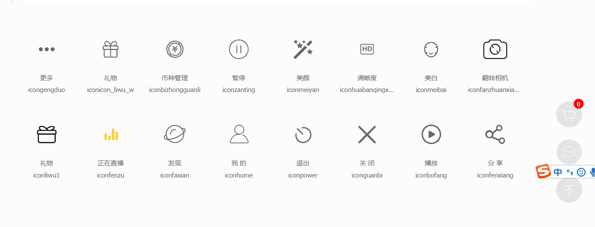
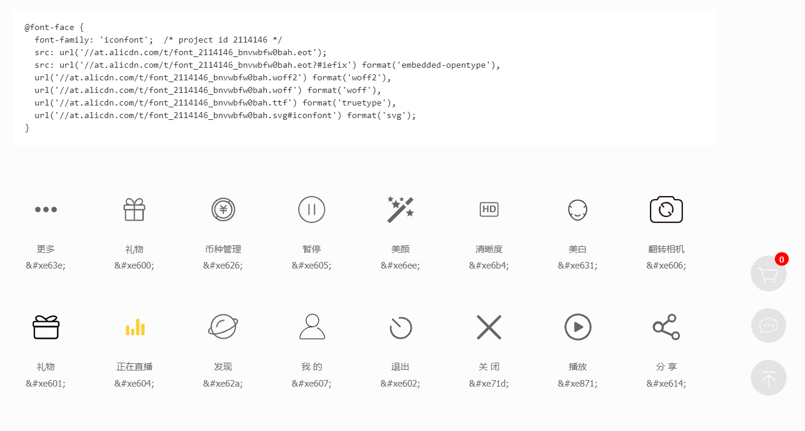
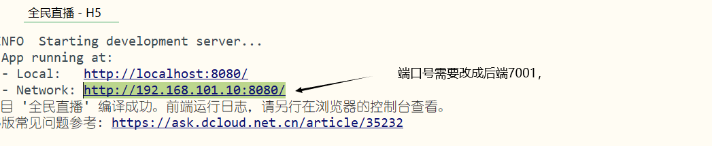

# 全局处理

## 直播外链

- 香港卫视,rtmp://live.hkstv.hk.lxdns.com/live/hks（已停用）

- 香港财经,rtmp://202.69.69.180:443/webcast/bshdlive-pc（推荐，信号好不卡顿）

- 韩国GoodTV,rtmp://mobliestream.c3tv.com:554/live/goodtv.sdp

- 韩国朝鲜日报,rtmp://live.chosun.gscdn.com/live/tvchosun1.stream

- 美国1,rtmp://ns8.indexforce.com/home/mystream

- 美国2,rtmp://media3.scctv.net/live/scctv_800

- 美国中文电视,rtmp://media3.sinovision.net:1935/live/livestream

- 湖南卫视,rtmp://58.200.131.2:1935/livetv/hunantv

- rtmp://58.200.131.2:1935/livetv/cctv1  cctv1综合  2020-08-27

  rtmp://58.200.131.2:1935/livetv/cctv2  cctv2财经  2020-08-27

  rtmp://58.200.131.2:1935/livetv/cctv3  cctv3综艺  2020-08-27

  rtmp://58.200.131.2:1935/livetv/cctv4  cctv4中文国际  2020-08-27

  rtmp://58.200.131.2:1935/livetv/cctv5  cctv5体育  2020-08-27

  rtmp://58.200.131.2:1935/livetv/cctv6  cctv6电影  2020-08-27

中央1：http://ivi.bupt.edu.cn/hls/cctv1.m3u8

中央2：http://ivi.bupt.edu.cn/hls/cctv2.m3u8

中央3：http://ivi.bupt.edu.cn/hls/cctv3.m3u8

中央4：http://ivi.bupt.edu.cn/hls/cctv4.m3u8

中央5：http://ivi.bupt.edu.cn/hls/cctv5.m3u8

中央6：http://ivi.bupt.edu.cn/hls/cctv6.m3u8

中央7：http://ivi.bupt.edu.cn/hls/cctv7.m3u8

中央8：http://ivi.bupt.edu.cn/hls/cctv8.m3u8

中央9：http://ivi.bupt.edu.cn/hls/cctv9.m3u8

中央10：http://ivi.bupt.edu.cn/hls/cctv10.m3u8

中央11：http://ivi.bupt.edu.cn/hls/cctv11.m3u8

##  图标和样式引入

```vue
//App.vue
<style>
    /*每个页面公共css */
    @import url("/common/free.css");
    @import url("/common/common.css");
    /* #ifndef APP-NVUE */
    @import url("http://at.alicdn.com/t/font_2114146_bnvwbfw0bah.css");
    /* #endif */
</style>
```

https://www.iconfont.cn/manage/index?manage_type=myprojects&projectId=2114146



**nvue页面图标处理**

https://weex.apache.org/zh/docs/modules/dom.html#addrule

```js
onLaunch: function() {
    const domModule = weex.requireModule('dom');
    domModule.addRule('fontFace', {
        fontFamily: 'iconfont',
        src: "url('http://at.alicdn.com/t/font_2114146_bnvwbfw0bah.ttf')"
    });
},
```

```html
<view><text class="ic onfont" style="font-size: 100rpx;">&#xe600;</text></view>
```



## 底部导航栏和全局样式

- app端，nvue会提高性能
- 中间按钮配置是有限制的。只对app有用。

https://uniapp.dcloud.io/api/ui/tabbar?id=ontabbarmidbuttontap

```json
{

    "globalStyle": {
        "navigationBarTextStyle": "white",
        "navigationBarTitleText": "cilicl直播",
        "navigationBarBackgroundColor": "#F8F8F8",
        "backgroundColor": "#F8F8F8"
    },
    "tabBar": {
        "color": "#0056B3",
        "selectedColor": "#007AFF",
        "backgroundColor": "#FFFFFF",
        "borderStyle": "black",
        "midButton": {
            "iconPath": "static/tabbar/min.png",
            "iconWidth":"60px",
            "height":"65px"
        },
        "list": [{
            "pagePath": "pages/index/index",
            "iconPath": "static/tabbar/find.png",
            "selectedIconPath": "static/tabbar/find-selected.png",
            "text": "首页"

        }, {
            "pagePath": "pages/my/my",
            "iconPath": "static/tabbar/my.png",
            "selectedIconPath": "static/tabbar/my-selected.png",
            "text": "我的"
        }]
    }
}

```

## vuex引入

## app端开发模式跨域解决



- 需要使用内网ip

## 权限验证

main.js

```js
import Vue from 'vue'
import App from './App'
import store from './store/index.js'
import $H from './common/request.js'
Vue.prototype.authJump = (options)=>{
	if(!store.state.token){
		uni.showToast({
			title: '请先登录',
			icon: 'none'
		});
		return uni.navigateTo({
			url: '/pages/login/login'
		});
	}
	uni.navigateTo(options);
}

Vue.prototype.$H = $H
Vue.config.productionTip = false
Vue.prototype.$store = store
App.mpType = 'app'

const app = new Vue({
    ...App,
		store
})
app.$mount()

```

## 方法权限验证

- 只有vuex可以在nvue里调用
- main.js里的代码无法接受执行！！！！！！！！！！

vuex

```js
actions:{
    authMethod({ state },callback){
        if(!state.token){
            uni.showToast({
                title: '请先登录',
                icon: 'none'
            });
            return uni.navigateTo({
                url: '/pages/login/login'
            });
        }
        callback()
    }
}

```

main.js

```js
Vue.prototype.authJump = (options)=>{
	if(!store.state.token){
		uni.showToast({
			title: '请先登录',
			icon: 'none'
		});
		return uni.navigateTo({
			url: '/pages/login/login'
		});
	}
	uni.navigateTo(options);
}
```

使用

```js
@click='authJump({url:'/pages/pay/pay'})'
this.authJump({})
```

