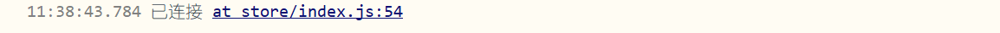
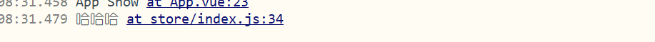

# sockit.io配置

## 引入uni-sockit.io库

客户端配置:https://eggjs.org/zh-cn/tutorials/socketio.html#client

```js
import io from '../common/uni-socket.io.js'
import $C from '../common/config.js'
export default new Vuex.Store({
    state: {
        socke
    },
    actions: {
        // 连接socket
        connectSocket({
            state,
            dispatch
        }) {
            const S = io($C.socketUrl, {
                query: {},
                transports: ['websocket'],
                timeout: 5000
            })

            let onlineEvent = (e) => {
                uni.$emit('live', {
                    type: "online",
                    data: e
                })
            }
            let commentEvent = (e) => {
                uni.$emit('live', {
                    type: "comment",
                    data: e
                })
            }
            let giftEvent = (e) => {
                uni.$emit('live', {
                    type: "gift",
                    data: e
                })
            }

            // 监听连接
            S.on('connect', () => {
                console.log('已连接')
                state.socket = S
                // socket.io唯一链接id，可以监控这个id实现点对点通讯
                const {
                    id
                } = S
                S.on(id, (e) => {
                    let d = e.data
                    if (d.action === 'error') {
                        let msg = d.payload
                        if (e.meta.notoast) {
                            return
                        }
                        return uni.showToast({
                            title: msg,
                            icon: 'none'
                        });
                    }
                })

                // 监听在线用户信息
                S.on('online', onlineEvent)
                // 监听评论
                S.on('comment', commentEvent)
                // 监听礼物接收
                S.on('gift', giftEvent)

            })

            // 移除监听事件
            const removeListener = () => {
                if (S) {
                    S.removeListener('online', onlineEvent)
                    S.removeListener('comment', commentEvent)
                    S.removeListener('gift', giftEvent)
                }
            }

            // 监听失败
            S.on('error', () => {
                removeListener()
                state.socket = null
                console.log('连接失败')
            })
            // 监听断开
            S.on('disconnect', () => {
                removeListener()
                state.socket = null
                console.log('已断开')
            })
        },
    }
})
```

## 前后端消息收发

>前端通过emit发射信息给后端，后端ctx.args[0]  接受这条消息
>
>前端和后端每条通信都会有个唯一id，前端通过该唯一id获取后端传入的消息。

前端:

```js
import io from '../common/uni-socket.io.js'
import $C from '../common/config.js'
export default new Vuex.Store({
    actions: {
        connectSocket({state}){
            const S = io($C.socketUrl, {
                query: {},
                transports: ['websocket'],
                timeout: 5000
            })
            S.on('connect',()=>{
                //发送信息到后端
                S.emit('test1','123456')
                console.log(S.id)//唯一的id,
                //接受信息
                S.on(S.id,e=>{
                    
                })
            })

        }
    }
})
```

```js
//App.vue
onShow: function() {
    this.$store.dispatch('connectSocket')
},
```



**后端：**

```js
//router
module.exports = app => {
    const { router, controller,io } = app;
	//命名空间of  test1必须和前端的一致
    io.of('/').route('test1',io.controller.nsp.test)
};
```

socket.io插件控制器：app/io/controller/nsp.js

```js
'use strict';

const Controller = require('egg').Controller;

class NspController extends Controller {
    async test() {
		const {ctx,app} = this;
        let message = ctx.args[0]  // arg:[ '123456' ]
        //当前sockit连接(通过前端的唯一id)
        const id = ctx.socket.id;
        ctx.socket.emit(id,'哈哈哈')
    }
}

module.exports = NspController;
```

前端接受哈哈哈



## sockit.io参数


