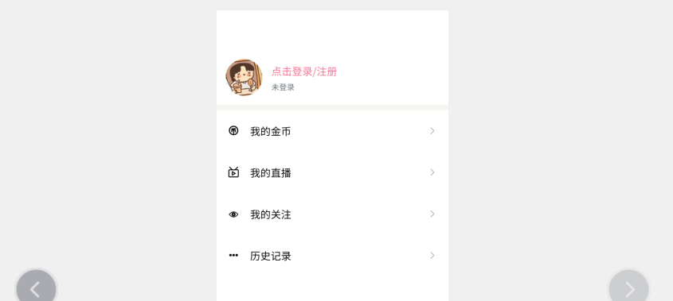

# 个人中心

## 基本模板



```html
<template>
	<view >
		<view style="height: 130rpx;"></view>

		<view @click="goLogin" class="my-head p-3 flex align-center">
			<image src="../../static/info/title.jpg" mode="" class="rounded-circle bg-light flex-shrink"></image>
			<view class="flex flex-column pl-3 flex-1">
				<view class="font-md cili-text-main">点击登录/注册</view>
				<text class="font-sm text-muted">未登录</text>
			</view>
		</view>
		
		<!-- <view class="my-head p-3 pr-0 flex align-center" >
			<image src="../../static/info/title.jpg" mode="" class="rounded-circle bg-light flex-shrink"></image>
			<view class="flex flex-column pl-3 flex-1">
				<view class="font-md text-dark">
					犬来八荒
					<text class="font-sm text-light-muted ml-2">男</text>
				</view>
				<view class="vip"><text class="rounded">正式会员</text></view>
			</view>
			<view class="text-muted text-center flex justify-center align-center font-sm">
				<text>空间</text>
				<text class="pr-1   iconfont  font-md ">1</text>
			</view>
		</view> -->
		
		<view class="f-divider"></view>
		<ci-list-item icon="iconBbi_ font-weight-bold" title="我的金币" ></ci-list-item>
		<ci-list-item icon="icon02 font-weight-bold" title="我的直播" ></ci-list-item>
		<ci-list-item icon="iconguanzhu01 font-weight-bold" title="我的关注" ></ci-list-item>
		<ci-list-item icon="icongengduo font-weight-bold" title="历史记录" ></ci-list-item>
		
		
		
		

		
	</view>
</template>

<script>
import ciListItem from '@/components/common/ci-list-item.vue';

export default {
	components: {
		ciListItem
		

	},
	data() {
		return {
			
			
			
		};
	},
	methods:{
		goLogin(){
			uni.navigateTo({
				url:'../login/login',
				animationType: 'pop-in',
				animationDuration: 200
			})
		}
	}
	
	
	
};
</script>

<style lang="scss">
.my-head {
	image {
		width: 120upx;
		height: 120upx;
	}
	.vip {
		text {
			border: 1px solid #f57498;
			color: #f77398;
			font-weight: 600;
			font-size: 25upx;
		}
	}
}
.headBlock {
	height: var(--status-bar-height);
}
</style>

```

## 用户状态判断

```js
import {mapState} from ' vuex'
export default {
	computed:{
		...mapState(['user'])
	}
};
```

```html
<view @click="goLogin" v-if='!user'>
	<!-- 注册逻辑 -->	
</view>
<view  v-else>
	<!-- 登录逻辑 -->	
</view>
```

```js
initUser({
    state
}) {
    let u = uni.getStorageSync('user')
    let token = uni.getStorageSync('token')
    if (u) {
        $H.get('/user/info',{
            token:true,
            noJump:true,
            toast:false
        })
    }
},
```


