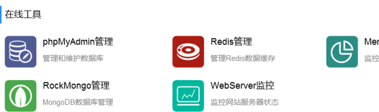

# 用户

## 用户注册

```js
router.post('/api/reg', controller.api.user.reg);
```

app/controller/api/user.js

```js
// 引入模块
const crypto = require('crypto');

    // 注册
    async reg() {
        let { ctx, app } = this;
        // 参数验证
        ctx.validate({
            username: {
                type: 'string',
                required: true,
                range: {
                    min: 5,
                    max: 20
                },
                desc: '用户名'
            },
            password: {
                type: 'string',
                required: true,
                desc: '密码'
            },
            repassword: {
                type: 'string',
                required: true,
                desc: '确认密码'
            }
        }, {
            equals: [
                ['password', 'repassword']
            ]
        });
        let { username, password } = ctx.request.body;
        // 验证用户是否已经存在
        if (await app.model.User.findOne({
            where: {
                username,
            }
        })) {
            ctx.throw(400, '用户名已存在');
        }
        // 创建用户
        let user = await app.model.User.create({
            username,
            password
        });
        if (!user) {
            ctx.throw(400, '创建用户失败');
        }
        ctx.apiSuccess(user);
    }
```


## JWT鉴权配置

jwt可以把token还原。

jwt 加密鉴权生成token 插件地址：

> https://www.npmjs.com/package/egg-jwt

安装

```js
npm i egg-jwt --save
```

配置

```js
// {app_root}/config/plugin.js
exports.jwt = {
  enable: true,
  package: "egg-jwt"
};

// {app_root}/config/config.default.js
config.jwt = {
  secret: '？？？？？？？？？'
};
```

安装crypto模块

> npm i crypto --save

```js
// app/extend/context.js
// 引入模块
const crypto = require('crypto');
// token生成
getToken(value) {
    return this.app.jwt.sign(value, this.app.config.jwt.secret);
},
// token验证
checkToken(token) {
    return this.app.jwt.verify(token, this.app.config.jwt.secret);
},
// 验证密码
async checkPassword(password, hash_password) {
    // 先对需要验证的密码进行crypto加密
    const hmac = crypto.createHash("sha256", this.app.config.crypto.secret);
    hmac.update(password);
    password = hmac.digest("hex");
    let res = password === hash_password;
    if (!res) {
        this.throw(400, '密码错误');
    }
    return true;
}
```

## redis缓存插件安装

- 使用集成环境upupwank自带的redis



- 使用集成环境upupwank自带的redis

redis 缓存插件和封装 安装

```
npm i egg-redis --save
```

配置

```js
// config/plugin.js
exports.redis = {
  enable: true,
  package: 'egg-redis',
};

// redis存储
config.redis = {
    client: {
        port: 6379,          // Redis port
        host: '127.0.0.1',   // Redis host
        password: '',
        db: 2,  //db2作为缓存
    },
}
```

缓存库封装

设置缓存: set(key,value,time) 单位:秒，如果不传默认永久有效

```js
//controller/xx.js
await this.service.cache.set('user_' + user.id, token)
```

```js
// app/service/cache.js
'use strict';

const Service = require('egg').Service;

class CacheService extends Service {
    /**
     * 获取列表
     * @param {string} key 键
     * @param {boolean} isChildObject 元素是否为对象
     * @return { array } 返回数组
     */
    async getList(key, isChildObject = false) {
        const { redis } = this.app
        let data = await redis.lrange(key, 0, -1)
        if (isChildObject) {
            data = data.map(item => {
                return JSON.parse(item);
            });
        }
        return data;
    }
    /**
     * 设置列表
     * @param {string} key 键
     * @param {object|string} value 值
     * @param {string} type 类型：push和unshift
     * @param {Number} expir 过期时间 单位秒
     * @return { Number } 返回索引
     */
    async setList(key, value, type = 'push', expir = 0) {
        const { redis } = this.app
        if (expir > 0) {
            await redis.expire(key, expir);
        }
        if (typeof value === 'object') {
            value = JSON.stringify(value);
        }
        if (type === 'push') {
            return await redis.rpush(key, value);
        }
        return await redis.lpush(key, value);
    }

    /**
     * 设置 redis 缓存
     * @param { String } key 键
     * @param {String | Object | array} value 值
     * @param { Number } expir 过期时间 单位秒
     * @return { String } 返回成功字符串OK
     */
    async set(key, value, expir = 0) {
        const { redis } = this.app
        if (expir === 0) {
            return await redis.set(key, JSON.stringify(value));
        } else {
            return await redis.set(key, JSON.stringify(value), 'EX', expir);
        }
    }

    /**
     * 获取 redis 缓存
     * @param { String } key 键
     * @return { String | array | Object } 返回获取的数据
     */
    async get(key) {
        const { redis } = this.app
        const result = await redis.get(key)
        return JSON.parse(result)
    }

    /**
     * redis 自增
     * @param { String } key 键
     * @param { Number } value 自增的值 
     * @return { Number } 返回递增值
     */
    async incr(key, number = 1) {
        const { redis } = this.app
        if (number === 1) {
            return await redis.incr(key)
        } else {
            return await redis.incrby(key, number)
        }
    }

    /**
     * 查询长度
     * @param { String } key
     * @return { Number } 返回数据长度
     */
    async strlen(key) {
        const { redis } = this.app
        return await redis.strlen(key)
    }

    /**
     * 删除指定key
     * @param {String} key 
     */
    async remove(key) {
        const { redis } = this.app
        return await redis.del(key)
    }

    /**
     * 清空缓存
     */
    async clear() {
        return await this.app.redis.flushall()
    }
}
module.exports = CacheService;
```

## 登陆逻辑

>验证用户是否存在
>
>验证密码
>
>根据user生成token，放入user对象
>
>token加入服务端redis缓存，代表登陆成功

控制器：app/controller/api/user.js

```js
// 登录
async login() {
    const { ctx, app } = this;
    // 参数验证
    ctx.validate({
        username: {
            type: 'string',
            required: true,
            desc: '用户名'
        },
        password: {
            type: 'string',
            required: true,
            desc: '密码'
        },
    });
    let { username, password } = ctx.request.body;
    // 验证该用户是否存在|验证该用户状态是否启用
    let user = await app.model.User.findOne({
        where: {
            username,
        }
    });
    if (!user) {
        ctx.throw(400, '用户不存在或已被禁用');
    }
    // 验证密码
    await ctx.checkPassword(password, user.password);

    user = JSON.parse(JSON.stringify(user));
    // 生成token
    let token = ctx.getToken(user);
    user.token = token;
    delete user.password;
    // 加入缓存中
    if (!await this.service.cache.set('user_' + user.id, token)) {
        ctx.throw(400, '登录失败');
    }
    // 返回用户信息和token
    return ctx.apiSuccess(user);
}
```

```js
// 用户登录
router.post('/api/login', controller.api.user.login);
```

## 权限验证中间件

- 前端传来的token放到header头，后端会在header头拿到token，判断是否存在这个token

```js
//let token = uni.getStorageSync('token')
//options.header.token = token

request.post('/logout',{},{token:true})
```

中间件：app/middleware/auth.js

```js
module.exports = (option, app) => {
    return async (ctx, next) => {
        //1. 获取 header 头token
        let token = ctx.header.token || ctx.query.token;
        if (!token) {
            ctx.throw(400, '您没有权限访问该接口!');
        }
        //2. 根据token解密，换取用户信息
        let user = {};
        try {
            user = ctx.checkToken(token);
        } catch (error) {
            let fail = error.name === 'TokenExpiredError' ? 'token 已过期! 请重新获取令牌' : 'Token 令牌不合法!';
            ctx.throw(400, fail);
        }
        //3. 判断当前用户是否登录
        let t = await ctx.service.cache.get('user_' + user.id);
        if (!t || t !== token) {
            ctx.throw(400, 'Token 令牌不合法!');
        }

        //4. 获取当前用户，验证当前用户是否被禁用
        user = await app.model.User.findByPk(user.id);
        if (!user) {
            ctx.throw(400, '用户不存在或已被禁用');
        }
        // 5. 把 user 信息挂载到全局ctx上
        ctx.authUser = user;

        await next();
    }
}
```

配置：config/config.default.js

```js
config.middleware = [
    //...
    'auth',
    // ...
];
config.auth = {
    match: [
      '/api/logout',
      '/api/live/create',
      '/api/live/changestatus',
      '/api/gift/wxpay',
      '/api/user/info',
    ]
  };
```

## 退出登录

```js
// 退出登录
async logout() {
    const { ctx, service } = this;
    // 拿到当前用户id
    let current_user_id = ctx.authUser.id;
    // 移除redis当前用户信息
    if (!await service.cache.remove('user_' + current_user_id)) {
        ctx.throw(400, '退出登录失败');
    }
    ctx.apiSuccess('退出成功');
}
```


## 获取当前用户信息

控制器：app/controller/api/user.js

```js
// 获取当前用户信息
async info(){
    const { ctx } = this;
    let user = ctx.authUser
    return ctx.apiSuccess(JSON.parse(JSON.stringify(user)))
}
```

```js
router.get('/api/user/info', controller.api.user.info);
```