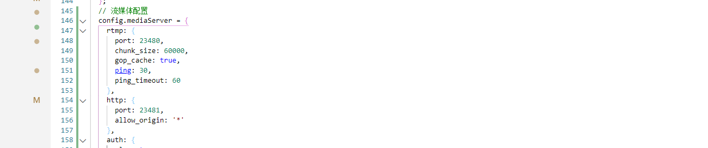

# 直播间

## 搭建直播服务器

```
npm install node-media-server --save
```

文档：https://github.com/illuspas/Node-Media-Server/blob/master/README_CN.md

配置：config/config.default.js

```js
// 流媒体配置
config.mediaServer = {
    rtmp: {
        port: 23480,
        chunk_size: 60000,
        gop_cache: true,
        ping: 30,
        ping_timeout: 60
    },
    http: {
        port: 23481,
        allow_origin: '*'
    },
    auth: {
        play: true,
        publish: true,
        secret: 'nodemedia2017privatekey',
    },
};
```

启动流媒体服务：app.js

- 根目录新建app.js,https://eggjs.org/zh-cn/basics/app-start.html

```
配置文件即将加载，这是最后动态修改配置的时机（configWillLoad）
配置文件加载完成（configDidLoad）
文件加载完成（didLoad）	(这里可以启动自定义服务，所以在这里写)
插件启动完毕（willReady）
worker 准备就绪（didReady）
应用启动完成（serverDidReady）  (http已经启动)
应用即将关闭（beforeClose）
```

- https://www.npmjs.com/package/node-media-server#event-callback事件

```js
// app.js
// 引入
const NodeMediaServer = require('node-media-server');
class AppBootHook {
    constructor(app) {
        this.app = app;
    }

    configWillLoad() {
        // 此时 config 文件已经被读取并合并，但是还并未生效
        // 这是应用层修改配置的最后时机
        // 注意：此函数只支持同步调用
    }

    async didLoad() {
        // 所有的配置已经加载完毕
        // 可以用来加载应用自定义的文件，启动自定义的服务
        // 启动流媒体服务
        if (!this.app.nms) { //如果没有这个事件，就启动他
            //使用nms关键字接受
            this.app.nms = new NodeMediaServer(this.app.config.mediaServer)
            //运行
            this.app.nms.run();
			
            this.app.nms.on('preConnect', (id, args) => {
                console.log('[NodeEvent on preConnect]', `id=${id} args=${JSON.stringify(args)}`);
                // let session = nms.getSession(id);
                // session.reject();
            });

            this.app.nms.on('postConnect', (id, args) => {
                console.log('[NodeEvent on postConnect]', `id=${id} args=${JSON.stringify(args)}`);
            });

            this.app.nms.on('doneConnect', (id, args) => {
                console.log('[NodeEvent on doneConnect]', `id=${id} args=${JSON.stringify(args)}`);
            });

            this.app.nms.on('prePublish', (id, StreamPath, args) => {
                console.log('[NodeEvent on prePublish]', `id=${id} StreamPath=${StreamPath} args=${JSON.stringify(args)}`);
                // let session = nms.getSession(id);
                // session.reject();
            });

            this.app.nms.on('postPublish', (id, StreamPath, args) => {
                console.log('[NodeEvent on postPublish]', `id=${id} StreamPath=${StreamPath} args=${JSON.stringify(args)}`);
            });

            this.app.nms.on('donePublish', (id, StreamPath, args) => {
                console.log('[NodeEvent on donePublish]', `id=${id} StreamPath=${StreamPath} args=${JSON.stringify(args)}`);
            });

            this.app.nms.on('prePlay', (id, StreamPath, args) => {
                console.log('[NodeEvent on prePlay]', `id=${id} StreamPath=${StreamPath} args=${JSON.stringify(args)}`);
                // let session = nms.getSession(id);
                // session.reject();
            });

            this.app.nms.on('postPlay', (id, StreamPath, args) => {
                console.log('[NodeEvent on postPlay]', `id=${id} StreamPath=${StreamPath} args=${JSON.stringify(args)}`);
            });

            this.app.nms.on('donePlay', (id, StreamPath, args) => {
                console.log('[NodeEvent on donePlay]', `id=${id} StreamPath=${StreamPath} args=${JSON.stringify(args)}`);
            });
        }
    }

    async willReady() {
        // 所有的插件都已启动完毕，但是应用整体还未 ready
        // 可以做一些数据初始化等操作，这些操作成功才会启动应用
    }

    async didReady() {
        // 应用已经启动完毕
    }

    async serverDidReady() {
        // http / https server 已启动，开始接受外部请求
        // 此时可以从 app.server 拿到 server 的实例

        // this.app.server.on('timeout', socket => {
        //     // handle socket timeout
        // });
    }
}

module.exports = AppBootHook;
```


## 逻辑整理

- 需要生成签名
- [鉴权验证](https://github.com/illuspas/Node-Media-Server/blob/master/README_CN.md#%E9%89%B4%E6%9D%83%E9%AA%8C%E8%AF%81)



```js
推流(主播)
rtmp://hostname:port/appname/stream?sign=expires-HashValue
协议 	 域名     端口    地址    唯一key   签名加密
例子：
rtmp://127.0.0.1:23480/live/key?sign=xxxxxxxxxxxxx

拉流(观众)  
http://hostname:port/appname/stream.flv?sign=expires-HashValue

http://127.0.0.1:23481/live/key.flv?sign=expires-HashValue


//加密签名
let key = ctx.randomString(20);
const secret = app.config.mediaServer.auth.secret
const expire = parseInt((Date.now() + 100000000) / 1000);
hashValue = md5(`/live/${key}-${expire}-${secret}`);
```

## 创建直播间api

```
cnpm i md5 --save
```

控制器：app/controller/api/live.js

```js
'use strict';

const Controller = require('egg').Controller;
const await = require('await-stream-ready/lib/await');
// 引入模块
const md5 = require('md5');
class LiveController extends Controller {
    // 创建直播间
    async save() {
        let { ctx,app } = this;
        let user_id = ctx.authUser.id

        // 参数验证
        ctx.validate({
            title:{
                required:true,
                type:"string",
                desc:"直播间标题"
            },
            cover:{
                required:true,
                type:"string",
                desc:"直播间封面"
            }
        })

        let {
            title,cover
        } = ctx.request.body

        // 生成唯一id
        let key = ctx.randomString(20)

        let res = await app.model.Live.create({
            title,
            cover,
            key,
            user_id
        })

        // 生成签名
        let sign = this.sign(key)

        ctx.apiSuccess({
            data:res,
            sign
        })

    }

    // 生成签名
    sign(key){
        let { ctx,app } = this
        const secret = app.config.mediaServer.auth.secret
        let expire = parseInt((Date.now() + 100000000) / 1000)
        let hashValue = md5(`/live/${key}-${expire}-${secret}`)
        return `${expire}-${hashValue}`
    }

}

module.exports = LiveController;

```

扩展：app/extend/context.js

```js
randomString(length) {
    const chars = '0123456789abcdefghijklmnopqrstuvwxyzABCDEFGHIJKLMNOPQRSTUVWXYZ';
    var result = '';
    for (var i = length; i > 0; --i) result += chars[Math.floor(Math.random() * chars.length)];
    return result;
},
```

路由：app/router.js

```js
// 创建直播间
router.post('/api/live/create', controller.api.live.save);
```

## obs推流拉流调试

```
推流(主播)

rtmp://127.0.0.1:7001/live/key?sign=xxxxxxxxxxxxx

拉流(观众)  
http://hostname:port/appname/stream.flv?sign=expires-HashValue

http://host:7001/live/key.flv?sign=expires-HashValue


//加密签名
let key = ctx.randomString(20);
const secret = app.config.mediaServer.auth.secret
const expire = parseInt((Date.now() + 100000000) / 1000);
hashValue = md5(`/live/${key}-${expire}-${secret}`);
```


```js
{
    "msg": "ok",
    "data": {
        "data": {
            "created_time": "2020-10-13 17:16:35",
            "cover": "",
            "look_count": 0,
            "coin": 0,
            "status": 0,
            "id": 1,
            "title": "测试直播间",
            "key": "L3V8KhRHin40gNug58zy",
            "user_id": 12,
            "updated_time": "2020-10-13T09:16:35.661Z",
            "userId": 12
        },
        "sign": "1602680596-95e13144c935f3fbb045d8fe06374297"
    }
}
```

替换

```
推流(主播)
rtmp://127.0.0.1:23480/live/L3V8KhRHin40gNug58zy?sign=1602680596-95e13144c935f3fbb045d8fe06374297

拉流(观众)  
http://127.0.0.1:23481/live/L3V8KhRHin40gNug58zy.flv?sign=1602680596-95e13144c935f3fbb045d8fe06374297

```

安装OBS

- 配置完毕服务器，开始推流
- 串流密钥就是live/后面的key


前端修改拉流链接

```html
<video class="flex-1" src="http://192.168.101.10:23481/live/L3V8KhRHin40gNug58zy.flv?sign=1602680596-95e13144c935f3fbb045d8fe06374297" autoplay :controls="false"></video>
```


## 修改直播间状态api

直播间总共有4个状态

- 0未开播

- 1直播中
- 2暂停直播
- 3停止直播

控制器:app/controller/api/live.js

使用方法:

```
//id:直播间id
//type:直播间状态
post('/api/live/changestatus',{id,type},{token:true})
```

```js
// 修改直播间状态
async changestatus() {
    let { ctx, app } = this;
    let user_id = ctx.authUser.id;
    // 参数验证
    ctx.validate({
        id: {
            type: 'int',
            required: true,
            desc: '直播间ID'
        },
        type: {
            type: 'string',
            required: true,
            range: {
                in: ['play', 'pause', 'stop']
            }
        }
    })
    let { id, type } = ctx.request.body

    let live = await app.model.Live.findOne({
        where: {
            id,
            user_id
        }
    });

    if (!live) {
        return ctx.apiFail('该直播间不存在');
    }

    if (live.status === 3) {
        return ctx.apiFail('该直播间已结束');
    }

    const status = {
        play: 1,
        pause: 2,
        stop: 3
    }

    live.status = status[type]
    await live.save()

    return ctx.apiSuccess('ok')
}
```

```js
// 修改直播间状态
router.post('/api/live/changestatus', controller.api.live.changestatus);
```

```js
config.userAuth = {
    match: [
        '/api/live/changestatus',
    ]
};
```


## 直播间列表分页

控制器：app/controller/api/live.js

```js
async list() {
    let { ctx, app } = this;
    ctx.validate({
        page: {
            required: true,
            desc: "页码",
            type: "int"
        }
    });
	
    //一页十条
    let page = ctx.params.page
    let limit = 10
    let offset = (page - 1) * limit

    let rows = await app.model.Live.findAll({
        limit, offset
    })

    ctx.apiSuccess(rows)
}

```

```js
// 直播间列表
router.get('/api/live/list/:page', controller.api.live.list);
```

## 查看指定直播间api

- 需要拿到拉流的key和签名组成链接

控制器：app/controller/api/live.js

```js
// 查看指定直播间
async read() {
    const { ctx, app } = this;
    // 参数验证
    ctx.validate({
        id: {
            required: true,
            desc: "直播间ID",
            type: "int"
        }
    })
	//获取指定直播间id
    const id = ctx.params.id;
	//查找到直播间和对应的主播信息
    let live = await app.model.Live.findOne({
        where: {
            id,
        },
        include: [{
            model: app.model.User,
            attributes: ['id', 'username', 'avatar']
        }]
    });
    
    //如果live没有，说明直播间不存在
    if (!live) {
        return ctx.apiFail('当前直播间不存在');
    }

    // 生成签名
    let sign =null;
    if(live.status!==3){//没有结束直播时，生成签名
         this.sign(live.key);
    }

    live = JSON.parse(JSON.stringify(live))

    ctx.apiSuccess({
        data: live,
        sign
    })

}
// 生成签名
sign(key){
    let { ctx,app } = this
    const secret = app.config.mediaServer.auth.secret
    let expire = parseInt((Date.now() + 100000000) / 1000)
    let hashValue = md5(`/live/${key}-${expire}-${secret}`)
    return `${expire}-${hashValue}`
}
```

```js
// 查看直播间
router.get('/api/live/read/:id', controller.api.live.read);
```

```
{
    "msg": "ok",
    "data": {
        "data": {
            "created_time": "1222-1-13 17:16:35",
            "id": 1,
            "title": "测试直播间",
            "cover": "",
            "user_id": 12,
            "look_count": 0,
            "coin": 0,
            "key": "L3V8KhRHin40gNug58zy",
            "status": 1,
            "updated_time": "1222-10-13T10:04:51.000Z",
            "userId": 12,
            "user": {
                "id": 12,
                "username": "ceshi1",
                "avatar": ""
            }
        },
        "sign": "1602691779-4c4cde8b52e829a17a6baf5b6c404ada"
    }
}
```

## socket.io安装和通讯

- 按照官网的教程安装就可以。

安装

```js
npm i egg-socket.io --save
```

> 文档地址：https://eggjs.org/zh-cn/tutorials/socketio.html

配置：

```js
// config/plugin.js
io: {
    enable: true,
    package: 'egg-socket.io',
},

// config/config.default.js
config.io = {
    init: {
      wsEngine: 'ws',//ws引擎
    },
    namespace: {
      '/': {
        connectionMiddleware: [
          'auth',//连接中间件
        ],
        packetMiddleware: [],
      }
    },
    redis: { //redis存储的db不能和其他的一样！！！
      host: '127.0.0.1',
      port: 6379,
      db: 3,
    },
  };
```

部署: package.json

```json
{
  "scripts": {
          "start": "egg-scripts start --daemon --title=egg-server-cilicl-live --sticky",
    "dev": "egg-bin dev --sticky",
    "start": "egg-scripts start --sticky"
  }
}
```

Nginx 配置

```
location / {
  proxy_set_header Upgrade $http_upgrade;
  proxy_set_header Connection "upgrade";
  proxy_set_header X-Forwarded-For $proxy_add_x_forwarded_for;
  proxy_set_header Host $host;
  proxy_pass   http://127.0.0.1:7001;

  # http://nginx.org/en/docs/http/ngx_http_proxy_module.html#proxy_bind
  # proxy_bind       $remote_addr transparent;
}
```

socket.io插件控制器：app/io/controller/nsp.js

```js
'use strict';

const Controller = require('egg').Controller;
const PREFIX = 'room';
class NspController extends Controller {
    async checkToken(token){
        const { ctx, app, service, helper } = this;
        const nsp = app.io.of('/');
        const socket = ctx.socket;
        const id = socket.id;

        // 用户验证
        if (!token) {
            socket.emit(id, ctx.helper.parseMsg('error', '您没有权限访问该接口!'));
            return false
        }
        //2. 根据token解密，换取用户信息
        let user = {};
        try {
            user = ctx.checkToken(token);
        } catch (error) {
            let fail = error.name === 'TokenExpiredError' ? 'token 已过期! 请重新获取令牌' : 'Token 令牌不合法!';
            socket.emit(id, ctx.helper.parseMsg('error', fail));
            return false
        }
        //3. 判断当前用户是否登录
        let t = await ctx.service.cache.get('user_' + user.id);
        if (!t || t !== token) {
            socket.emit(id, ctx.helper.parseMsg('error', 'Token 令牌不合法!'));
            return false
        }

        //4. 获取当前用户，验证当前用户是否被禁用
        user = await app.model.User.findByPk(user.id);
        if (!user) {
            socket.emit(id, ctx.helper.parseMsg('error', '用户不存在或已被禁用'));
            return false
        }

        return user
    }
    // 直播间发送消息
    async comment() {
        const { ctx, app, service, helper } = this;
        const nsp = app.io.of('/');
        const message = ctx.args[0] || {};
        const socket = ctx.socket;
        const id = socket.id;

        const { live_id, data,token } = message;

        let user = await this.checkToken(token)
        if(!user){
            return
        }

        try {
            // 验证当前直播间是否存在且是否处于开播中
            let msg = await service.live.checkStatus(live_id)
            if (msg) {
                socket.emit(id, ctx.helper.parseMsg('error', msg));
                return
            }

            const room = 'live_' + live_id
            // 推送消息到直播间
            nsp.to(room).emit('comment', {
                user: {
                    id: user.id,
                    name: user.nickname || user.username,
                    avatar: user.avatar,
                },
                content: data
            });

            app.model.Comment.create({
                content: data,
                live_id,
                user_id: user.id
            })

        } catch (error) {
            app.logger.error(error);
        }
    }

    // 进入直播间
    async joinLive() {
        const { ctx, app, service, helper } = this;
        const nsp = app.io.of('/');
        const message = ctx.args[0] || {};
        const socket = ctx.socket;
        const id = socket.id;

        const { live_id,token } = message;

        let user = await this.checkToken(token)
        if(!user){
            return
        }

        // 验证当前直播间是否存在且是否处于开播中
        let msg = await service.live.checkStatus(live_id)
        if (msg) {
            socket.emit(id, ctx.helper.parseMsg('error', msg));
            return
        }

        const room = 'live_' + live_id
        // 用户加入
        console.log('#join', room);
        socket.join(room);

        const rooms = [room];
        // 在线列表
        // nsp.adapter.clients(rooms, (err, clients) => {
        //     console.log('#online_join', clients);
        // });

        // 加入存储中
        let list = await service.cache.get('userList_' + room);
        list = list ? list : [];
        list = list.filter(item => item.id !== user.id)
        list.unshift({
            id: user.id,
            name: user.nickname || user.username,
            avatar: user.avatar,
        })
        service.cache.set('userList_' + room, list)

        // 更新在线用户列表
        nsp.adapter.clients(rooms, (err, clients) => {
            console.log('#online_join', clients);
            nsp.to(room).emit('online', {
                clients,
                action: 'join',
                user: {
                    id: user.id,
                    name: user.nickname || user.username,
                    avatar: user.avatar,
                },
                data: list
            });
        });

        // 加入播放历史记录
        let liveUser = await app.model.LiveUser.findOne({
            where: {
                user_id: user.id,
                live_id
            }
        })
        if (!liveUser) {
            app.model.LiveUser.create({
                user_id: user.id,
                live_id
            })
            // 总观看人数+1
            let live = await service.live.exist(live_id)
            live.increment({
                look_count: 1
            })
        }

    }

    // 离开直播间
    async leaveLive() {
        const { ctx, app, service, helper } = this;
        const nsp = app.io.of('/');
        const message = ctx.args[0] || {};
        const socket = ctx.socket;
        const id = socket.id;

        const { live_id,token } = message;

        let user = await this.checkToken(token)
        if(!user){
            return
        }

        // 验证当前直播间是否存在且是否处于开播中
        let msg = await service.live.checkStatus(live_id)
        if (msg) {
            socket.emit(id, ctx.helper.parseMsg('error', msg));
            return
        }

        const room = 'live_' + live_id
        // 用户离开
        console.log('#leave', room);
        socket.leave(room);

        const rooms = [room];
        // 在线列表
        nsp.adapter.clients(rooms, (err, clients) => {
            console.log('#online_join', clients);

            // 更新在线用户列表
            nsp.to(room).emit('online', {
                clients,
                action: 'leave',
                user: {
                    id: user.id,
                    name: user.nickname || user.username,
                    avatar: user.avatar,
                },
            });
        });

        let list = await service.cache.get('userList_' + room);
        if (list) {
            list = list.filter(item => item.id !== user.id)
            service.cache.set('userList_' + room, list)
        }
    }

    // 直播间送礼物
    async gift() {
        const { ctx, app, service, helper } = this;
        const nsp = app.io.of('/');
        const message = ctx.args[0] || {};
        const socket = ctx.socket;
        const id = socket.id;

        const { live_id, gift_id, token } = message;

        let user = await this.checkToken(token)
        if(!user){
            return
        }

        try {
            // 验证当前直播间是否存在且是否处于开播中
            let live = await service.live.checkStatus(live_id,true)
            if (typeof live === 'string') {
                socket.emit(id, ctx.helper.parseMsg('error', live));
                return
            }

            // 验证礼物是否存在
            let gift = await app.model.Gift.findOne({
                where: { id: gift_id }
            })
            if (!gift) {
                socket.emit(id, ctx.helper.parseMsg('error', '该礼物不存在'));
                return
            }
            // 金币不足
            if (user.coin < gift.coin) {
                socket.emit(id, ctx.helper.parseMsg('error', '金币不足，请先充值'));
                return
            }
            // 扣除金币
            user.coin -= gift.coin
            await user.save()

            // 写入礼物记录表
            app.model.LiveGift.create({
                live_id,
                user_id: user.id,
                gift_id
            })

            // 直播间增加金币数
            live.coin += gift.coin
            live.save()

            const room = 'live_' + live_id
            // 推送消息到直播间
            nsp.to(room).emit('gift', {
                avatar: user.avatar,
                username: user.nickname || user.username,
                gift_image: gift.image,
                gift_name: gift.name,
                num: 1
            });

        } catch (error) {
            app.logger.error(error);
        }
    }
}

module.exports = NspController;
```

扩展：app/extend/helper.js

```js
module.exports = {
  parseMsg(action, payload = {}, metadata = {}) {
    const meta = Object.assign({}, {
      timestamp: Date.now(),
    }, metadata);

    return {
      meta,
      data: {
        action,
        payload,
      },
    };
  },
}
```

插件路由：app/router.js

```js
  io.of('/').route('comment', io.controller.nsp.comment);
  io.of('/').route('joinLive', io.controller.nsp.joinLive);
  io.of('/').route('leaveLive', io.controller.nsp.leaveLive);
  io.of('/').route('gift', io.controller.nsp.gift);
```

### token验证

```js
//验证用户token
async checkToken() {
    const { ctx, app, service, helper } = this;
    const socket = ctx.socket
    const id = socket.id

    // 用户验证
    if (!token) {
        // 通知前端，您没有服务该接口权限
        socket.emit(id, ctx.helper.parseMsg('error', '用户未登录'))
    }

    let user = {}
    try {
        user = ctx.checkToken(token)
    } catch (err) {
        let fail = error.name === 'TokenExpiredError' ? '登录已过期,请重新登陆' : 'Token 令牌不合法!';
        socket.emit(id, ctx.helper.parseMsg('error', fail))
        return false
    }
    // 判断用户是否登录
    let t = await ctx.service.cache.get('user_' + user.id)
    if (!t || t !== token) {
        socket.emit(id, ctx.helper.parseMsg('error', 'Token 令牌不合法!'))
        return false
    }

    // 4.判断用户是否存在
    user = await app.model.User.findOne({
        where: {
            id: user.id
        }
    })
    if (!user) {
        socket.emit(id, ctx.helper.parseMsg('error', '用户不存在'))
        return false
    }

    return user
}
```

### 进入直播间api

```
- 验证用户token
- 验证直播间是否处于开播状态，获取直播间id
- 把用户的socket加入直播间
- 用户加入redis存储，方便后期其他成员拿到在线情况，因为数据库不如redis读写快
- 更新在线用户列表
- 加入播放历史记录，方便后台查看你的直播间人气
```

```js

```

app\service\live.js

```js
'use strict';

const await = require('await-stream-ready/lib/await');

const Service = require('egg').Service;

class LiveService extends Service {
  async exist(id){
    return await this.app.model.Live.findOne({
      where:{
        id
      }
    })
  }
  async checkStatus(id) {
    let live = await this.app.model.Live.fondOne({
      where: {
        id
      }
    })

    if (!live) {
      return '直播间不存在'
    } else if (live.status == 0) {
      return '未开播'
    } else if (live.status == 3) {
      return '直播已结束'
    }
    return false

  }
}

module.exports = LiveService;

```

