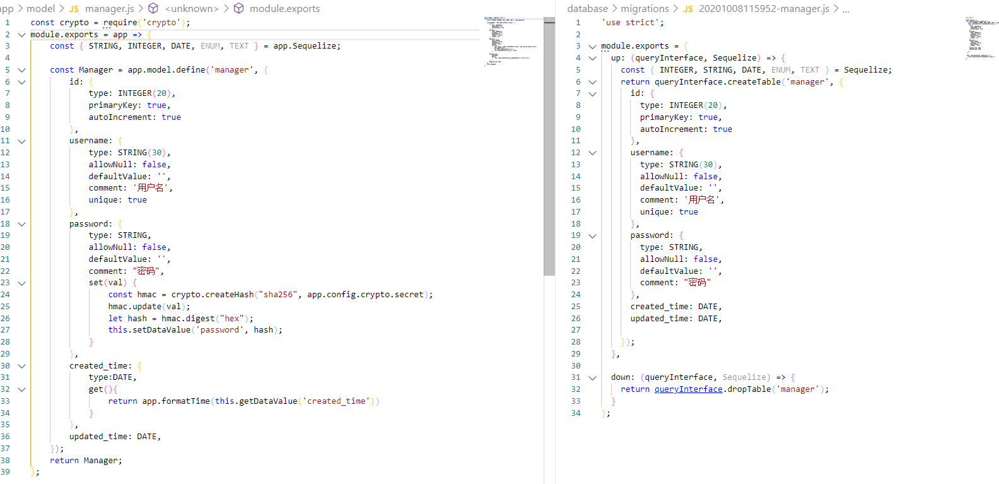

# 管理员模块

## 迁移文件和model文件对比



## 新增管理员

创建数据迁移表

```js
npx sequelize migration:generate --name=manager
```

1.执行完命令后，会在database / migrations / 目录下生成数据表迁移文件，然后定义

```js
'use strict';

module.exports = {
  up: (queryInterface, Sequelize) => {
    const { INTEGER, STRING, DATE, ENUM, TEXT } = Sequelize;
    return queryInterface.createTable('manager', {
      id: {
        type: INTEGER(20),
        primaryKey: true,
        autoIncrement: true
      },
      username: {
        type: STRING(30),
        allowNull: false,
        defaultValue: '',
        comment: '用户名',
        unique: true
      },
      password: {
        type: STRING,
        allowNull: false,
        defaultValue: '',
        comment: "密码"
      },
      created_time: DATE,
      updated_time: DATE,

    });
  },

  down: (queryInterface, Sequelize) => {
    return queryInterface.dropTable('manager');
  }
};
```

模型 app\model\manager.js

> 安装 crypto 模块
>
> 1. 安装

```js
npm install crypto --save
```

1. 配置文件配置 config / config.default.js

```js
config.crypto = {
    secret:  '？？？？？？？？？？？？？？？？'
};
const crypto = require('crypto');
module.exports = app => {
    const { STRING, INTEGER, DATE, ENUM, TEXT } = app.Sequelize;

    const Manager = app.model.define('manager', {
        id: {
            type: INTEGER(20),
            primaryKey: true,
            autoIncrement: true
        },
        username: {
            type: STRING(30),
            allowNull: false,
            defaultValue: '',
            comment: '用户名',
            unique: true
        },
        password: {
            type: STRING,
            allowNull: false,
            defaultValue: '',
            comment: "密码",
            set(val) {
                const hmac = crypto.createHash("sha256", app.config.crypto.secret);
                hmac.update(val);
                let hash = hmac.digest("hex");
                this.setDataValue('password', hash);
            }
        },
        created_time: {
            type:DATE,
            get(){ 
                return app.formatTime(this.getDataValue('created_time'))
            }
        },
        updated_time: DATE,
    });
    return Manager;
};
```

封装格式化时间方法：app\extend\application.js

```js
module.exports = {
    formatTime(time){
        let d = new Date(time);  
        const Month = (d.getMonth() + 1) >= 10 ? (d.getMonth() + 1) : '0'+(d.getMonth() + 1)
        const Day = d.getDate() >= 10 ? d.getDate() : '0' + d.getDate()
        const h = d.getHours() >= 10 ? d.getHours() : '0' + d.getHours()
        const m = d.getMinutes() >= 10 ? d.getMinutes() : '0' + d.getMinutes()
        const s = d.getSeconds() >= 10 ? d.getSeconds() : '0' + d.getSeconds()
        return d.getFullYear() + '-' + Month + '-' + Day + ' ' + h + ':' + m + ':' + s;
    }
};
```

控制器：app\controller\manager.js

```js
    // 新增页面
    async create() {
        const { ctx, app } = this;
        // 渲染公共模板
        await ctx.renderTemplate({
            // 页面标题
            title: "创建管理员",
            // 模板类型 form表单，table表格分页
            tempType: "form",
            // 表单配置
            form: {
                // 提交地址
                action: "/admin/manager",
                // 字段配置
                fields:[{
                    label: "用户名",
                    type: "text",
                    name: "username",
                    placeholder: "用户名",
                }, {
                    label: "密码",
                    type: "text",
                    name: "password",
                    placeholder: "密码"
                }]
            },
            // 新增成功跳转路径
            successUrl:"/admin/manager"
        })
    }
    // 新增逻辑
    async save() {
        const { ctx, app } = this;

        // 参数验证
        ctx.validate({
            username: {
                type: 'string',
                required: true,
                desc: '用户名'
            },
            password: {
                type: 'string',
                required: true,
                desc: '密码'
            },
        });
        let { username, password } = ctx.request.body;

        // 验证用户是否已经存在
        if (await app.model.Manager.findOne({
            where: { username }
        })) {
            ctx.throw(400, '用户名已存在');
        }
        // 创建用户
        let manager = await app.model.Manager.create({
            username,
            password,
        });
        if (!manager) {
            ctx.throw(400, '创建用户失败');
        }
        ctx.apiSuccess(manager);
    }
```

## 模板扩展

context扩展：app\extend\context.js

```js
    // 渲染公共模板
    async renderTemplate(params = {}) {
        // 获取cookie中的消息提示（闪存）
        let toast = this.cookies.get('toast',{
            // 中文需要解密
            encrypt: true
        });
        // 合并到参数中
        params.toast = toast ? JSON.parse(toast) : null
        // 渲染公共模板
        return await this.render('admin/common/template.html', params)
    },
    // 消息提示
    toast(msg,type = 'danger'){
        // 设置消息提示到cookie中
        this.cookies.set('toast',JSON.stringify({
            msg,type
        }),{
            // 过期时间
            maxAge: 1500, 
            // 中文需要加密
            encrypt: true
        });
    }
```

模板部分：app\view\admin\common\template.html

```html
<!--引入主布局-->

<!--替换页面标题-->
 {{ title }} 
```

模板部分：app\view\admin\layout\main_app.html

```html
<!DOCTYPE html>
<html lang="en">
    <head>
        <meta charset="utf-8">
        <meta name="viewport" content="width=device-width, initial-scale=1.0, user-scalable=0">
        <title>后台 - 直播后台</title>
        <!-- Favicon -->
        <link rel="shortcut icon" type="image/x-icon" href="/public/assets/img/favicon.png">
        <!-- Bootstrap CSS -->
        <link rel="stylesheet" href="http://cdn.bootstrapmb.com/bootstrap/4.3.1/css/bootstrap.min.css">
        <!-- Fontawesome CSS -->
        <link rel="stylesheet" href="/public/assets/css/font-awesome.min.css">
        <!-- Feathericon CSS -->
        <link rel="stylesheet" href="/public/assets/css/feathericon.min.css">
        <!-- Main CSS -->
        <link rel="stylesheet" href="/public/assets/css/style.css">
        <!--[if lt IE 9]>
<script src="/public/assets/js/html5shiv.min.js"></script>
<script src="/public/assets/js/respond.min.js"></script>
<![endif]-->
        
        <style>
            [v-cloak] {
                display: none;
            }

            .fade-enter-active,
            .fade-leave-active {
                transition: opacity .3s;
            }

            .fade-enter,
            .fade-leave-to

            /* .fade-leave-active below version 2.1.8 */
            {
                opacity: 0;
            }
        </style>
        <!-- jQuery -->
        <script src="/public/assets/js/jquery-3.2.1.min.js"></script>

        <!-- Bootstrap Core JS -->
        <script src="/public/assets/js/popper.min.js"></script>
        <script src="http://cdn.bootstrapmb.com/bootstrap/4.3.1/js/bootstrap.min.js"></script>

        <!-- Slimscroll JS -->
        <script src="/public/assets/plugins/slimscroll/jquery.slimscroll.min.js"></script>

        <!-- Custom JS -->
        <script src="/public/assets/js/script.js"></script>

        <script src="/public/assets/js/vue.min.js"></script>
        <script src="/public/assets/js/vue.components.js"></script>
    </head>

    <body>

        <!-- Main Wrapper -->
        <div class="main-wrapper" id="vueapp">
            <confirm ref="confirm"></confirm>
            <toast ref="toast"></toast>
            <!-- 公共头部 -->
            
            <!-- /公共头部 -->

            <!-- 公共侧边栏 -->
            
            <!-- /公共侧边栏 -->

            <!-- 页面主布局 -->
            
            <div class="page-wrapper">
                <div class="content container-fluid">
                    <div class="page-header">
                        <div class="row align-items-center">
                            <div class="col">
                                <h3 class="page-title">{{ title }}</h3>
                                <ul class="breadcrumb">
                                    <li class="breadcrumb-item"><a href="/admin">后台首页</a></li>
                                    <li class="breadcrumb-item active">{{ title }}</li>
                                </ul>
                            </div>
                        </div>
                    </div>

                    <div class="row">
                        <div class="col-sm-12">
                            <!--根据不同的模板类型渲染不同模板-->
                            

                            
                            
                            
                            
                            

                            


                        </div>
                    </div>
                </div>
            </div>
            
            <!-- /页面主布局 -->

        </div>
        <!-- /Main Wrapper -->
        
        
        <script>
            // 消息提示
            if(Vueapp && Vueapp.$refs.toast){
                Vueapp.$refs.toast.show({
                    msg: "{{toast.msg}}",
                    type:"{{toast.type}}",
                })
            }
        </script>
        
    </body>

</html>
```

模板部分（公共头部）：app\view\admin\layout\ _header.html

```html
<div class="header">

    <!-- Logo -->
    <div class="header-left">
        <a href="/admin" class="logo">
            
        </a>
        <a href="/admin" class="logo logo-small">
            
        </a>
    </div>
    <!-- /Logo -->

    <a href="javascript:void(0);" id="toggle_btn">
        <i class="fe fe-text-align-left"></i>
    </a>

    <!-- <div class="top-nav-search">
        <form>
            <input type="text" class="form-control" placeholder="搜索直播间">
            <button class="btn" type="submit"><i class="fa fa-search"></i></button>
        </form>
    </div> -->

    <!-- Mobile Menu Toggle -->
    <a class="mobile_btn" id="mobile_btn">
        <i class="fa fa-bars"></i>
    </a>
    <!-- /Mobile Menu Toggle -->

    <!-- Header Right Menu -->
    <ul class="nav user-menu">
        <!-- User Menu -->
        <li class="nav-item dropdown has-arrow">
            <a href="#" class="dropdown-toggle nav-link" data-toggle="dropdown">
                <span class="user-img"></span>
            </a>
            
            <div class="dropdown-menu">
                <div class="user-header">
                    <div class="avatar avatar-sm">
                        
                    </div>
                    <div class="user-text">
                        <h6>{{ctx.session.auth.username}}</h6>
                        <p class="text-muted mb-0">超级管理员</p>
                    </div>
                </div>
                <a class="dropdown-item" href="/admin/logout">退出登录</a>
            </div>
            
        </li>
        <!-- /User Menu -->

    </ul>
    <!-- /Header Right Menu -->

</div>
```

模板部分（公共侧边）：app\view\admin\layout\ _sidebar.html

```html
<div class="sidebar" id="sidebar">
    <div class="sidebar-inner slimscroll">
        <div id="sidebar-menu" class="sidebar-menu">
            <ul>
                
                <li class="{{ item.active }}">
                    <a href="{{item.url}}"><i class="fe {{item.icon}}"></i> <span>{{item.name}}</span></a>
                </li>
                
            </ul>
        </div>
    </div>
</div>
```

模板部分（公共表格）：app\view\admin\layout\ _table.html

```html
<div class="card card-table">
    
    <div class="card-header">
        
        <a class="btn btn-outline-primary" href="{{ table.buttons.add }}">新增</a>
        
    </div>
    
    <div class="card-body">

        
        <ul class="nav nav-tabs nav-tabs-top">
            
            <li class="nav-item"><a class="nav-link active" href="{{ item.url }}">{{ item.name }}</a></li>
            
        </ul>
        

        <div class="table-responsive">
            <table class="table table-hover table-center mb-0">
                <thead>
                    <tr>
                        
                        <th  class="text-{{item.fixed}}"  
                            width="{{item.width}}" >{{item.title}}</th>
                        
                    </tr>
                </thead>
                <tbody>
                    
                    
                    <tr>
                        
                        <td  class="text-{{c.fixed}}" >
                            
                            {{ item[c.key] }}
                            
                            <div class="actions">
                                
                                <a href="{{c.action.edit(item.id) }}" class="btn btn-sm bg-success-light mr-2">修改</a>
                                
                                
                                <a @click="del('{{c.action.delete(item.id) }}')" class="btn btn-sm bg-danger-light mr-2">删除</a>
                                
                            </div>
                            
                            {{ c.render(item) | safe}}
                            
                        </td>
                        
                    </tr>
                    
                    
                </tbody>
            </table>
        </div>
    </div>

    <div class="card-footer d-flex justify-content-center">
        {{ ctx.locals.pageRender | safe }}
    </div>

</div>
<script>
    var Vueapp = new Vue({
        el: '#vueapp',
        data: function () {
            return {

            }
        },
        methods: {
            del(url){
                this.$refs.confirm.show({
                    content:"是否要删除该记录？",
                    success:function(){
                        window.location.href = url
                    }
                })
            },
            modal(url,content){
                this.$refs.confirm.show({
                    content,
                    success:function(){
                        window.location.href = url
                    }
                })
            },
            openInfo(url,title){
                var _t = this
                $.ajax({
                    type: "GET",
                    contentType: "application/json;charset=UTF-8",
                    url,
                    success: function (result) {
                        console.log(result)
                        _t.$refs.confirm.show({
                            isconfirm:false,
                            ths:result.data.ths,
                            data:result.data.data,
                            title
                        })
                    },
                    error: function (e) {
                        _t.$refs.toast.show({
                            msg: e.responseJSON.data
                        })
                    }
                });
            }
        },
    })
</script>
```

模板部分（公共表单）：app\view\admin\layout\ _form.html

```html
<div class="card">
    <div class="card-body">
        
        <form v-cloak action="{{ form.action }}" method="{{ form.method if form.method else 'POST' }}">
            
            <div class="form-group row">
                <label class="col-form-label col-md-2">{{item.label}}</label>
                <div class="col-md-10">
                    
                    <div class="input-group">
                        <div class="input-group-prepend">
                            <span class="input-group-text">￥</span>
                        </div>
                        <input class="form-control" type="{{item.type}}" name="{{item.name}}" v-model="form.{{ item.name }}">
                    </div>
                    
                        
                        <input type="file" name="{{item.name}}" class="form-control" @change="fileUpload($event,'{{item.name}}')">
                        
                        
                        <input type="{{item.type}}" name="{{item.name}}" class="form-control"
                        placeholder="{{item.placeholder}}" v-model="form.{{ item.name }}">
                        
                    
                </div>
            </div>
            
            <div class="text-right mt-3"> <button type="submit" class="btn btn-primary" @click.stop.prevent="submit">提
                    交</button>
            </div>
        </form>
        

    </div>
</div>
<script>
    var Vueapp = new Vue({
        el: '#vueapp',
        data: function () {
            return {
                form: {
                     {{ item.name }}: "{{ form.data[item.name] if form.data[item.name] else item.default }}",
                }
            }
        },
        methods: {
            fileUpload:function(event,name){
                var _t = this
                // 上传文件
                let file = event.target.files
                let formData = new FormData()
                formData.append('file', file[0])

                $.ajax({
                    url:"/admin/upload?_csrf={{ctx.csrf|safe}}",
                    type:'POST',
                    data: formData,
                    contentType: false,
                    processData: false,
                    success:function(res){
                        _t.form[name] = res.data.url
                        _t.$refs.toast.show({
                            msg: '上传成功',
                            type:"success"
                        })
                    }
                })
            },
            submit: function () {
                var _t = this
                $.ajax({
                    type: "{{ form.method if form.method else 'POST' }}",
                    contentType: "application/json;charset=UTF-8",
                    url: "{{ form.action }}?_csrf={{ctx.csrf|safe}}",
                    data: JSON.stringify(this.form),
                    success: function (result) {
                        _t.$refs.toast.show({
                            msg: "{{ '修改' if id else '创建' }}成功",
                            type:"success",
                            success:function(){
                                window.location.href = "{{successUrl}}"
                            },
                            delay:1000
                        })
                    },
                    error: function (e) {
                        _t.$refs.toast.show({
                            msg: e.responseJSON.data
                        })
                    }
                });
            }
        },
    })
</script>
```

## 管理员列表

控制器：app/controller/admin/manager.js

```js
    async index() {
        const { ctx, app } = this;

        let data = await ctx.page('Manager')

        await ctx.renderTemplate({
            title: "管理员管理",
            tempType: "table",
            table: {
                // 按钮
                buttons: {
                    add: "/admin/manager/create"
                },
                // 表头
                columns: [{
                    title: '管理员',
                    fixed: 'left',
                    key: "username"
                }, {
                    title: '时间',
                    key: 'created_time',
                    width: 180,
                    fixed: 'center'
                }, {
                    title: "操作",
                    width: 200,
                    fixed: 'center',
                    action:{
                        edit:function(id){
                            return `/admin/manager/edit/${id}`
                        },
                        delete:function(id){
                            return `/admin/manager/delete/${id}`
                        },
                    }
                }],
                data
            }
        })
    }
```

扩展：app/extend/context.js

```js
    // 分页
    async page(modelName, where, options = {}) {
        let page = this.query.page ? parseInt(this.query.page) : 1;
        let limit = this.query.limit ? parseInt(this.query.limit) : 10;
        let offset = (page - 1) * limit;

        if (!options.order) {
            options.order = [
                ['id', 'DESC']
            ];
        }

        let res = await this.app.model[modelName].findAndCountAll({
            where,
            offset,
            limit,
            ...options
        });

        // 总共有多少页
        let totalPage = Math.ceil(res.count / limit)

        // 其他参数
        let query = { ...this.query }
        if (query.hasOwnProperty('page')) {
            delete query.page
        }
        if (query.hasOwnProperty('limit')) {
            delete query.limit
        }

        // 对象转&拼接字符串
        const urlEncode = (param, key, encode)=>{
            if (param==null) return '';
            var paramStr = '';
            var t = typeof (param);
            if (t == 'string' || t == 'number' || t == 'boolean') {
                paramStr += '&' + key + '='  + ((encode==null||encode) ? encodeURIComponent(param) : param); 
            } else {
                for (var i in param) {
                    var k = key == null ? i : key + (param instanceof Array ? '[' + i + ']' : '.' + i)
                    paramStr += urlEncode(param[i], k, encode)
                }
            }
            return paramStr;
        }

        query = urlEncode(query)

        let pageEl = ''
        for (let index = 1; index <= totalPage; index++) {
            // 当前页码
            let active = ''
            if(index === page){
                active = 'active'
            }
            pageEl += `<li class="page-item ${active}"><a class="page-link" href="?page=${index}&limit=${limit}${query}">${index}</a></li>`
        }

        const preDisabled = page <= 1 ? 'disabled' : ''
        const nextDisabled = page >= totalPage ? 'disabled' : ''

        let pageRender = `
            <ul class="pagination">
            <li class="page-item ${preDisabled}">
                <a class="page-link" href="?page=${page - 1}&limit=${limit}${query}" aria-label="Previous">
                    <span aria-hidden="true">«</span>
                    <span class="sr-only">Previous</span>
                </a>
            </li>
            ${pageEl}
            <li class="page-item ${nextDisabled}">
                <a class="page-link" href="?page=${page + 1}&limit=${limit}${query}" aria-label="Next">
                    <span aria-hidden="true">»</span>
                    <span class="sr-only">Next</span>
                </a>
            </li>
        </ul>
            `;
        this.locals.pageRender = pageRender
        return res.rows
    },
```

路由：app/router.js

```js
router.get('/admin/manager', controller.admin.manager.index);
```

## vue全局消息提示组件

在模板渲染时获取cookie,并进行解密，然后判断是否有toast,最后会传到模板里，

```js
module.exports = {
    async renderTemplate(params = {}) {
        // 获取cookie中的消息提示（闪存）
        let toast = this.cookies.get('toast', {
            // 中文需要解密
            encrypt: true
        });
        // 合并到参数中
        params.toast = toast ? JSON.parse(toast) : null
        // 渲染公共模板
        return await this.render('admin/common/template.html', params)
    },
    // 消息提示
    toast(msg, type = 'danger') {
        // 设置消息提示到cookie中
        this.cookies.set('toast', JSON.stringify({
            msg, type
        }), {
            // 过期时间
            maxAge: 1500,
            // 中文需要加密
            encrypt: true
        });
    }
}
```

引入vue`app\public\assets\js\vue.min.js`

编写组件`app\public\assets\components.js`

```js
Vue.component('toast', {
    template: `
<div role="alert" class="alert" :class="c" style="position: fixed;right: 0;top: 70px;z-index: 10000;" v-if="toast">
{{ msg }}
</div>
`,
    data() {
        return {
            msg: "",
            toast: false,
            timer: null,
            type: "danger"
        }
    },
    computed: {
        c: function () {
            return 'alert-' + this.type
        }
    },
    methods: {
        show: function (options) {
            this.msg = options.msg || '提示'
            this.type = options.type || 'danger'
            this.toast = true
            if (this.timer) {
                clearTimeout(this.timer)
            }
            this.timer = setTimeout(() => {
                this.hide()
                this.timer = null
            }, options.delay || 1500);
        },
        hide: function () {
            this.toast = false
        }
    },
})
```

main_app.html,因为是全局的提示,

```html
<!DOCTYPE html>
<html lang="en">

    <head>
        <meta charset="utf-8">
        <meta name="viewport" content="width=device-width, initial-scale=1.0, user-scalable=0">

        <script src="/public/assets/js/vue.min.js"></script>
        <script src="/public/assets/components.js"></script>
        <script>
            var Vueapp = new Vue({
                el: "#vueapp"
            })
        </script>
    </head>

    <body>

        <!-- Main Wrapper -->
        <div class="main-wrapper" id="vueapp">

            <toast ref="toast"></toast>

        </div>
        <!-- /Main Wrapper -->

        <!-- Custom JS -->
        <script src="/public/assets/js/script.js"></script>

        

        
        <script>
            var toast = "{{ toast.msg }}"
            if (toast && Vueapp && Vueapp.$refs.toast) {
                Vueapp.$refs.toast.show({
                    msg: "{{ toast.msg }}",
                    type: "{{ toast.type }}"
                })
            }
        </script>
    </body>

</html>
```

## vue全局确认提示组件                                                                                                                                                                                                                                                                                                                                                                                                                                                                                                                                                                                                                                                                                                                                                                                                                                                                                                                                                                                                                                                                                                                                                                                                                                                                                                                                                                                                                                                                                                                                                                                                                                                                                                                                                               

```js
Vue.component('confirm', {
    template: `
    <div class="modal fade" id="exampleModalCenter" tabindex="-1" role="dialog" aria-labelledby="exampleModalCenterTitle" aria-hidden="true">
        <div class="modal-dialog modal-dialog-centered" role="document">
        <div class="modal-content">
            <div class="modal-header">
            <h5 class="modal-title" id="exampleModalCenterTitle">{{title}}</h5>
            <button type="button" class="close" data-dismiss="modal" aria-label="Close">
                <span aria-hidden="true">&times;</span>
            </button>
            </div>
            <div class="modal-body">
            {{content}}
            </div>
            <div class="modal-footer">
            <button type="button" class="btn btn-secondary" data-dismiss="modal" @click="hide">取消</button>
            <button type="button" class="btn btn-primary" @click="confirm">确定</button>
            </div>
        </div>
        </div>
    </div>
    `,
    data() {
        return {
            title: "提示",
            content: "",
            success: null
        }
    },
    methods: {
        show(options = {}) {
            this.title = options.title || '提示'
            this.content = options.content
            this.success = options.success || null
            $('#exampleModalCenter').modal('show')
        },
        hide() {
            $('#exampleModalCenter').modal('hide')
        },
        confirm() {
            if (this.success && typeof this.success === 'function') {
                this.success()
            }
            this.hide()
        }
    },
})
```

## 删除管理员


控制器：app/controller/admin/manager.js

```js
//- get -params - id   
async delete(){
        const { ctx, app } = this;
        const id = ctx.params.id
        await app.model.Manager.destroy({
            where:{
                id
            }
        })
        ctx.toast('删除成功','success')

        ctx.redirect(`/admin/manager`);
    }
```

扩展：app/extend/context.js

[cookie注意事项](https://eggjs.org/zh-cn/core/cookie-and-session.html)

- 如果想要 Cookie 在浏览器端不能被修改，不能看到明文,  encrypt: true, // 加密传输
- 中文内容也需要encrypt

```js
//存到cookie里，最多1.5s,加密，因为
toast(msg,type = 'danger'){
    this.cookies.set('toast',JSON.stringify({
        msg,type
    }),{
        maxAge: 1500, 
        encrypt: true
    });
}
```

路由：app/router.js

```js
router.get('/admin/manager/delete/:id', controller.admin.manager.delete);
```

```html
//	app\view\admin\layout\_table.html
<div class="card card-table">
    
    <div class="card-header">
        
        <a href="{{ table.buttons.add }}" class="btn btn-outline-primary">创建</a>
        
    </div>
    
    <div class="card-body">
        <div class="table-responsive">

            
            <table class="table table-hover table-center mb-0">
                <thead>
                    <tr>
                        
                        <th class="text-{{item.fixed}}" width="{{item.width}}">{{ item.title }}</th>
                        
                    </tr>
                </thead>
                <tbody>
                    
                    <tr>
                        
                        <td class="text-{{item2.fixed}}">
                            
                            {{ item[item2.key] }}
                            
                            <div class="actions">
                                
                                <a href="{{ item2.action.edit(item.id) }}" class="btn btn-sm bg-success-light mr-2">
                                    <i class="fe fe-pencil"></i> 修改
                                </a>
                                
                                
                                <a class="btn btn-sm bg-danger-light" style="cursor: pointer;"
                                    @click="del('{{ item2.action.delete(item.id) }}')">
                                    <i class="fe fe-trash"></i> 删除
                                </a>
                                
                            </div>
                            
                        </td>
                        

                    </tr>
                    

                </tbody>
            </table>
            
        </div>
    </div>

    <div class="card-footer d-flex justify-content-center">
        {{ ctx.locals.pageRender | safe }}
    </div>
</div>

<script>
    Vueapp = new Vue({
        el: "#vueapp",
        methods: {
            del(url) {
                this.$refs.confirm.show({
                    title: "提示",
                    content: "是否要删除该记录？",
                    success: function () {
                        window.location.href = url
                    }
                })
            }
        },
    })
</script>
```

## 修改管理员

- 编辑页面
- 编辑回调

### 页面

控制器：app/controller/admin/manager.js

```js
'use strict';
const Controller = require('egg').Controller;
class ManagerController extends Controller {
    async edit() {
        const { ctx, app } = this
        const id = ctx.params.id

        let data = await app.model.Manager.findOne({
            where: {
                id
            }
        })
        if (!data) {
            return await ctx.pageFail('该记录不存在')
        }

        data = JSON.parse(JSON.stringify(data))
        delete data.password

        await ctx.renderTemplate({
            id,
            title: "修改管理员",
            tempType: "form",
            form: {
                // 提交地址
                action: "/admin/manager/" + id,
                // 字段配置
                fields: [{
                    label: "用户名",
                    type: "text",
                    name: "username",
                    placeholder: "用户名",
                }, {
                    label: "密码",
                    type: "text",
                    name: "password",
                    placeholder: "密码"
                }],
                // 默认值
                data
            }
        })
    }

    // 修改逻辑
    async update() {
        const { ctx, app } = this;
        ctx.validate({
            id: {
                type: "int",
                required: true
            },
            username: {
                type: "string",
                required: true
            },
            password: {
                type: "string",
            },
        })
        const id = ctx.params.id
        const { username, password } = ctx.request.body
        // 用户名是否已存在
        const Op = app.Sequelize.Op;
        if (await app.model.Manager.findOne({
            where: {
                id: {
                    [Op.ne]: id,
                },
                username
            }
        })) {
            return ctx.apiFail('该用户名已存在')
        }
        // 当前管理员是否存在
        let manager = await app.model.Manager.findOne({
            where: {
                id
            }
        })
        if (!manager) {
            return ctx.apiFail('该记录不存在')
        }

        manager.username = username
        if (password) {
            manager.password = password
        }
        ctx.apiSuccess(await manager.save())
    }
}
module.exports = ManagerController;
```

app\view\admin\layout\_form.html

- url提交时要传入csrf的token,防止网站被恶意攻击

```html
<div class="card">
    <div class="card-body">
        
        <form action="{{form.action}}" method="POST">
            
            <div class="form-group row">
                <label class="col-form-label col-md-2">{{item.label}}</label>
                <div class="col-md-10">
                    <input
                           name="{{item.name}}"
                           type="{{item.type}}"
                           class="form-control"
                           placeholder="{{item.placeholder}}..."
                           v-model="form.{{item.name}}"
                           />
                </div>
            </div>
            

            <div class="text-right mt-3">
                <button
                        type="submit"
                        class="btn btn-primary"
                        @click.stop.prevent="submit"
                        >
                    提 交
                </button>
            </div>
        </form>
        
    </div>
</div>
<script>
    Vueapp = new Vue({
        el: "#vueapp",
        data() {
            return {
                form: {
                    
                { { item.name } }: "{{ form.data[item.name] if form.data[item.name] else item.default }}",
        
                     }
                     }
    },
        methods: {
            submit() {
                $.ajax({
                    type: "POST",
                    url: "{{ form.action }}?_csrf={{ctx.csrf|safe}}",
                    contentType: "application/json;chatset=UTF-8",
                    data: JSON.stringify(this.form),
                    success: function (result) {
                        //修改提示
                        Vueapp.$refs.toast.show({
                            msg: "{{ '修改' if id else '新增' }}成功",
                            type: "success",
                            success: function () {
                                window.location.href = "{{ successUrl }}"
                            }
                        })
                    },
                    error: function (e) {
                        Vueapp.$refs.toast.show({
                            msg: e.responseJSON.data,
                            type: "danger"
                        })
                    }
                })
            }
        },
    })
</script>

```


