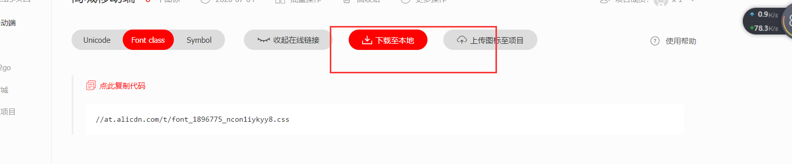

# vue移动端项目

## axios封装和请求响应劫持

### 封装

```js
import axios from 'axios'
import config from '@/config'

const baseUrl = process.env.NODE_ENV === 'development' ? config.baseUrl.dev : config.baseUrl.prod


class Request {
  constructor(baseUrl) {
    this.baseUrl = baseUrl;
    this.queue = {}
  }
  // 设置配置配置
  getInsideConfig() {  //返回结果 {baseUrl,header}
    const config = {
      baseURL: this.baseUrl,
      headers: {
        // 全局请求头配置
      }
    }
    return config;
  }

  // 拦截 
  interceptors(instance) {

    // 拦截请求
    instance.interceptors.request.use((reqConfig) => {
      // 修改配置
      console.log('拦截请求' , reqConfig)
      return reqConfig
    })

    // 拦截响应
    instance.interceptors.response.use((res) => {
      console.log('拦截响应', res)
      return res.data
    }, err => {
      // 响应出问题
      console.log(err)
      return { error: '出错' }
    })


  }

  request(options) {
    const instance = axios.create();

    // 后面的会覆盖前面的
    options = Object.assign(this.getInsideConfig(), options)
    this.interceptors(instance, options.url)
    return instance(options)
  }

}

const axiosObj = new Request(baseUrl)

export default axiosObj;
```

```js
import axios from '@/api/axios'

export const getBannerData = () => {
  return axios.request({
    url: '/index/banner',
    method: 'get'
  })
}
```

```vue
<template>
  <div></div>
</template>

<script>
  import {getBannerData} from "@/api/requestMethods.js";

  export default {
    methods: {
      getBannerData() {
        getBannerData();
      },
    },
    async mounted() {
      let result = await getBannerData()
      console.log(1)
      console.log(result)
    },
  };
</script>

<style scoped>
</style>
```

### 后端允许跨域配置

```js
let express =require('express')
let app = express()

//允许跨域
app.use((req,res,next)=>{
  res.append('Access-Control-Allow-Origin','*')
  res.append('Access-Control-Allow-headers','*')
  next()
})


app.get('/index/banner',(req,res)=>{
  res.json({
    msg:'banner'
  })
})
app.listen(3000)
```

## 开发模式跨域解决方法

凡是访问/api都会进入代理

```js
module.exports = {
  devServer: {
    proxy: {
      '/api': {
        target: 'http://localhost:3000',
        pathRewrite: {
          '^/api': ''
        },
      },
    }
  }
}
```

```js
export default {
  title:'project',
  baseUrl:{
    dev:'/api/',
    prod:''
  }
}
```

## mockJs模拟后端数据

拦截后端请求，模拟请求。

```js
//main.js
if (process.env.NODE_ENV == 'development') require('@/api/mock.js')

```

```js
import Mock from 'mockjs'

// 配置请求延时
Mock.setup({
  timeout: 1000
})

//直接使用字符串匹配
// Mock.mock('/api/userInfo', {
//	 "id|+1":1,	
//   username: '尤雨溪',
//   age: 18
// })


// 正则匹配
// Mock.mock(/\/api\/user/ig, {
//   username: '正则'
// })


// 随机
Mock.mock('/index', {
  username: '正则',
  "updateTime": "@datetime",  //时间
  "score|1-800": 800, //1-800
  "rank|1-100": 100,
  "nickname": "@cname",
  "image": "@image('200x100')",
  'email': '@email'
})


Mock.mock(/\/api\/user/ig, {
  'data|4-8': [
    {
      id: '@id',
      title: '@title',
      namespace: 'desctab',
      content: '@paragraph',
      isPublish: '@boolean',
      createTime: '@datetime',
      'fileList|1-10': [{
        name: '@integer(1,960)',
        uid: '-@name',
        image: '@image',
        status: 'done',
      }],
    },
  ],
})


let Random = Mock.Random;
let productData = () => {
  let productList = []; // 存放农机信息的数组
  for (let i = 0; i < 100; i++) {
    let product = {
      name: Random.ctitle(5, 9),
      img: Random.dataImage('125x125', '农机' + Random.integer(1, 100)),
      price: Random.integer(1000, 10000),
      owner: Random.cname(),
      email: Random.email(),
      
    };
    productList.push(product);
  }
  return productList;
};
Mock.mock('http://www.czw.com/getVarietyItem', productData);

```

```js
export const getUserName = () => {
  return axios.request({
    url:'userName',
    method:'get'
  })
}
```

## rem布局

```js
(function(){
    function resize(){
        var baseFontSize = 100; //设计稿100px相当于1rem,750px -->7.5rem--->各种屏幕的100%的宽度。1000px
        var designWidth = 750;//设计稿宽度
        var width = window.innerWidth;//屏幕宽度
        var currentFontSize = (width/designWidth)* baseFontSize;
        document.querySelector('html').style.fontSize = currentFontSize +'px';
    }
    
    window.onresize = function(){
        resize()
    }

    document.addEventListener('DOMContentLoaded',resize)

}())
```

```js
;
(function (win) {
    var doc = win.document;
    var docEl = doc.documentElement;
    var tid;

    function refreshRem() {
        var width = docEl.getBoundingClientRect().width;
        var rem = width / 6.4; // 将屏幕宽度分成6.4份， 1份为1rem
        docEl.style.fontSize = rem + 'px';
        // console.log(0.14*rem);
    }

    win.addEventListener('resize', function () {
        clearTimeout(tid);
        tid = setTimeout(refreshRem, 10);
    }, false);
    win.addEventListener('pageshow', function (e) {
        if (e.persisted) {
            clearTimeout(tid);
            tid = setTimeout(refreshRem, 10);
        }
    }, false);

    refreshRem();

})(window);

```

```js
// main.js

import '@/config/rem'

```

##	数据获取

```js
//src\api\mock.js
Mock.mock('/api/restaurants',restaurants)
```

```js
//src\api\requestMethods.js
export const getRestaurantsData = () =>{
    return axios.request({
        url:"restaurants",
        method:"get"
    })
}
```

```js
 import {getRestaurantsData} from "@/api/requestMethods.js";

async mounted() {
      await getRestaurantsData().then((res) => {
        this.shopListArr = res;
      });
    },
```

## 字体图标

下载字体图标



```js
引入
//public/css/iconfont.css
```


```html
 <link rel="stylesheet" href="<%= BASE_URL %>css/iconfont.css">

```

```js
<span class="iconfont iconxxx"></span>

```

## vant-移动端ui组件库使用

```js
npm i vant -S
npm i babel-plugin-import -D

```

```js
//babel.config.js
module.exports = {
  plugins: [
    ['import', {
      libraryName: 'vant',
      libraryDirectory: 'es',
      style: true
    }, 'vant']
  ]
};
```

```js
import { Button } from 'vant';
Vue.use(Button);
```

或者

```js
import { Button } from 'vant';
components:{
  Button
}
```

## ui插槽和样式修改

## 轮播和grid宫格布局

 ## 列表加载和骨架屏使用


