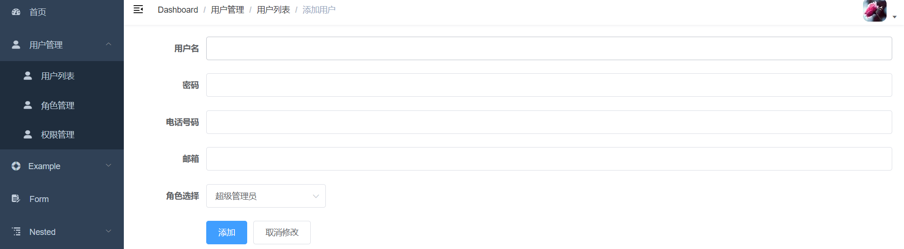

# vue后台

## vue-element-template基础模板搭建

## eslint警告解除

```js
module.exports = {
  lintOnSave:false
}

```

## 布局和路由

```js
import Vue from 'vue'
import Router from 'vue-router'

Vue.use(Router)

/* 布局 */
import Layout from '@/layout'

export const constantRoutes = [
  {
    path: '/login', //后台登录页
    component: () => import('@/views/login/index'),
    hidden: true	//不会在左侧边栏出现
  },
  {
    path: '/404',
    component: () => import('@/views/404'),
    hidden: true  //侧边菜单不会显示
  },
  {
    path: '/',
    component: Layout,
    redirect: '/dashboard', //后台首页
    children: [{
      path: 'dashboard',
      name: 'Dashboard',
      component: () => import('@/views/dashboard/index'),
      meta: { title: 'Dashboard', icon: 'dashboard' } //菜单标题 图标icons/svg
    }]
  },

  {
    path: '/example',
    component: Layout,
    redirect: '/example/table',
    name: 'Example',
    meta: { title: 'Example', icon: 'el-icon-s-help' },
    children: [
      {
        path: 'table',	//子菜单
        name: 'Table',
        component: () => import('@/views/table/index'),
        meta: { title: 'Table', icon: 'table' }
      },
      {
        path: 'tree',
        name: 'Tree',
        component: () => import('@/views/tree/index'),
        meta: { title: 'Tree', icon: 'tree' }
      }
    ]
  },

  {
    path: '/form',
    component: Layout,
    children: [
      {
        path: 'index',
        name: 'Form',
        component: () => import('@/views/form/index'),
        meta: { title: 'Form', icon: 'form' }
      }
    ]
  },
  {
    path: 'external-link',
    component: Layout,
    children: [
      {
        path: 'https://panjiachen.github.io/vue-element-admin-site/#/',
        meta: { title: 'External Link', icon: 'link' }
      }
    ]
  },

  // 404 page must be placed at the end !!!
  { path: '*', redirect: '/404', hidden: true }
]

```

## 登录+后端配置

```js
export function validUsername(str) {
  const valid_map = ['admin', 'editor']
  return valid_map.indexOf(str.trim()) >= 0 
}

```

data校验

```js
<el-form
ref="loginForm"
:model="loginForm"
:rules="loginRules"	

>
import { validUsername } from "@/utils/validate";

data() {
      // 是否校验
      const validateUsername = (rule, value, callback) => {
        if (!validUsername(value)) {
          callback(new Error("Please enter the correct user name"));
        } else {
          callback();
        }
      };
      // 长度是否小于6
      const validatePassword = (rule, value, callback) => {
        if (value.length < 6) {
          callback(new Error("密码长度不能小于六个字符"));
        } else {
          callback();
        }
      };
      return {
        loginForm: {
          username: "admin",
          password: "111111",
        },
        // 验证规则
        loginRules: {
          username: [
            { required: true, trigger: "blur", validator: validateUsername },
          ],
          password: [
            { required: true, trigger: "blur", validator: validatePassword },
          ],
        },
        loading: false,
        passwordType: "password",
        redirect: undefined,
      };
    },
```

点击登录

```js
handleLogin() {
  this.$refs.loginForm.validate((valid) => {
    if (valid) {
      this.loading = true;

      this.$store
      // 调用vuex的user模块下的login里的函数
        .dispatch("user/login", this.loginForm)
        .then(() => {
        this.$router.push({ path: this.redirect || "/" });
        this.loading = false;
      })
        .catch(() => {
        this.loading = false;
      });
    } else {
      console.log("error submit!!");
      return false;
    }
  });
},
```

vuex校验

```js
import { login } from '@/api/user'

const actions = {
  // user login
  login({ commit }, userInfo) {
    const { username, password } = userInfo
    return new Promise((resolve, reject) => {
      login({ username: username.trim(), password: password }).then(response => {
        const { data } = response
        commit('SET_TOKEN', data.token)
        setToken(data.token)
        resolve()
      }).catch(error => {
        reject(error)
      })
    })
  }
}
```

```js
import request from '@/utils/request'

export function login(data) {
  return request({
    url: '/vue-admin-template/user/login',
    method: 'post',
    data
  })
}
```

### 后端登录

### thinkJs创建后台

```js
npm install -g think-cli
cnpm i 
npm start
```

设置路由


```js
//src\controller\user\login.js
const Base = require('../base.js');

module.exports = class extends Base {
  loginAction() {
    return this.json({msg:"login page"})
  }
};
// http://127.0.0.1:8360/user/login/login
```

### cmswing数据表引入

- 使用cmswing作为后端数据表。注意版本是8.0的。

  

- ```js
  src\config\adapter.js
  
  /....
    mysql: {
      handle: mysql,
      database: 'vuethinkmall',
      prefix: 'cmswing_',
      encoding: 'utf8',
      host: '127.0.0.1',
      port: '',//默认3360
      user: 'root',
      password: 'root',
      dateStrings: true
    }
  ```


### JST跨域身份验证

- 使用session进行保留用户状态
- session使用到Cookie,必须同一个域下才可以。
- jwt是跨域身份验证的方案。json web token。
  - 1.用户发送用户名密码
  - 2.验证用户名密码，保存验证信息。
  - 3.返回口令给前端
  - 4.前端保留口令(本地存储或者设置cookie)
  - 5.再次再访问时前端把口令返回。
  - 6.服务器验证口令判断用户登录状态和信息。
  - 7.更新口令的有效期。

代码:

```js
npm install jsonwebtoken
```

```js
//src\controller\base.js

module.exports = class extends think.Controller {
  authFail(){
    this.json({error:'JWT校验失败'});
    return false
  }
  checkAuth(){
    let token = this.ctx.headers['x-token']
    const {secret,cookie,expire} = this.config('jwt');

    try{
      //如果有就使用secret加盐。
      var tokenObj = token? jsonWebToken.verify(token,secret):{}
      this.ctx.state.username = tokenObj.name;//我们设置的
    }catch(error){
      return this.authFail()
    }
    
    if(!tokenObj.name){
      return this.authFail();
    }
    
    this.updateAuth(token.name);
    
  }
  
  updateAuth(username){
    const userInfo = {
      name:username
    };
    //设置有效期
    const {secret,cookie,exipre} = this.config('jwt');
    const token = jsonWebToken.verify(userInfo,secret,{expiresIn:exipre});
    this.cookie(cookie,token)//设置到cookie里
    
    this.headers('authoriztion',token)//也可以设置到头里
    
    return token;
  }
};

```

- 配置默认config设置

```js
//src\config\config.js
const 

module.exports = {
  workers: 1,
  jwt:{
    secret:'chengguo',
    cookie:'jwt-token',
    exipre:30
  }
};
```

### 中间件处理

```js
cnpm install koa-jwt --save
```

```js
//src\config\middleware.js

const jwt =require('koa-jwt')
module.exports = [
  {
    handle: jwt,
    options: {
      cookie: think.config('jwt')['cookie'],
      secret: think.config('jwt')['secret'],
      passthrought: true
    }
  },
  //逻辑之前执行
  'logic',
]
```

### 登录逻辑

- 因为要和数据库进行请求所以需要async
- 用到[ctx.method](https://thinkjs.org/zh-cn/doc/3.0/context.html#toc-972)方法判断是否是post请求
- 用[ctx.post](https://thinkjs.org/zh-cn/doc/3.0/context.html#toc-29b)方法获取用户名密码。
- 判断密码和数据库member表密码是否一致。调用加盐加密方法
- 数据表使用cmswing提供的数据表member。

```js
//src\controller\user\login.js
const Base = require('../base.js');
const { think } = require('thinkjs');

module.exports = class extends Base {
  async loginAction() {
    if (this.method == 'POST') {
      let username = this.post('username')
      let password = this.post('password');
      // 查找数据表
      let user = await this.modle('member').where({ username }).find();//找一条
      // 判断提交的密码是否和查询的密码一致
      if (user.password === this.verifyPassword(password)) {
        // 完成登录-更新token,并且有时效性
        this.json({ msg: '登录成功' })
      } else {
        return this.json({ msg: '登录失败' })
      }
    }
  }
  
  verifyPassword(pwd) {
    // 使用cmswing进行加盐加密.他只能正向尝试。
    return think.md5(think.md5(www.cmswing.com) + think.md5(pwd) + think.md5('Chen'))
  }
};

```

### 前端axios请求和登录逻辑校正

- 首先在登录页找到对应方法，我们成功后跳转到admin

```js
handleLogin() {
  this.$refs.loginForm.validate(valid => {
    if (valid) {
      this.loading = true
      this.$store.dispatch('user/login', this.loginForm).then(() => {
        // 登录成功跳转到admin
        this.$router.push({ path: '/admin' || '/' })
      }).catch(() => {
      })
    } 
  })
}
```

- 路由里面修改首页为默认login
- 登录成功跳转到admin/dashboard

```js
const routes = [
  {
    path: '/',
    redirect: '/login'
  },
  {
    path: '/admin',
    component: Layout,
    redirect: '/admin/dashboard',//重定向到子组件
    children: [{
      path: 'dashboard',
      name: 'Dashboard',
      component: () => import('@/views/dashboard/index'),
      meta: { title: 'Dashboard', icon: 'dashboard' }
    }]
  },
]
```

- 修改axios下的登录逻辑
  - 这里引入了login的api

```js
//src\store\modules\user.js
import { login, logout, getInfo } from '@/api/user'  

login({ commit }, userInfo) {
  const { username, password } = userInfo
  return new Promise((resolve, reject) => {
    login({ username: username.trim(), password: password }).then(response => {
      const { data } = response
      commit('SET_TOKEN', data.token)
      setToken(data.token)
      resolve()
    }).catch(error => {
      reject(error)
    })
  })
},
```

- 修改请求发送的url
  - 这里引入了request文件

```js
//src\api\user.js
import request from '@/utils/request'

export function login(data) {
  return request({
    url: '/user/login/login',
    method: 'post',
    data
  })
}
```

- request里使用了环境变量。

```js
//'@/utils/request'

import axios from 'axios'
import { MessageBox, Message } from 'element-ui'
import store from '@/store'
import { getToken } from '@/utils/auth'

// create an axios instance
const service = axios.create({
  baseURL: process.env.VUE_APP_BASE_API, // url = base url + request url
})
```

- 查看环境变量配置


- 前端设置跨域代理
  - 记得把mock去掉

```js
module.exports = {
  devServer: {
    proxy: {
      '/api': {
        target: 'http://localhost:3000',
        pathRewrite: {
          '^/api': ''
        },
      },
    }
  }
}
```

因为下面后端端口8360所以要设置代理


- permission.js里进行处理

```js
if (hasToken) {
  next()
  NProgress.done()
  await store.dispatch('user/getInfo');//调用获取个人信息的方法
}else{
  
}
```

登录后头部和set-cookie里都有


```js
router.beforeEach(async(to, from, next) => {
//.......
  if (hasToken) {
   next()
   NProgress.done()
   await store.dispatch('user/getInfo')
  } 
```

- 劫持

```js
service.interceptors.response.use(

  response => {
    const res = response.data
    if (response.status !== 200) {
      Message({
        message: res.message || 'Error',
        type: 'error',
        duration: 5 * 1000
      })

      router.push('/login')

      return Promise.reject(new Error(res.message || 'Error'))
    } else {
      if (res.error === 'JWT校验失败') {
        Message({
          message: '校验失败了,请重新登录',
          type: 'error',
          duration: 3 * 1000

        })
        router.push('/login')

      } else if (response.headers.authoriztion) {
        setToken(response.headers.authoriztion)
      }
      return res
    }
  },
  error => {
    console.log('err' + error) // for debug
    Message({
      message: error.message,
      type: 'error',
      duration: 5 * 1000
    })
    return Promise.reject(error)
  }
)
```


## axios拦截器有坑

```js

```


## 获取用户信息

### 后端配置

建立admin文件夹


```js
const Base = require('../base.js');
const { think } = require('thinkjs');

module.exports = class extends Base {
  // 权限校验
  __before() {
    return this.checkAuth()
  }
  async userInfo() {
    let username = this.ctx.state.username;//因为校验里能获取到用户名信息
    let user = await this.model('member').where({ username }).find()
    // 设置头像路径
    let filepath = think.ROOT_PATH + '/www/static/image/avatar/avatar' + user.id + '.png';
    if (think.isFile(filepath)) {//如果有这个路径就
      user.avatar = this.config('hostIpPort') + '/static/image/avatar/avatar' + user.id + '.png';
    } else {
      // 如果没有上传头像就用这个。
      user.avatar = this.config('hostIpPort') + '/static/image/avatar/avatar.png'

    }
    
    return this.json({ userinfo: user })

  }

};

```

- 配置主机ip端口号

### 前端配置


```js
//src\api\user.js
export function getInfo(token) {
  return request({
    url: '/admin/index/userInfo',
    method: 'get',
  })
}
```

- 因为我们已经在request里进行token发送，所以不需要每次都发送一次


- vuex里进行配置

  ```js
   getInfo({ commit, state }) {
      return new Promise((resolve, reject) => {
        getInfo(state.token).then(response => {
          if(!response.userInfo){
            reject('校验失败，请重新登录')
          }
  
          const { username, avatar } = response.userInfo
  
          commit('SET_NAME', username)
          commit('SET_AVATAR', avatar)
          resolve(response.userInfo)
        }).catch(error => {
          reject(error)
        })
      })
    },
  
  ```


## 注销

- 注销页面

```js
// src\layout\components\Navbar.vue
async logout() {
  await this.$store.dispatch('user/logout')
  this.$router.push(`/login?redirect=${this.$route.fullPath}`)
}
```

```js
logout({ commit, state }) {
    return new Promise((resolve, reject) => {
      removeToken() // 移除token
      resetRouter() //
      commit('RESET_STATE')
      resolve()
    })
  },
```

## 用户管理

### 后端配置

新建src\controller\admin\user.js

实现获取用户列表接口

实现删除指定用户接口

实现获取用户信息接口

```js
//src\controller\admin\user.js
const Base = require('../base.js');
const { think } = require('thinkjs');

module.exports = class extends Base {
  // 权限校验
  __before() {
    return this.checkAuth()
  }
  indexAction() {
    return this.json({ msg: '用户管理' })
  }

  // 取出用户列表
  async userListAction() {
    // 查找member数据库，按照id排序，获取第一页十个数据
    let userList = await this.model('member').order('id').page(1, 10).select()
    return this.json({ userList })
  }

  //删除
  async userDeleteAction() {
    // 
    let userid = this.get(id)
    await this.model('member').where({ id: userid }).delete()
    this.json({
      msg: '删除成功'
    })
  }

  //获取用户信息,查看关联关系。
  async userinfoAction() {
    let userid = this.get('id');
    // 连接3张表查询，通过userid找到member表里的用户信息，
    //在通过member的id找到auth_user_role表的userid对应的那条数据，在通过这条role_id找到角色的详细信息
    let user = await this.model('member').where({ 'cmswing_member.id': userid })
      .join({
        table: 'auth_user_role',
        join: "left",
        as: 'l', //别名
        on: ['id', 'user_id']//左表的id和右表user_id相连
      })
      .join({
        table: 'auth_role',//权限名称
        join: "left",
        as: 'c',
        on: ['l.role_id', 'id']
      }).field('username,desc,password,mobile,email,role_id').find() //要提取的内容信息。 
    this.json({ user })
  }
};

```

### 前端路由配置


```js
{
    path: '/user',
    component: Layout,
    name: 'user',
    meta: { title: '用户管理', icon: 'user' },
    children: [
      {
        path: 'userlist',
        name: 'userlist',
        component: () => import('@/views/user/index'),
        meta: { title: '用户列表', icon: 'user' }
      },
      {
        path: 'rolelist',
        name: 'rolelist',
        component: () => import('@/views/user/role'),
        meta: { title: '角色管理', icon: 'user' }
      },
      {
        path: 'authlist',
        name: 'authlist',
        component: () => import('@/views/user/auth'),
        meta: { title: '权限管理', icon: 'user' }
      },
    ]
  },

```

## 用户列表设置

### 分页


**接口请求**

- api文件夹下设置创建用户信息相关ajax

```js
//src\controller\admin\admin.js
import request from '@/utils/request'

export function userlist(params) {
  return request({
    url: '/admin/user/userlist',
    method: 'get',
    params
  })
}
```

```js
// src\views\user\index.vue
import { userlist } from '@/api/admin'

userlist().then(response => {
  this.list = response.userlist
  console.log(this.list)
  this.listLoading = false
})
```

**表单配置**

```html
 <el-table
      v-loading="listLoading"
      :data="list"
      element-loading-text="Loading"
      border
      fit
      highlight-current-row
    >
      <el-table-column align="center" label="ID" width="95">
        <template slot-scope="scope">{{ scope.row.id }}</template>
      </el-table-column>
      <el-table-column label="用户名" align="center">
        <template slot-scope="scope">{{ scope.row.username }}</template>
      </el-table-column>
      <el-table-column label="邮箱" align="center">
        <template slot-scope="scope">
          <span>{{ scope.row.email }}</span>
        </template>
      </el-table-column>
      <el-table-column label="电话号码" width="110" align="center">
        <template slot-scope="scope">{{ scope.row.mobile }}</template>
      </el-table-column>
      <!-- 禁用状态 -->
      <el-table-column class-name="status-col" label="状态" width="110" align="center">
        <template slot-scope="scope">
          <el-tag :type="scope.row.status | statusFilter">{{ scope.row.status===1?'已启用':'已禁用' }}</el-tag>
        </template>
      </el-table-column>
      <!--  -->
      <el-table-column align="center" prop="created_at" label="编辑" width="80">
        <template slot-scope="scope">
          <el-button type="primary" icon="el-icon-edit" circle></el-button>
        </template>
      </el-table-column>
      <el-table-column align="center" prop="created_at" label="删除用户" width="80">
        <template slot-scope="scope">
          <el-button type="danger" icon="el-icon-close" circle></el-button>
        </template>
      </el-table-column>
    </el-table>
```

**分页**

https://element.eleme.io/#/zh-CN/component/pagination

- 获取后端传入的分页数据传入到total里

- 监听事件current-change：当前页面currentPage 改变时会触发，默认参数e是当前点击的页数。

```html
<el-pagination
               @current-change="getUserListPage"
               background
               layout="prev, pager, next"
               :total="total"
               >
</el-pagination>
```

```js
getUserListPage(page) {
  userlist({ page }).then((response) => {
    this.list = response.userlist;
    this.total = response.total;
    this.listLoading = false;
  });
},
```

**后端配置**

```js
//后端接口 
async userlistAction() {
    let page = this.get('page')?this.get('page'):1
    // 查找member数据库，按照id排序，获取第一页十个数据
    let userlist = await this.model('member').order('id').page(page, 10).select()
    // 获取总条数
    let total = await this.model('member').count()
    this.json({ userlist,total })
  }
```

### 删除


```html
 <el-button @click="del(scope.row.id)"></el-button>
```

```js
async del(id) {
  this.$confirm("是否删除当前用户", "确认删除", {
    distinguishCancelAndClose: true,
    confirmButtonText: "删除",
    cancelButtonText: "取消",
  }).then(async () => {
    this.listLoading = true;
    let res = await deluser({ id });
    this.listLoading = false;
    this.fetchData();
  });
},
```

- api文件。

```js
export function deluser(params) {
  return request({
    url: '/admin/user/deluser',
    method: 'get',
    params
  })
}
```

### 用户信息编辑页路由配置

**点击编辑进入编辑页**

```html
<el-button @click="edit(scope.row.id)" type="primary" icon="el-icon-edit" circle></el-button>
```

```js
edit(id) {
  this.$router.push({
    name: "edituser",
    params:{
      id
    }
  });
},
```

**路由配置**

```js
const router = [
  {
    path: '/user',
    component: Layout,
    name: 'user',
    meta: { title: '用户管理', icon: 'user' },
    children: [
      {
        path: 'userlist',
        name: 'userlist',
        component: () => import('@/views/user/index'),
        meta: { title: '用户列表', icon: 'user' },
      },
      {
        path: 'edituser/:id',
        name: 'edituser',
        component: () => import('@/views/user/index/edituser'),
        hidden: true
      }
    ]
  }
]
```

### 用户信息编辑页接口编写

**前端**

```js
// 用户信息 角色列表 更数据
  import { userinfo,rolelist,updateuser } from "@/api/admin";

```

```js
// @/api/admin

// 用户信息
export function userinfo(params) {
  return request({
    url: '/admin/user/userinfo',
    method: 'get',
    params
  })
}

//角色列表
export function rolelist() {
  return request({
    url: '/admin/role/rolelist',
    method: 'get',
    
  })
}

export function updateuser(params) {
  return request({
    url: '/admin/user/updateUser',
    method: 'post',
    params
  })
}
```

**后端**

```js
  async userinfoAction() {
    let userid = this.get('id');
    // 连接3张表查询，通过userid找到member表里的用户信息，
    //在通过member的id找到auth_user_role表的userid对应的那条数据，在通过这条role_id找到角色的详细信息
    let user = await this.model('member').where({ 'cmswing_member.id': userid })
      .join({
        table: 'auth_user_role',
        join: "left",
        as: 'l', //别名
        on: ['id', 'user_id']//左表的id和右表user_id相连
      })
      .join({
        table: 'auth_role',//权限名称
        join: "left",
        as: 'c',
        on: ['l.role_id', 'id']
      }).field('username,desc,password,mobile,email,role_id').find() //要提取的内容信息。 
    this.json({ user })
  }


  async updateUserAction() {
    let postUser = this.post();
    if (this.method == 'POST' && postUser.password != "") {
      await this.model('member').where({ id: postUser.id }).update({ password: this.verifyPassword(postUser.password), email: postUser.email, mobile: postUser.mobile });
      let role = await this.model('auth_user_role').where({ user_id: postUser.id }).find()
      // console.log(role)
      if (role.id) {
        await this.model('auth_user_role').where({ user_id: postUser.id }).update({ role_id: postUser.role_id });
      } else {
        await this.model('auth_user_role').add({ user_id: postUser.id, role_id: postUser.role_id });
      }
      this.json({ "msg": "更新成功2" });

    } else if (this.method == 'POST') {
      await this.model('member').where({ id: postUser.id }).update({ email: postUser.email, mobile: postUser.mobile });
      let role = await this.model('auth_user_role').where({ user_id: postUser.id }).find()
      // console.log(role)
      if (role.id) {
        await this.model('auth_user_role').where({ user_id: postUser.id }).update({ role_id: postUser.role_id });
      } else {
        await this.model('auth_user_role').add({ user_id: postUser.id, role_id: postUser.role_id });
      }

      this.json({ "msg": "更新成功1" });
      // console.log(postUser)
    } else {
      this.json({ error: "100", "msg": "请使用post方法" })
    }
  }
```

```js
  async rolelistAction() {
    let page = this.get('page') ? this.get('page') : 1;
    let rolelist = await this.model('auth_role').order('id').page(page, 10).select();
    let total = await this.model("auth_role").count()
    return this.json({ rolelist, total })
  }
```

### 用户信息编辑前台配置

```js
  async created() {
      let userid = this.$route.params.id;
      let res = await userinfo({ id: userid });
      this.form.username = res.user.username;
      this.form.mobile = res.user.mobile;
      this.form.email = res.user.email;
      this.form.role_id = res.user.role_id;
      this.form.id = userid;
      this.role_id = res.user.role_id;
    },
    async mounted() {
      let rolist = await rolelist();
      console.log(rolist);
      this.rolelist = rolist.rolelist;
    },
```

```js
  onSubmit() {
        if (!this.form.role_id) {
          this.$message("请选择用户身份!");
        } else {
          this.$message("submit!");

          updateuser(this.form);
          this.$router.push("/user/userlist");
        }
      },
```

### 添加用户



- 判断用户是否存在
- 如果不存在，就添加，并且往角色id里添加一条对应角色

```js
async addUserAction() {

		if (this.method == 'POST') {
			let postUser = this.post();
			let user = this.model('member').where({
				username: postUser.username
			}).find();
			if (!user.username) {
				postUser.status = 1;
				let addinfo = await this.model('member').add(postUser)
				// console.log(addinfo);
				let user = await this.model('member').where({
					username: postUser.username
				}).find()
				await this.model('auth_user_role').add({
					user_id: user.id,
					role_id: postUser.role_id
				});
				this.json({
					msg: "添加成功"
				})
			} else {
				this.json({
					msg: "添加失败",
					content: "用户名已存在"
				})
			}

		}
	}
```

## 角色管理

