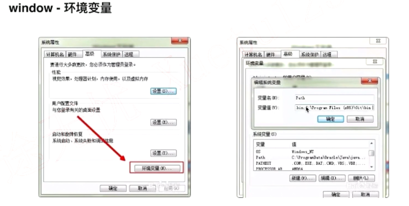
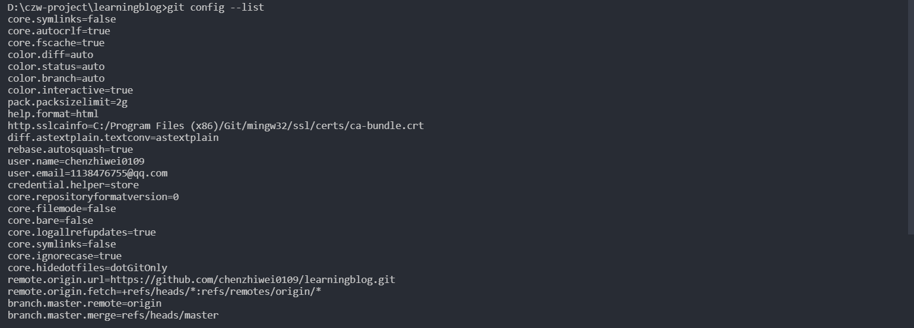
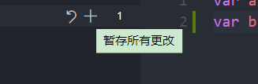
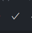
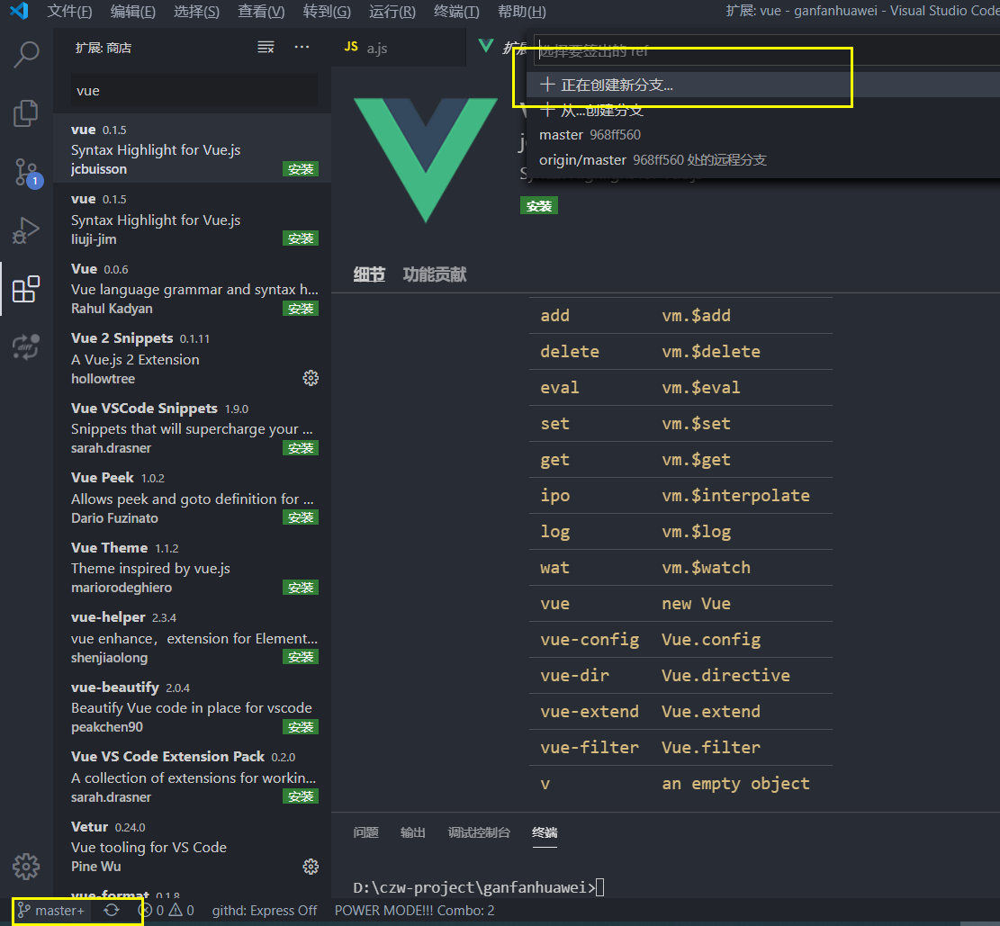
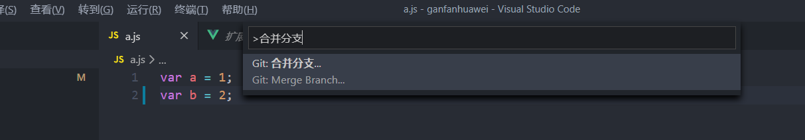
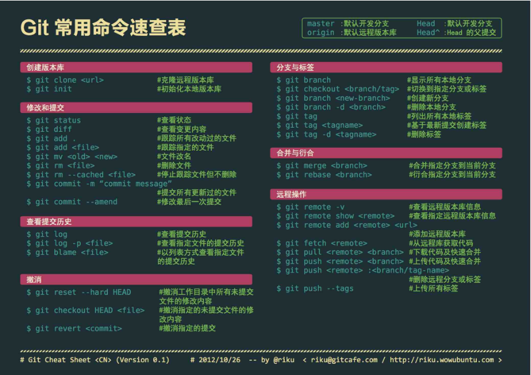
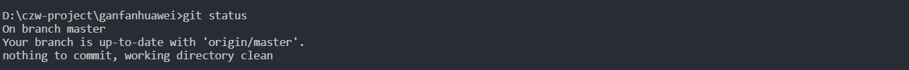
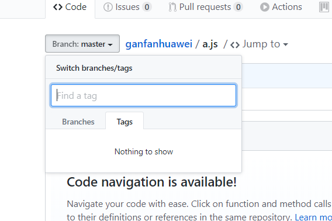

# git安装配置

**配置本地环境变量**

**SSH添加密钥**

- git config --list

  

- git config --gobal user.name ''

  

- git config -- global user.email'xxx@xxx.com'

- git config --global credential.helper store

- ssh-keygen -t rsa -C 'aaaa@xxx.com'

- .ssh ls

- ssh-keygen -t rsa  

## vs-code操作git

这三个命令基本差不多用了；

Git History Diff插件

### 创建分支

### 合并分支

切换到demo 1

## git常用命令

git clone 下载项目，注意公钥只能使用在ssh上面

git init 初始化项目; 把一个非git项目变成git项目，如果我们想把本地项目推送到远程，可以这样

**修改和提交**

git status:查看状态

git add:添加c.js  git ad c.js

git commit:提交到git

git commit -m 'add c'  提交添加备注

git push origin demo2 推送到远程的demo2分支  //如果是主分支不需要

git mv c.js d.js 把c.js的名字变成d.js;

git commit -m 'xxx' -a  //-a是提交所有变动

git commit 只是提交暂存的

git add . 添加所有

**分支与标签**

git checkout master 切换master

git tag  t1.0.0  打标签

git push origin t1.0.0

git pull git push

**撤销**

git reset

git checkout .   //不止能切换分支