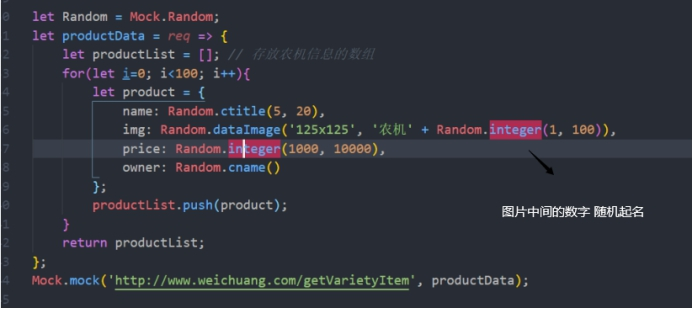

# mock

拦截ajax请求

```js
// component/mock/mock.js
import Mock from 'mockjs'
Mock.mock('https://www.xx.com/api',a)
Mock.mock('http:xx.com',{
    'name|2':'czw',
    'age|18-35':20
})
```



```js
//main.js
import '@/mock/mock.js'
```

```js

```

