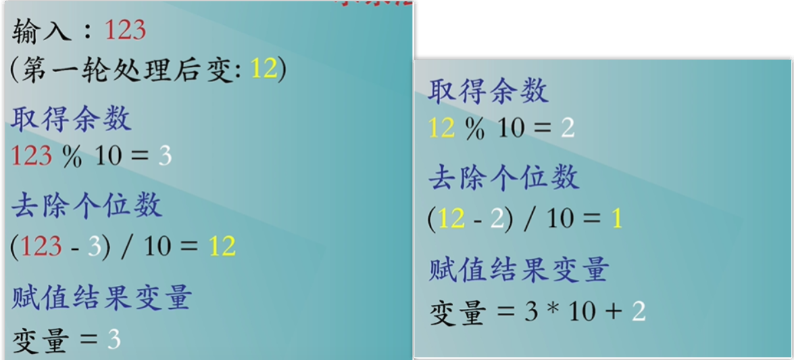
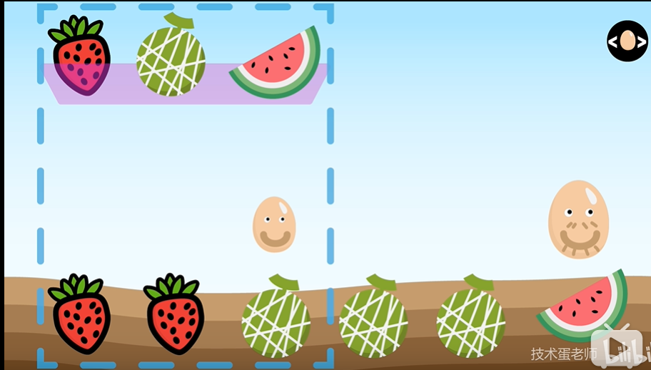

# leetcode刷题

## 1. 两数之和

给定一个整数数组 `nums` 和一个目标值 `target`，请你在该数组中找出和为目标值的那 **两个** 整数，并返回他们的数组下标。

你可以假设每种输入只会对应一个答案。但是，数组中同一个元素不能使用两遍。

**示例:**

```
给定 nums = [2, 7, 11, 15], target = 9

因为 nums[0] + nums[1] = 2 + 7 = 9
所以返回 [0, 1]
```

我们不知道元素的内容，只能依靠序号查看。每个盒子只能打开

**方法**

- 利用对象存储数据
- 根据键值对,把数组的值变成对象的键，数组的键变成对象的值。arr[6,12,8]=>obj{6:0,12:1,8:2}

- 然后利用减法 target减去当前循环的值， 14-6 = 8;
- 如果obj[8] 存在，就返回 [obj[8],当前i值];

for循环遍历数组元素，每次循环都

```js
var twoSum = function(nums, target) {
    var box = {};
    for(var i = 0 ; i<nums.length;i++){
        var diff = target-nums[i];  //把加法变成减法，如果目标数减去当前的数有
        if(box[diff]||box[diff]===0){  
            return [box[diff],i]  //i肯定是最后一个，因为如果是第一个，他还没选呢。
        }
        box[nums[i]]=i;  //把数组值作为对象名，数组索引作为对象值
    }
};
```

**方法**

利用map。原理同上。

```js
var twoSum = function(nums, target) {
    var box = new Map();
    for(var i = 0 ; i<nums.length;i++){
        var diff = target-nums[i];
        if(box[diff]>=0){  //索引值也可能是0；不能直接利用box[diff]判断，因为0是falsy变量；
            return [box[diff],i]  //i肯定是最后一个，因为如果是第一个，他还没选呢。
        }
        box[nums[i]]=i;
    }
};
```

```js
var twoSum = function(nums, target) {
    let mapbox = new Map();
    for(var i=0;i<nums.length;i++){
        var b = target - nums[i];
        if(mapbox.has(b)){
            return [mapbox.get(b),i]
        }
        mapbox.set(nums[i],i)
    }
};
```

## [2. 两数相加](https://leetcode-cn.com/problems/add-two-numbers/)

给出两个 **非空** 的链表用来表示两个非负的整数。其中，它们各自的位数是按照 **逆序** 的方式存储的，并且它们的每个节点只能存储 **一位** 数字。

如果，我们将这两个数相加起来，则会返回一个新的链表来表示它们的和。

您可以假设除了数字 0 之外，这两个数都不会以 0 开头。

**示例：**

```
输入：(2 -> 4 -> 3) + (5 -> 6 -> 4)
输出：7 -> 0 -> 8
原因：342 + 465 = 807
```

步骤

```js
1.新建空链表
2.遍历被相加的两个链表，个位数追加，十位数留在下一位相加
```

代码

```js
/**
 * Definition for singly-linked list.
 * function ListNode(val) {
 *     this.val = val;
 *     this.next = null;
 * }
 */
/**
 * @param {ListNode} l1
 * @param {ListNode} l2
 * @return {ListNode}
 */
var addTwoNumbers = function (l1, l2) {
    let l3 = new ListNode(0);//创建一个头部节点
    let p3 = l3;
    let carry = 0;//十位数
    while (l1 || l2) {
        const val1 = l1 ? l1.val : 0;											
        const val2 = l2 ? l2.val : 0;
        const val = val1 + val2 + carry;
        carry = Math.floor(val / 10);   // 取十位数
        p3.next = new ListNode(val % 10); //取个位数
        if (l1) l1 = l1.next;
        if (l2) l2 = l2.next;
        p3 = p3.next
    }
    if(carry){ //如果最后两位相加也是十位数还需要添加一个链表 
        p3.next = new ListNode(carry)
    }
    return l3.next；
};
```

## [3. 无重复字符的最长子串](https://leetcode-cn.com/problems/longest-substring-without-repeating-characters/)

给定一个字符串，请你找出其中不含有重复字符的 **最长子串** 的长度。

**示例 1:**

```
输入: "abcabcbb"
输出: 3 
解释: 因为无重复字符的最长子串是 "abc"，所以其长度为 3。
```

**示例 2:**

```
输入: "bbbbb"
输出: 1
解释: 因为无重复字符的最长子串是 "b"，所以其长度为 1。
```

**示例 3:**

```
输入: "pwwkew"
输出: 3
解释: 因为无重复字符的最长子串是 "wke"，所以其长度为 3。
     请注意，你的答案必须是 子串 的长度，"pwke" 是一个子序列，不是子串。
```

利用字典索引的唯一性，维护一个滑动窗口，从头开始遍历字符串，把每一项作为字典key，索引作为字典val,遇到重复的项就把左指针往后移动，并和之前的字串长度比对，然后把重复项在字典进行更新。

```js
var lengthOfLongestSubstring = function(s) {
    var L =0;
    var result =0;
    var map = new Map()
    for(var i=0;i<s.length;i++){
        let rightVal = s[i];//右指针指向
        if(map.has(rightVal)&&map.get(rightVal)>=L){//如果字典里有重复项，并且重复项索引比L大
            L = map.get(rightVal)+1 //左指针加1,跳过重复项。
        }
        result = Math.max(result,i-L+1)//最大者是当前窗口长度:右边减左边+1
                //如何知道是重复字符? 把当前的值作为字典的索引。利用索引的不重复性。
        map.set(rightVal,i)
    }
    return result
};
```

## [4. 寻找两个正序数组的中位数](https://leetcode-cn.com/problems/median-of-two-sorted-arrays/)

给定两个大小为 m 和 n 的正序（从小到大）数组 `nums1` 和 `nums2`。请你找出并返回这两个正序数组的中位数。

**进阶：**你能设计一个时间复杂度为 `O(log (m+n))` 的算法解决此问题吗？

**示例 1：**

```
输入：nums1 = [1,3], nums2 = [2]
输出：2.00000
解释：合并数组 = [1,2,3] ，中位数 2
```

**示例 2：**

```
输入：nums1 = [1,2], nums2 = [3,4]
输出：2.50000
解释：合并数组 = [1,2,3,4] ，中位数 (2 + 3) / 2 = 2.5
```

**示例 3：**

```
输入：nums1 = [0,0], nums2 = [0,0]
输出：0.00000
```

**示例 4：**

```
输入：nums1 = [], nums2 = [1]
输出：1.00000
```

**示例 5：**

```
输入：nums1 = [2], nums2 = []
输出：2.00000
```

**提示：**

- `nums1.length == m`
- `nums2.length == n`
- `0 <= m <= 1000`
- `0 <= n <= 1000`
- `1 <= m + n <= 2000`
- `-106 <= nums1[i], nums2[i] <= 106`

```js
var findMedianSortedArrays = function(nums1, nums2) {
	if(nums1.length>nums2.length){
        
    }
};
```


## 整数翻转

给出一个 32 位的有符号整数，你需要将这个整数中每位上的数字进行反转。

**示例 1:**

```
输入: 123
输出: 321
```

 **示例 2:**

```
输入: -123
输出: -321
```

**示例 3:**

```
输入: 120
输出: 21
```

**注意:**

假设我们的环境只能存储得下 32 位的有符号整数，则其数值范围为 [−231,  231 − 1]。请根据这个假设，如果反转后整数溢出那么就返回 0。

**方法1**

数据类型转换

```js
var reverse = fuction(x){
	var sign = Math.sign(x);
  x = Math.abs(x);
  var result = (x +'').split('').reverse().join()*1*sign;
  if( result> Math.pow(2,31)-1|| result< Math.pow(-2,31)){
    return 0
  }
  return result
}
```

**方法2**

>执行用时 :72 ms, 在所有 JavaScript 提交中击败了98.89%的用户
>
>内存消耗 :35.5 MB, 在所有 JavaScript 提交中击败了98.26%的用户

求余法。

123->321



```js
var reverse = function(x) {
  var sign = Math.sign(x);
  x = Math.abs(x);
  var result = 0;
  var remainder;//声明余数变量
  while(x>0){
    reminder = x%10;
    x = (x-reminder)/10;
    result = result*10 + reminder;
  }
  result *=sign;
  if(result>Math.pow(2,31)-1||result<Math.pow(-2,31)){
    return 0;
  }
  return result
};
```

## 9. 回文数

判断一个整数是否是回文数。回文数是指正序（从左向右）和倒序（从右向左）读都是一样的整数。

**示例 1:**

```
输入: 121
输出: true
```

**示例 2:**

```
输入: -121
输出: false
解释: 从左向右读, 为 -121 。 从右向左读, 为 121- 。因此它不是一个回文数。
```

**示例 3:**

```
输入: 10
输出: false
解释: 从右向左读, 为 01 。因此它不是一个回文数。
```

**进阶:**

你能不将整数转为字符串来解决这个问题吗？

```js
var isPalindrome = function(x){
    if(x<0) return false;
    var reverse = function(x) {
        var result = 0;
        var remainder;//声明余数变量
        while(x>0){
            reminder = x%10;
            x = (x-reminder)/10;
            result = result*10 + reminder;
        }
        return result
	};
     if(x === reverse(x)){
        return true
    }else{
        return false
    } 
}
```

## [10. 正则表达式匹配](https://leetcode-cn.com/problems/regular-expression-matching/)

给你一个字符串 `s` 和一个字符规律 `p`，请你来实现一个支持 `'.'` 和 `'*'` 的正则表达式匹配。

```
'.' 匹配任意单个字符
'*' 匹配零个或多个前面的那一个元素
```

所谓匹配，是要涵盖 **整个** 字符串 `s`的，而不是部分字符串。

**说明:**

- `s` 可能为空，且只包含从 `a-z` 的小写字母。
- `p` 可能为空，且只包含从 `a-z` 的小写字母，以及字符 `.` 和 `*`。

**示例 1:**

```
输入:
s = "aa"
p = "a"
输出: false
解释: "a" 无法匹配 "aa" 整个字符串。
```

**示例 2:**

```
输入:
s = "aa"
p = "a*"
输出: true
解释: 因为 '*' 代表可以匹配零个或多个前面的那一个元素, 在这里前面的元素就是 'a'。因此，字符串 "aa" 可被视为 'a' 重复了一次。
```

**示例 3:**

```
输入:
s = "ab"
p = ".*"
输出: true
解释: ".*" 表示可匹配零个或多个（'*'）任意字符（'.'）。
```

**示例 4:**

```
输入:
s = "aab"
p = "c*a*b"
输出: true
解释: 因为 '*' 表示零个或多个，这里 'c' 为 0 个, 'a' 被重复一次。因此可以匹配字符串 "aab"。
```

**示例 5:**

```
输入:
s = "mississippi"
p = "mis*is*p*."
输出: false
```

解题思路


## 13. 罗马数字转整数

罗马数字包含以下七种字符: `I`， `V`， `X`， `L`，`C`，`D` 和 `M`。

```
字符          数值
I             1
V             5
X             10
L             50
C             100
D             500
M             1000
```

例如， 罗马数字 2 写做 `II` ，即为两个并列的 1。12 写做 `XII` ，即为 `X` + `II` 。 27 写做  `XXVII`, 即为 `XX` + `V` + `II` 。

通常情况下，罗马数字中小的数字在大的数字的右边。但也存在特例，例如 4 不写做 `IIII`，而是 `IV`。数字 1 在数字 5 的左边，所表示的数等于大数 5 减小数 1 得到的数值 4 。同样地，数字 9 表示为 `IX`。这个特殊的规则只适用于以下六种情况：

- `I` 可以放在 `V` (5) 和 `X` (10) 的左边，来表示 4 和 9。
- `X` 可以放在 `L` (50) 和 `C` (100) 的左边，来表示 40 和 90。 
- `C` 可以放在 `D` (500) 和 `M` (1000) 的左边，来表示 400 和 900。

给定一个罗马数字，将其转换成整数。输入确保在 1 到 3999 的范围内。

**示例 1:**

```
输入: "III"
输出: 3
```

**示例 2:**

```
输入: "IV"
输出: 4
```

**示例 3:**

```
输入: "IX"
输出: 9
```

**示例 4:**

```
输入: "LVIII"
输出: 58
解释: L = 50, V= 5, III = 3.
```

**示例 5:**

```
输入: "MCMXCIV"
输出: 1994
解释: M = 1000, CM = 900, XC = 90, IV = 4
```

**哈希表+双指针**

小数字在右是加法小数字在左是减法。

```JS
let str = 'MCMXCIV'
var romanToInt = function(s) {
  let result =0;
	let alpha = {I:1,V:5,X:10,L:50,C:100,D:500,M:1000}
	for(var i=0;i<s.length;i++){
    var front = s[i], back=s[i+1]; 
    if(obj[back]>obj[front]){
      result -= obj[front]
    }else{
      result += obj[front]
    }
  }
};

```

## 17.电话号码组合

给定一个仅包含数字 `2-9` 的字符串，返回所有它能表示的字母组合。

给出数字到字母的映射如下（与电话按键相同）。注意 1 不对应任何字母。


**示例:**

```
输入："23"
输出：["ad", "ae", "af", "bd", "be", "bf", "cd", "ce", "cf"].
```

**说明:**
尽管上面的答案是按字典序排列的，但是你可以任意选择答案输出的顺序。

**方法**

"234"=>转换映射关系=>['abc', 'def' ,'ghi'];

首先组合'abc'和'def',把组合的结果resultarr组成一份数组，替换掉这个映射数组的前两项。

[["ad", "ae", "af", "bd", "be", "bf", "cd", "ce", "cf"],'ghi']。

如果arr长度大于1，还需要递归。

如果长度等于1，就直接输出他。

最后输出这个结果。

将前两组合后再将其结果与下一个进行组合
因此立即想到将前两个分出来，将其组成第一份数组。

```js
var letterCombinations = function(digits) {
// 如果输入为 "" 时, LeetCode 答案上是返回 []
  if(digits === '') {
    return []
  }
  let map = ['', 1, 'abc', 'def', 'ghi', 'jkl', 'mno', 'pqrs', 'tuv', 'wxyz']
  
  // 保存输入号码对应的字母, 234 => code['abc', 'def' ,'ghi']
  let code = []
  for(var i =0;i<digits.length;i++){
      code.push(map[digits[i]])
  }

// 还需要加一个判断, 如果只输入一个数字, 如 "2" 的时候, 只进行一次循环.
  if(code.length === 1) {
    return (code+'').split('')
  }
// 进行组合运算;code['abc', 'def' ,'ghi'] =>组合他
  function comb(arr){
      //不确定code的长度，使用临时变量temp用于保存前两个组合的结果。
    var tmp = []
    //最外层循环遍历code的第一个
    for(let i = 0; i < arr[0].length; i ++) {
      for(let j = 0; j < arr[1].length; j ++) {
        tmp.push(`${arr[0][i]}${arr[1][j]}`)
      }
    }
    arr.splice(0, 2, tmp); //把code前两项使用这个临时结果替换。
    if(arr.length > 1) {
      comb(arr)
    }else{
      return tmp
    }
    return arr[0]
  }
	return 
};
```

## 26. 删除排序数组的重复项

给定一个排序数组，你需要在 **原地** 删除重复出现的元素，使得每个元素只出现一次，返回移除后数组的新长度。

不要使用额外的数组空间，你必须在 **原地 修改输入数组** 并在使用 O(1) 额外空间的条件下完成。

**示例 1:**

```
给定数组 nums = [1,1,2], 

函数应该返回新的长度 2, 并且原数组 nums 的前两个元素被修改为 1, 2。 

你不需要考虑数组中超出新长度后面的元素。
```

**示例 2:**

```
给定 nums = [0,0,1,1,1,2,2,3,3,4],

函数应该返回新的长度 5, 并且原数组 nums 的前五个元素被修改为 0, 1, 2, 3, 4。

你不需要考虑数组中超出新长度后面的元素。
```

**遍历移除**

遍历移除

```js
var nums = [1,1,2,3,4,5,5]
var removeDuplicates = function(nums) {
	for(var i=0;i<nums.length;i++){
    if(nums[i]=nums[i+1]){
      nums.splice(i,1);
      i--
    }
  }
};
```

**双指针法** 

[2,2,4,4,4,6]  =>[2,4,6........]

两个指针，右边的指针如果和左边的不相等，左边的就+1，并且把自己的位置替换成右边的。如果相等，左边的就不需要替换。


```js
var nums = [1,1,2,3,4,5,5]
var removeDuplicates = function(nums) {
	for(var father=0,child=0;father<nums.length;father++){
    if(nums[child]!==nums[father]){
      child++;
      nums[child] = nums[father]
    }
  }
  return child +1;
};
```



## [89. 格雷编码](https://leetcode-cn.com/problems/gray-code/)

格雷编码是一个二进制数字系统，在该系统中，两个连续的数值仅有一个位数的差异。

给定一个代表编码总位数的非负整数 *n*，打印其格雷编码序列。即使有多个不同答案，你也只需要返回其中一种。

格雷编码序列必须以 0 开头。

**就是个对称的东西。。。。如果去掉前面的0和1，右把边竖着看，就是对称的排列。**

**示例 1:**

```
输入: 2
输出: [0,1,3,2]
解释:
00 - 0
01 - 1
11 - 3
10 - 2

对于给定的 n，其格雷编码序列并不唯一。
例如，[0,2,3,1] 也是一个有效的格雷编码序列。

00 - 0
10 - 2
11 - 3
01 - 1
```

**示例 2:**

```
输入: 0
输出: [0]
解释: 我们定义格雷编码序列必须以 0 开头。
     给定编码总位数为 n 的格雷编码序列，其长度为 2n。当 n = 0 时，长度为 20 = 1。
     因此，当 n = 0 时，其格雷编码序列为 [0]。
```

**这题是个找规律题**

- n = 0, [0]
  n = 1, [0,1] //新的元素1，为0+2^0
  n = 2, [0,1,3,2] // 新的元素[3,2]为[0,1]->[1,0]后分别加上2^1
  n = 3, [0,1,3,2,6,7,5,4] // 新的元素[6,7,5,4]为[0,1,3,2]->[2,3,1,0]后分别加上2^2->[6,7,5,4]

```js
var grayCode = function(n) {
  var res = [0];
  var right;
  var i = 1;
  for(var i = 1;i<=n;i++ ){
    right = [...res].reverse().map((item) => item + Math.pow(2, i - 1));
    res = res.concat(right);
  }
  return res;
};
```

## 151. 翻转字符串单词

给定一个字符串，你需要反转字符串中每个单词的字符顺序，同时仍保留空格和单词的初始顺序。

**示例 1:**

```
输入: "Let's take LeetCode contest"
输出: "s'teL ekat edoCteeL tsetnoc" 
```

**注意：**在字符串中，每个单词由单个空格分隔，并且字符串中不会有任何额外的空格。

**方法1**

- 字符串按照空格变成数组
- 每个单词翻转

```js
//尽量一行搞定！！
var reverseWords = function(s) {
	// spit (separator,howmany)  如果设置了howmany，返回的子串不会多于这个参数指定的数组
	let arr = s.split(' ');  //s.split(/\s/g).
    // map返回数组
    let result = arr.map((item)=>{
        return item.split('').reverse().join('')
    })
    return result.join(' ')
};
```

**思路2**

v-on的思路,

字符串完全split("")分割成数组，然后翻转reverse()数组，再把数组join("")成字符串。

然后把字符串按照空格分割成split('  ')数组，并翻转reverse()，最后使用空格分割join('  ')转换成字符串

```js
var reverseWords = function(s) {
    //比map快，先翻转整个
    let arr=s.split("").reverse().join("")
    //再使用" "分割成数组并翻转，然后使用" "转换成字符串
    return arr.split(" ").reverse().join(" ")
};
```

## [164. 最大间距](https://leetcode-cn.com/problems/maximum-gap/)

给定一个无序的数组，找出数组在排序之后，相邻元素之间最大的差值。

如果数组元素个数小于 2，则返回 0。

**示例 1:**

```
输入: [3,6,9,1]
输出: 3
解释: 排序后的数组是 [1,3,6,9], 其中相邻元素 (3,6) 和 (6,9) 之间都存在最大差值 3。
```

**示例 2:**

```
输入: [10]
输出: 0
解释: 数组元素个数小于 2，因此返回 0。
```

**说明:**

- 你可以假设数组中所有元素都是非负整数，且数值在 32 位有符号整数范围内。
- 请尝试在线性时间复杂度和空间复杂度的条件下解决此问题。

**解决方法**

使用选择排序。

```js
var maximumGap = function(nums) {
	if(nums.length<2){
    return 0
  }
	let 
};
```

## [459. 重复的子字符串](https://leetcode-cn.com/problems/repeated-substring-pattern/)

给定一个非空的字符串，判断它是否可以由它的一个子串重复多次构成。给定的字符串只含有小写英文字母，并且长度不超过10000。

**示例 1:**

```
输入: "abab"

输出: True

解释: 可由子字符串 "ab" 重复两次构成。
```

**示例 2:**

```
输入: "aba"

输出: False
```

**示例 3:**

```
输入: "abcabcabcabc"

输出: True

解释: 可由子字符串 "abc" 重复四次构成。 (或者子字符串 "abcabc" 重复两次构成。)
```

解题思路：

判断母串长度是否是子串的倍数就可以。

```js
 var repeatedSubstringPattern = function(s) {
    let len = Math.floor(s.length/2); // 子字符串一定不会大于一半，加这个限制条件
    for(let i=0;i<len;i++){
        if(Number.isInteger(s.length/(i+1))){ // 判断是否能整除字符串长度，不能则不是重复子字符串
            let tmp = s.substr(0,i+1);
            let j = i+1;
            while(j < s.length){
                if(tmp != s.substr(j,tmp.length)) break;
                j += tmp.length;  
            }
            if(j == s.length) return true
        }
    }
    return false

};

```


## [605. (简单数组)种花问题](https://leetcode-cn.com/problems/can-place-flowers/)

假设你有一个很长的花坛，一部分地块种植了花，另一部分却没有。可是，花卉不能种植在相邻的地块上，它们会争夺水源，两者都会死去。

给定一个花坛（表示为一个数组包含0和1，其中0表示没种植花，1表示种植了花），和一个数 **n** 。能否在不打破种植规则的情况下种入 **n** 朵花？能则返回True，不能则返回False。

**示例 1:**

```
输入: flowerbed = [1,0,0,0,1], n = 1
输出: True
```

**示例 2:**

```
输入: flowerbed = [1,0,0,0,1], n = 2
输出: False
```

**注意:**

1. 数组内已种好的花不会违反种植规则。
2. 输入的数组长度范围为 [1, 20000]。
3. **n** 是非负整数，且不会超过输入数组的大小。

方法

只判断当前元素未0，前后元素不为1即可。

```js
var canPlaceFlowers = function (flowerbed, n) {
  var num = 0
  for (var i = 0, length = flowerbed.length; i < length; i++) {
    if (flowerbed[i] === 0 && flowerbed[i - 1] !== 1 && flowerbed[i + 1] !== 1) {
      flowerbed[i] = 1；
      num++；
      i++；
    }
  }
  return n <= num
};
```

## 696. 计数二进制子串

给定一个字符串 `s`，计算具有相同数量0和1的非空(连续)子字符串的数量，并且这些子字符串中的所有0和所有1都是组合在一起的。

重复出现的子串要计算它们出现的次数。

**示例 1 :**

```
输入: "00110011"
输出: 6
解释: 有6个子串具有相同数量的连续1和0：“0011”，“01”，“1100”，“10”，“0011” 和 “01”。

请注意，一些重复出现的子串要计算它们出现的次数。

另外，“00110011”不是有效的子串，因为所有的0（和1）没有组合在一起。
```

**示例 2 :**

```
输入: "10101"
输出: 4
解释: 有4个子串：“10”，“01”，“10”，“01”，它们具有相同数量的连续1和0。
```

**注意：**

- `s.length` 在1到50,000之间。
- `s` 只包含“0”或“1”字符。

**题解**

先统计连续的0和1分别有多少个，如：111100011000，得到4323；在4323中的任意相邻两个数字，取小的一个加起来，就是3+2+2 = 7；

```js
let countBinarySubstrings = function (s) {
  let n = 0, arr = s.match(/([1]+)|([0]+)/g)
  for (let i = 0; i < arr.length - 1; i++) {
    n += Math.min(arr[i].length, arr[i + 1].length)
  }
  return n	
}
```

## 914. 卡牌分组

[题](<https://leetcode-cn.com/problems/x-of-a-kind-in-a-deck-of-cards/>)

给定一副牌，每张牌上都写着一个整数。

此时，你需要选定一个数字 `X`，使我们可以将整副牌按下述规则分成 1 组或更多组：

- 每组都有 `X` 张牌。
- 组内所有的牌上都写着相同的整数。

仅当你可选的 `X >= 2` 时返回 `true`。

**示例 1：**

```
输入：[1,2,3,4,4,3,2,1]
输出：true
解释：可行的分组是 [1,1]，[2,2]，[3,3]，[4,4]
```

**示例 2：**

```
输入：[1,1,1,2,2,2,3,3]
输出：false
解释：没有满足要求的分组。
```

**示例 3：**

```
输入：[1]
输出：false
解释：没有满足要求的分组。
```

**示例 4：**

```
输入：[1,1]
输出：true
解释：可行的分组是 [1,1]
```

**示例 5：**

```
输入：[1,1,2,2,2,2]
输出：true
解释：可行的分组是 [1,1]，[2,2]，[2,2]
```

**提示**

1. `1 <= deck.length <= 10000`
2. `0 <= deck[i] < 10000`

解题思路:

1.遍历deck，得到key-value的map。再用map.values()取出其value。
2.利用gcd判断每个数是否满足最大公约数>1

```js
var hasGroupsSizeX = function(deck) {
    let map = new Map()
    for(let n of deck){
        map.set(n,map.has(n)?map.get(n)+1:1)
    }
    let arr = [...map.values()]
    let res = arr[0]
    return arr.every(i => (res = gcd(res, i)) > 1)

};
let gcd = (a, b) => (b === 0 ? a : gcd(b, a % b))

```

## [922. 按奇偶排序数组 II](https://leetcode-cn.com/problems/sort-array-by-parity-ii/)

给定一个非负整数数组 `A`， A 中一半整数是奇数，一半整数是偶数。

对数组进行排序，以便当 `A[i]` 为奇数时，`i` 也是奇数；当 `A[i]` 为偶数时， `i` 也是偶数。

你可以返回任何满足上述条件的数组作为答案。

**示例：**

```
输入：[4,2,5,7]
输出：[4,5,2,7]
解释：[4,7,2,5]，[2,5,4,7]，[2,7,4,5] 也会被接受。
```

**提示：**

1. `2 <= A.length <= 20000`
2. `A.length % 2 == 0`
3. `0 <= A[i] <= 1000`

 