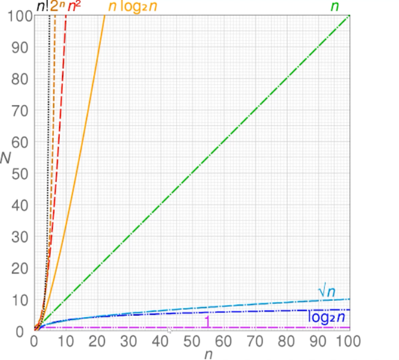

# 数据结构与算法介绍

[TOC]
[[toc]]


## 数据结构分类

- 栈
- 队列
- 链表
- 集合
- 字典
- 树
- 堆
- 图

## 算法分类

- 链表：遍历链表，删除链表节点
- 树、图：深度/广度遍历
- 数组：冒泡选择插入规避快速排序...

## 时间复杂度和空间复杂度

### 时间复杂度是什么

- 使用O表示的一个函数
- O(1)+O(N) = O(N)

```js
时间复杂度O(1)。 因为只会执行一次
let i = 0;
i +=1;
```

```js
时间复杂度O(n)。 因为执行n次
for(var i =0;i<n;i++){
  console.log(i)
}
```

```js
时间复杂度O(n^2)。 因为n*n
for (let index = 0; index < array.length; index++) {
  for (let i = 0; i < array.length; i++) {
    const element = array[i];

  }
}
```

```js
时间复杂度O(logN)  //2的多少次方为N 
let i = 1;
while(i<n){ //2的x次方>=n会停止  
  console.log(i);
  i*=2;
}
```



### 空间复杂度是什么

- -一个函数,用大0表示，比如0(1)、O(n)、 O(n^2)....
- 算法运行占用的存储空间大小

```js
O(1) 单个变量永远为1
let i = 1;
i+=1;
```

```js
O(n);  n个变量
const list = []
for(let i=0;i<n;i++){
  list.push(i)
}
```

```js
O(n^2) 
矩阵。
const arr = []
for(let i=0;i<n){
  arr.push([]);
  for(...){
    arr[i].push(j)
  }
}
```


