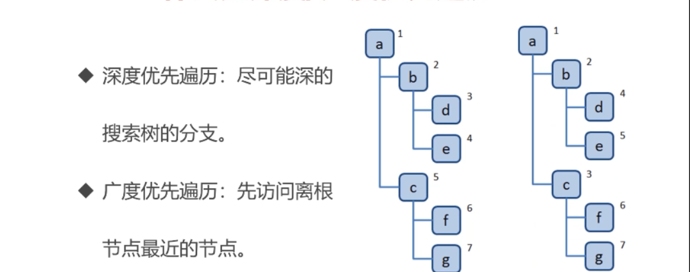
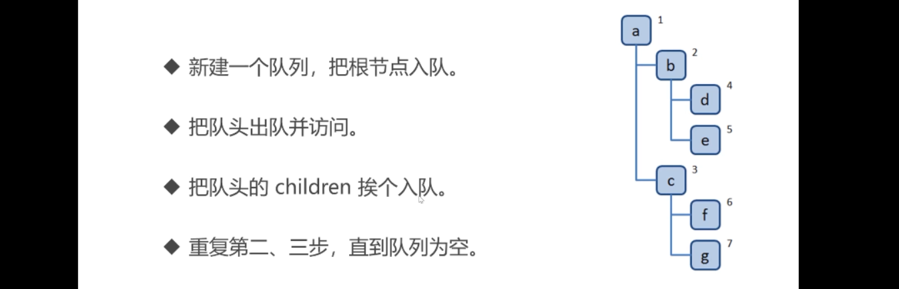
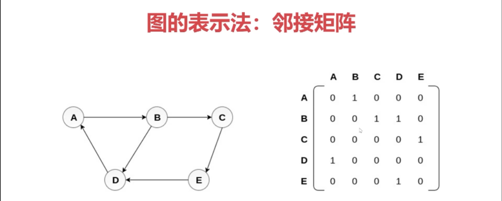
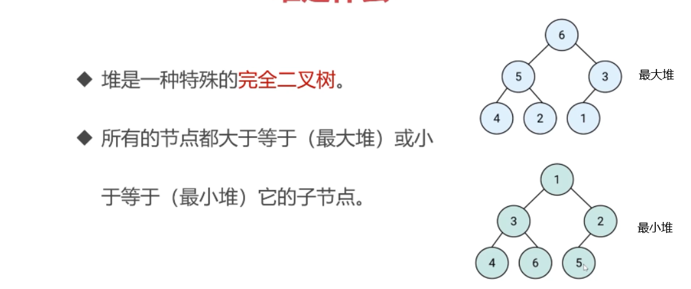

# 树、图

[TOC]
[[toc]]


## 树

- 树是一种分层数据的抽象模型

- DOM,pick多级联动，树形控件

- 树操作
  - 深度/广度优先遍历
  - 先，中，后序遍历

```js
const tree = {
  val:'a',
  children:[
    {
      val:'b',
      children:[
        {
          val:'d',
          children:[]
        },{
          val:'e',
          children:[]
        }
      ]
    },{
      val:'c',
      children:[
        {
          val:'f',
          children:[]
        },{
          val:'g',
          children:[]
        }
      ]
    }
  ]
}
```

### 树的深度/广度优先遍历



**深度优先遍历算法：**

- 访问根节点
- 对根节点的children挨个进行深度优先遍历，递归调用

```js
const dfs = (root)=>{
  console.log(root.val);
  root.children.forEach(dfs)
}
dfs(tree)

const dfs = (root) =>{
  if(!root){return;}
  console.log(n.val)
  dfs(n.left);
  dfs(n.right)
}
```

**广度优先遍历算法**



第一轮：a入队，a出队访问，b，c入队

第二轮：b出队并访问，d和e入队。

第三轮：c出队访问，f和g入队。

第四轮：d出队访问，无children。

第五轮：e出队访问。。。。。。。。。

```js
const bfs = root =>{
  let queue = [root];
	while(queue.length){
    const n = queue.shift();
    console.log(n);
    n.children.forEach(child=>queue.push(child))
  }
}
```

### 二叉树先中后序遍历

>总结:
>
>先序遍历：根左右，递归
>
>中序遍历：左根右，递归
>
>后序遍历：左右根

二叉树：树的每个节点最多有两个子节点；

JS用Object模拟二叉树

```js
const binaryTree = {
  val:1,
  left:{
    val:2,
    left:null,
    right:null
  },
  right:{
    val:3,
    left:null,
    right:null
  }
}
```

先序遍历


- 访问根节点
- 对根节点左子树先序遍历
- 对根节点右子树先序遍历

```js
const preorder = root =>{
  if(!root){return;}
  console.log(root.val);
  preorder(root.left);
  preorder(root.right);
}
```

中序遍历


- 对根节点的左子树进行中序遍历
- 访问根节点
- 对根节点右子树进行中序遍历

后序遍历


### 二叉树先中后序遍历(非递归版)

先序遍历：中，左右

```js
function preorder(root){
  if(!root){return};
  let stack = [root];
  while(stack.length){
    // 1.出栈并访问根节点
    const n = stack.pop();
    console.log(n.val);
    //2.栈是后进先出，所以应该让left后进，这样下次循环才会先出
    if(n.right) stack.push(n.right);
    if(n.left) stack.push(n.left);
    
  }
}
```

中序遍历

```js
function inorder(root){
   if(!root){return};
  let stack = [];
  let p = root
    // 1.把所有的左子树丢到堆栈
  while(stack.length||p){
    while(p){
      stack.push(p)
      p = p.left
    }
        // 2.弹出最尽头的左栈
    const n = stack.pop();
    console.log(n.val);
    //把指针赋值给最尽头的左栈的right
    p = n.right
  }
}
```

后序遍历

```js
// 后序遍历：左右根 我们可以变成根右左
// 然后利用先序遍历的逻辑实现逆序访问
// 然后把访问操作变成入栈操作，
const postorder = root=>{
  if(!root) return;
  // 函数调用栈
  let stack = [root];
  // 倒置栈
  let outputstack = []
  while(stack.length){
    const n = stack.pop();
    outputstack.push(n)
    if(n.left) stack.push(n.left)
    if(n.right) stack.push(n.right)

  }
  while(outputstack.length){
    console.log(outputstack.pop().val)
  }
  
}
```

### 力扣104-二叉树最大深度

难度简单

给定一个二叉树，找出其最大深度。

二叉树的深度为根节点到最远叶子节点的最长路径上的节点数。

**说明:** 叶子节点是指没有子节点的节点。

**示例：**
给定二叉树 `[3,9,20,null,null,15,7]`，

```
    3
   / \
  9  20
    /  \
   15   7
```

返回它的最大深度 3 。

**思路**

- 求最大深度，使用深度优先遍历做。
- 遍历过程中记录每个节点的层级

步骤

1. 建立遍历记录深度
2. 深度遍历整棵树并记录每个节点层级

```js
// T = O(n)；
// S = O(logn);//因为形成了调用堆栈。最好情况Ologn 最坏On
var maxDepth = function (root) {
    let res = 0;
    const dfs = (root, deep) => {
        if (!root) { return; };
        //只需要在当前节点是叶子节点才进行判断
        if (!root.left && !root.right) {
            res = Math.max(res, deep);
        }

        dfs(root.left, deep + 1);
        dfs(root.right, deep + 1);
    }
    dfs(root, 1)
    return res
};
```

```js
var maxDepth = function(root) {
    if(!root) {
        return 0;
    } else {
        const left = maxDepth(root.left);
        const right = maxDepth(root.right);
        return Math.max(left, right) + 1;
    }
};
```

### [力扣111](https://leetcode-cn.com/problems/minimum-depth-of-binary-tree/)-二叉树的最小深度

广度优先遍历适合求最小深度。

给定一个二叉树，找出其最小深度。

最小深度是从根节点到最近叶子节点的最短路径上的节点数量。

**说明:** 叶子节点是指没有子节点的节点。

**示例:**

给定二叉树 `[3,9,20,null,null,15,7]`,

```
    3
   / \
  9  20
    /  \
   15   7
```

返回它的最小深度  2.

**思路**

1. 在广度优先遍历过程中，遇到叶子节点，停止遍历，返回节点层级。

**解题步骤**

1. 广度优先遍历整棵树，记录每个节点层级。
2. 遇到叶子节点，返回节点层级，停止遍历。

```js
var minDepth = function (root) {
    if (!root) { return 0 };
    const q = [[root,1]];
    while (q.length) {
        const [n,deep] = q.shift()
        if(!n.left&&!n.right){return deep}
        if (n.left) q.push([n.left,deep+1])
        if (n.right) q.push([n.right,deep+1])
    }
};
```

### [力扣102](https://leetcode-cn.com/problems/binary-tree-level-order-traversal/)-二叉树层序遍历

给你一个二叉树，请你返回其按 **层序遍历** 得到的节点值。 （即逐层地，从左到右访问所有节点）。

**示例：**
二叉树：`[3,9,20,null,null,15,7]`,

```
    3
   / \
  9  20
    /  \
   15   7
```

返回其层次遍历结果：

```
[
  [3],
  [9,20],
  [15,7]
]
```

**思路**

- 层序遍历就是广度优先遍历
- 但是遍历的时候要记录当前节点所处的层级。

步骤

1. 广度优先遍历二叉树

2. 遍历过程中，记录层级，当把子节点推入队列后，孩子节点的层级就是当前层级+1

代码

```js
var levelOrder = function(root){
  if(!root) return [];
  const res = []
  const q = [[root,0]];
  while(q.length){
    const [n,level] = q.shift();
    if(!res[level]) {res.push([n.val])}
    else{ res[level].push(n.val)}
    if(n.left) q.push([n.left,level+1]);
    if(n.right) q.push([n.right,level+1]);
  }
  return res
}
```

```js
T=On
S=On
var levelOrder = function(root){
  if(!root) return [];
  const res = []
  const q = [root]
  while(q.length){
    let len = q.length;
    res.push([]);
    while(length--){//保证都是同层节点
      const n = q.shift();
      if(n.left) q.push(n.left);
      res[res.length-1].push(n.val)
      if(n.right) q.push(n.right);
    }
  }
  return res
}
```

### 力扣94-二叉树中序遍历

### 力扣112-路径总和

**深度优先遍历**

给定一个二叉树和一个目标和，判断该树中是否存在根节点到叶子节点的路径，这条路径上所有节点值相加等于目标和。

说明: 叶子节点是指没有子节点的节点。

示例: 
给定如下二叉树，以及目标和 sum = 22，

              5
             / \
            4   8
           /   / \
          11  13  4
         /  \      \
        7    2      1
返回 true, 因为存在目标和为 22 的根节点到叶子节点的路径 5->4->11->2。

## 图

### 图是什么

- 图是由边连接的节点。

- 图可以表示任何二元关系，一条边只有两个节点。
- JS没有图，可以用Object和Array构建图
- 图的表示法：邻接矩阵、邻接表、关联矩阵。。。。

**邻接矩阵**



**邻接表**

```js
{
  A:['B'],
  B:['C','D'],
  C:['E'],
  D:['A'],
  E:['D ']
}
```

图的常用操作

- 深度优先遍历
- 广度优先遍历

### 图的深度优先遍历

- 深度：尽可能深的搜索分支
- 广度：先访问离根节点最近的

深度算法

- 访问根节点
- 


## 堆

### 堆简介

**堆是什么？**

完全二叉树就是只可能最右节点没有的二叉树



**JS的堆**

- 数组表示堆。
- 我们按照广度优先排列
  - 任意节点的左侧子节点下标是父节点坐标的2i+1。
  - 任意节点的右侧子节点位置是2i+2.
  - 任意节点的父节点是(i-1)/2的商，向下取整

堆的应用

- 快速高效的找出最大值和最小值。
- 找出第K个最大(最小)元素。


