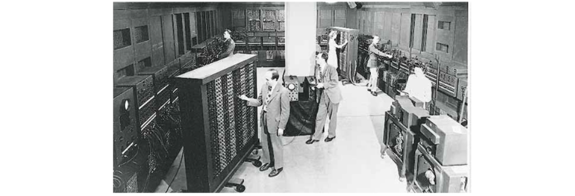
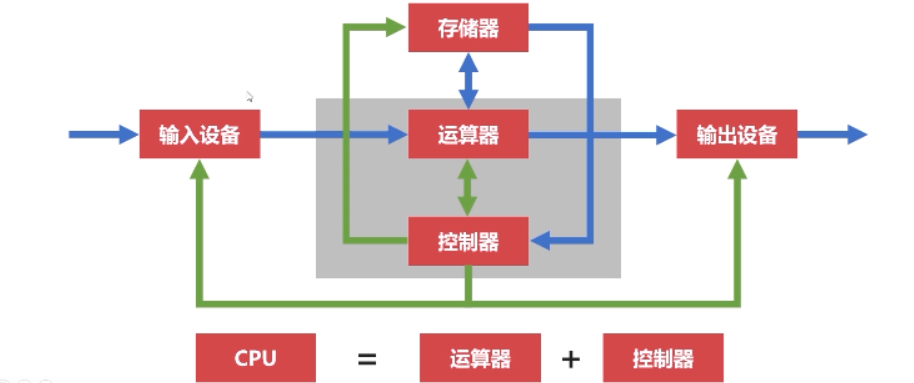
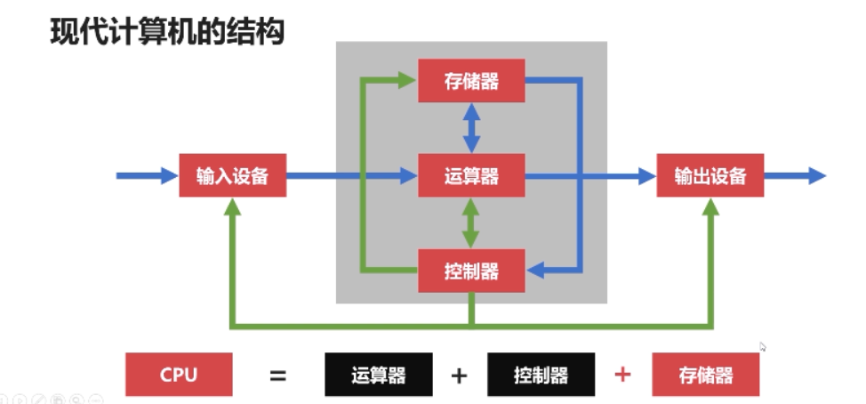
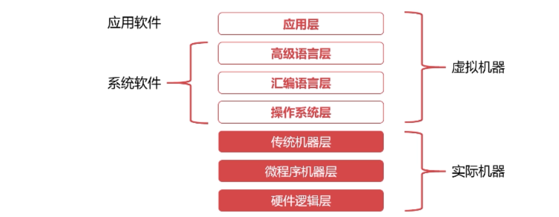
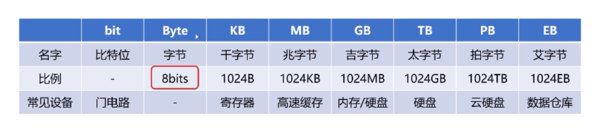
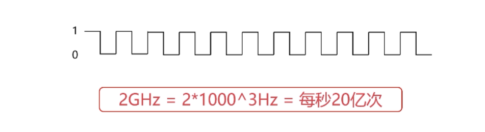
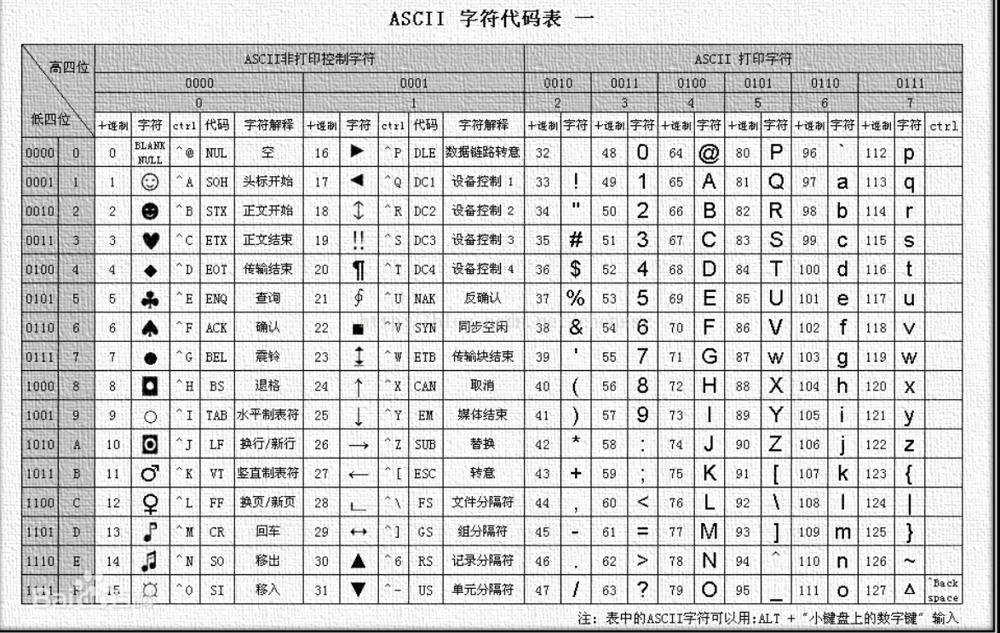

# 计算机组成原理概述

## 计算机历史

### 计算机发展的四个阶段

- 电子管计算机(1946-1957)
- 晶体管计算机(1957-1964)
- 集成电路计算机(1964-1980)
- 超大规模集成电路计算机(现在 )

**电子管计算机**

- 二战催化电子管计算机，英国截获德国无线波，为了解开密文，设计了电子管计算机。

- 埃尼阿克(ENIAC)计算机：美国计算射击参数使用

  

  

  - 18000多个电子管
  - 30T,1500平方英尺

- 特点：

  - 集成度小，空间占用大
  - 功耗高，运算速度慢
  - 操作复杂，更换程序需要接线

**晶体管计算机**

- TX-0 第一台
- 特点
  - 集成度高，空间占用小
  - 功耗更低运行速度更快
  - 操作简单，交互更方便，配备显示器

**集成电路计算机**

- 德州仪器工程师发明集成电路IC
- 特点
  - 更小，功耗更低，速度更快
- IBM推出System/360,操作系统雏形。

**超大规模集成电路计算机**

- 一个芯片集成很多晶体管
- 用途丰富。
- 乔布斯
  - Apple和Apple二代

生物计算机

- 体积小效率高
- 无热损耗
- 生物级别

量子计算机

- 2013年5月，谷歌和NASA发布D-Wave Two
- 2017年5月，中国科学院宣布制造出光量子计算机
- 2019年1月，IBM展示了世界首款商业化量子计算机
- 腾讯，阿里研究量子计算机 

### 微型计算机发展历史

- 单核cpu
  - 摩尔定律:每18-24个月集成电路性能提升一倍。21世纪失效
- 多核cpu
  - 2005年奔腾双核
  - 2006年酷睿4核
  - 酷睿16核
  - 至强56核cpu

## 计算机分类

- 超级计算机
- 大型计算机
- 工作站
- 迷你计算机(服务器)
- 微型计算机

## 计算机体系和结构

- 冯诺依曼体系
- 现代计算机结构

### 冯诺依曼体系

cpu=运算器+控制器



- 程序指令和数据一起存储的计算机设计结构。
- 改变程序不需要重新更改结构设计电路。

**冯诺依曼体系：**

- 存储器
- 控制器：控制程序执行
- 运算器：控制程序运算
- 输入
- 输出 

**特点：**

- 把需要的程序和数据送入计算机
- 能够长期记忆程序，数据，中间结果和最终运算结果的能力
- 能够具备算术、逻辑运算和数据传送等数据加工处理的能力
- 能够按照要求将处理结果输出给用户

**瓶颈:**

cpu空转等待数据传输，存储和运行时间不符

### 现代计算机结构

cpu=运算器+控制器+存储器



- 解决CPU和存储设备的性能差异问题

- 存储器：cpu的寄存器和内存。
- 以存储器为核心

## 计算机的层次和编程语言

- 程序翻译和程序解释
- 计算机层次和编程逻辑

### 程序翻译和程序解释

- 人类语言和计算机语言不通。

- 计算机执行的指令都是L0
- 翻译过程生成新的L0程序，解释过程不生成新的L0程序。
- 解释过程由L0编写的解释器去解释L1程序

程序翻译

- C/C++
- Object-C
- Golang

程序解释

- Python
- Php
- Js

翻译+解释

- Java:java->JVM字节码->机器码
- C#

 ### 计算机层次和编程语言



- 硬件逻辑层

  - 门、触发器
  - 属于电子工程

- 微程序机器层

  - 编程语言是微指令集
  - 硬件

- 传统机器层

  - 编程语言是Cpu指令集，也就是机器指令

  - 操作硬件，和硬件直接相关。

  - 不同架构的cpu使用不同指令集

    >一条机器指令对应一个微程序
    >
    >一个微程序对应一组微指令

- 操作系统层
  - 向上提供简易的操作界面
  - 向下对接了指令系统管理硬件资源
  - 软件硬件

- 汇编语言层

  - 汇编语言可以翻译成直接执行的机器语言
  - 完成翻译的过程就是汇编器

  - 例子

    ```js
    PUSH DS
    PUSH AX
    MOV AX,0040
    MOV DS,AX
    ```

- 高级语言层
  - py,c,c++

- 应用层
  - word/excel/office

## 计算机的计算单位

### 容量单位

>面试题：1G内存可以存储多少字节的数据？可以存储多少比特的数据？
>
>面试题：为什么移动硬盘500G的只有465G。
>
>500*1000^3 / 1024^3 ===465。
>
>硬盘的扇区使用十进制位标记。



**容量单位**

- 物理层面，高低电平记录信息
- 0/1称为比特位bit
- 1Byte = 8bits   一字节是八比特位
- 1024=2^10

### 速度单位

**网络速度：**

网络常用单位为Mbps。

100M = 100M/S =12.5MB/s

**cpu速度:**

- 表示cpu速度的是时钟频率

- 时钟频率单位为HZ
- hz就是每秒里周期性，15HZ就是1S 15次。人类听觉是20-2000Hz。



## 计算机字符和编码集

- 字符编码集历史
- 中文编码集

### 字符编码集的历史

- ASCII码
- extended ascii 
- 字符编码集国际化

ASCII码



- 使用7个bits表示ASCII码
- 包含95个可打印字符+33个不可打印字符

可扩展ascii码

字符编码集的国际化：

- 

### 中文编码集

GB2312

- ◆- 共收录了7445个字符
- ◆包括6763个汉字和682个其它符号

GBK

- 向下兼容GB2312,向上支持ISO标准
- 收录21003个汉字，支持全部中日韩汉字。

### unicode

- 统一码，万国码
- unicode定义世界通用符号，
- utf-8以字节为单位对Unicode编码
- windows默认GBK编码。