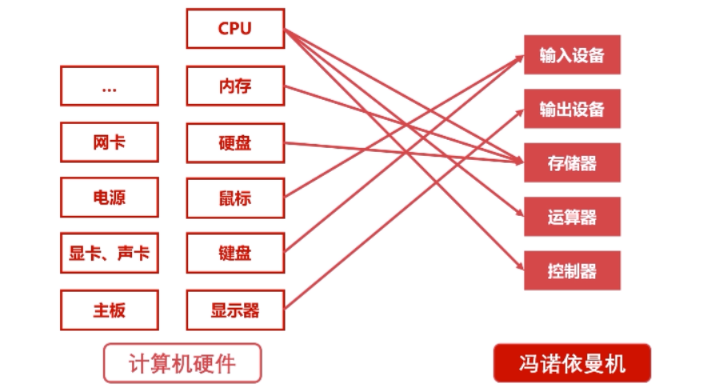

# 计算机组成原理组成




## 总线

- 总线概述
- 总线仲裁

### 总线概述

**总线是什么？**

- USB:通用串行总线,提供对外连接的接口，不同设备通过usb接口连接，是一个连接标准，促使外围设备接口统一。

- PCI总线：显卡
- ISA总线
- Thunderbolt总线（苹果电脑总线）

**总线概述**

- 各种输入输出设备可以直接连接io总线
- 运算器存储器控制器也可以直接连接io
- 使得计算机各个逻辑清理

**总线分类**

- 片内总线

  - 芯片内的总线
  - 寄存机与寄存器之间
  - 寄存器与控制器、运算器之间

- 系统总线

  - 比如usb总线,支持连接计算机外部设备的一条总线。

  - 数据总线
    - 双向传输各个部位的数据信息
    - 总线的位数(宽度)是数据总线的重要参数
    - 一般和cpu位数相同(32,64位)
  - 地址总线
    - 指定源数据和目的数据在内存的地址
    - 位数和存储单元位数有关系
    - 总线位数=n,寻址范围0-2^n
  - 控制总线
    - 控制总线发出各种控制信号的传输线
    - 控制信号由控制职能管辖从一个组件发给另一个组件
    - 可以监控不同组件之间的状态（键盘就绪未就绪）

### 总线仲裁

 解决总线使用权的冲突问题

总线仲裁的方法：

- 链式查询
- 计时器定时查询
- 独立请求

**链式查询**

- 好处：电路复杂度低，仲裁方式简单。
- 坏处：优先级低的设备难以获得总线使用权。 
- 坏处：对电路故障敏感

设备2发出请求使用，仲裁控制器发送信号，设备1接收后，他如果不使用总线，就允许他往后面执行

**计时器定时查询**


设备3发出请求，计时器接收后，然后定时发送

- 仲裁控制器对设备编号并使用计数器累计计数
- 接收到仲裁信号后，往所有设备发出计数值
- 计数值与设备编号一 致则获得总线使用权

**独立请求**


- 每个设备独立连接仲裁器
- 设备单独向仲裁器发送请求接收请求
- 同时收到多个请求，仲裁器有权按优先级分配使用权

- 好处
  - 响应速度快，优先顺序动态改变
  - 设备连线多，相对复杂

## 输入输出设备

- 常见设备
- 通用设计
- CPU和IO通信的两个方法

### 常见输入输出设备

常见输入设备：字符输入设备，图形输入设备

常见输出设备：显示器

### 输入输出接口通用设计

- 数据线：传输数据
- 状态线：查询是否正常连接，是否被占用

- 命令线：cpu向设备发送命令的信号线、发送读写信号、发送启动停止信号停止光驱
- 设备选择线：3个u盘连接，需要通过这个线来选择具体u盘操作

### CPU和IO通信方法

- 程序中断
- DMA(直接存储器访问 )

**程序中断**

- 当外围IO设备就绪时，向CPU发出中断信号
- CPU有专门的电路响应中断信号。
- 提供低速设备通知CPU的一种异步方式
- CPU可以告诉运转的同时兼顾低速设备的响应

 

**DMA(直接存储器访问)**

- DMA直接连接主存和IO设备
- DMA工作时不需要CPU参与
- 硬盘、显卡都有DMA设备


## 存储器概览

- 存储器分类
- 存储器层次结构

### 存储器分类

**按存储介质分类：**

- 半导体存储器：内存、U盘、固态
- 磁存储器：磁带、磁盘

**按照存取方式分类:**

- 随机存储器RAM：可存可写，随机读取，和位置无关
- 串行存储器：与位置有关，按顺序查找
- 只读存储器ROM：只能读取。

### 存储器层次结构

容量+价格=>位价：每比特位价格


缓存-主存层次：

- 原理：局部性原理（程序经常访问的内存会放在一个较小的区域，把这段内存置换到缓存）
- 实现：CPU和主存之间增加一层速度快容量小的Cache
- 目的：解决主存和CPU性能不匹配的问题

主存-辅存层次

- 原理：局部性原理
- 实现：主存外增加U盘、磁盘等
- 目的：解决主存容量不足问题(游戏20G,内存8G,把当前运行的部分代码放在主存，不需要的放在辅存)

## 存储器-主存和辅存

- 主存储器-内存
- 辅存储器-硬盘

>- 计算机断电后内存数据丢失
>- 计算机断电后磁盘数据不会丢失

### 主存  

- RAM随机存储
- RAM通过电容存储，必须每隔一段时间刷新一次，如果掉电，那么一段时间后就丢失所有数据 

  

32位系统：2^32 = 4GB,最多支持4GB内存

64位系统：2^64 =2^34GB内存

### 辅存和辅存算法


磁盘

- 表面是可磁化的硬磁特性材料
- 移动磁头径向运动读取磁道信息

磁盘算法

- 先来先服务算法
- 最短寻道时间优先算法

- 扫描算法(电梯算法)
- 循环扫描算法

**先来先服务算法**


- 按顺序访问进程的磁道读写需求

读取顺序 1=》4=》2=》3=》5

**最短寻道时间优先算法**

- 和磁头当前位置有关
- 优先访问离磁头最近的磁道 

读取顺序：

当前磁头位于4，首先读取4，然后读取5，接着可能读取5或者读取3，假设我们读5，那么接下来读取3，然后读取2，然后读取1，然后读取1。

**扫描算法(电梯算法)**

- 每次只往一个方向运动，到达一个方向尽头再反方向移动
- 不公平

例子

```js
磁头在磁道4
磁头方向向外
读取 142315
读取顺序：
432115
```

**循环扫描算法**

- 只往一个方向读取。读完再从那个方向的开头开始往下读

例子

```js
磁头在磁道4
磁头方向向内
读取 142315的顺序
4 5 1 1 2 3
```

## 存储器-高速缓存

高速缓存位于 缓存-主存层次

- 高速缓存工作原理

- 高速缓存替换策略

  

### 字和字块

字：存放在一个存储单元的二进制代码组合

字块：存储在连续存储单元的一组字。


主存面试题：

假设主存用户空间容量4G,字块大小为4M,字长32位，则对应地址中块地址m和块内存地址b的位数。至少为多少？

```js
4G = 4096M
字块数量：4096/4 = 1024;
字块地址 2^m = M = 1024 ; m =10
一个字块的字个数：字块大小/每个字字长 = 4M/32bit = 1048576 
块内存地址b：2^b = 1048576 b = 20

m>=10
b>=20
```

### 高速缓存工作原理


- 每次CPU都能从高速缓存取数据时，命中率为1

**命中率运算：**

设访问主存次数为M，访问缓存次数为C；

命中率h = C /(M+C)

**访问效率**


- CPU需要的数据在缓存里
- CPU需要的数据不在缓存里
- 不在缓存的数据需要去主存拿

面试题

例子:假设CPU在执行某段程序时，共访问了Cache命中2000次，访问主存50次，已知Cache的存取时间为50ns，主存的存取时间为200ns,求Cache-主存系统的命中率、访问效率和平均访问时间。

```js
命中率 h = 2000 /(2000+50)
```

### 高速缓存替换算法

替换时机：缓存没有数据，就从主存载入所需要数据。

- 随机算法：随机选取一个缓存位置进行替换
- 先进先出算法FIFO:
- 最不经常使用算法LFU:
- 最近最少使用算法LRU:

**先进先出算法FIFO**

- 把高速缓存看做是一个先进先出的队列
- 优先替换最先进入的队列字块

**最不经常使用算法LFU**

- 先淘汰最不经常使用的字块
- 需要额外的空间记录使用频率,每访问一个字块，就给这个字块的频率+1；

| 缓存 | 1    | 2    | 3    | 4    | 5    | 6    | 7    | 8    |
| ---- | ---- | ---- | ---- | ---- | ---- | ---- | ---- | ---- |
| 频率 | 7    | 4    | 2    | 1    | 8    | 4    | 2    | 6    |

根据LFU算法，替换到第四个字块、

**最近最少使用算法LRU:**

- 优先淘汰一段时间内没有使用的字块
- 一般使用双向链表
- 把当前访问节点放在链表前面(保证链表头部节点最近使用)

例子：

假设缓存4个字块，()表示使用的字块，[]表示淘汰的字块，

(1) 1

(2) 2、1  使用2，把2放到头部。

(4) 4、2、1

(7) 7、4、2、1

(5) 5、7、4、2[淘汰1]

(4) 4、5、7、2 (把4放到链表头部)

(6) 6、4、5、7[淘汰末尾的2]

## 计算机指令系统

- 机器指令形成
- 机器指令操作类型
- 机器指令寻址方式

### 机器指令的形式


- 机器指令由操作码、地址码组成

- 操作码：
  - 操作码指明指令所要完成的操作
  - 操作码的位数反映了机器的操作种类 。最多有2^8=256种操作

- 地址码
  - 地址码直接给出操作数或者操作数的地址
  - 分三地址指令、二地址指令和一地址指令

**地址码三地址指令**

addr1 op addr2 = dddr3

1    +    2   = 3


**地址码二地址指令**

把结果放到地址1或者地址2


**地址码一地址指令**

add1op ->add1自己对自己进行操作。

addr1 op ACC ->addr1  自增操作不需要第二个操作数。


零地址指令：

- 中断操作、停机操作、空操作等等
- 无地址码

### 机器指令操作类型

**数据传输类型**

**数据传输类型**

- 寄存器之间、寄存器与存储单元、存储单元之间传送
- 数据读写、交换地址数据、清零置一等操作

**算数逻辑操作类型**

- 加减乘除
- 与或非

**移位操作**

- 数据左移(乘2)、数据右移 (除2)
  完成数据在算术逻辑单元的必要操作

**控制指令操作**

### 机器指令寻址方式

指令寻址、数据寻址

指令寻址


- 顺序寻址
- 跳跃寻址

数据寻址

- 立即寻址：指令直接获得操作数不访问寻址器
- 直接寻址：寻找操作数简单，直接给出操作数的主存地址。地址码位数限制操作数寻址范围

- 间接寻址：操作数寻址范围大，速度慢。

## 控制器

程序技

## 运算器

运算器用来进行数据运算加工的。 


数据缓冲器

-  输入缓冲和输出缓冲
- 输入缓冲暂时存放外设送来的数据
- 输出缓冲暂时存放送往外设的数据

ALU算数逻辑单元


- 完成位运算：左右移、与或非
- 完成加减乘除

状态字寄存器

存放运算状态(条件码、进位、溢出、结果正负等)
存放运算控制信息(调试跟踪标记位、允许中断位等)

通用寄存器

用于暂时存放或传送数据或指令
可保存ALU的运算中间结果
容量比一般专用寄存器要大

## 计算机指令执行过程

- 取指令
- 分析指令
- 执行指令