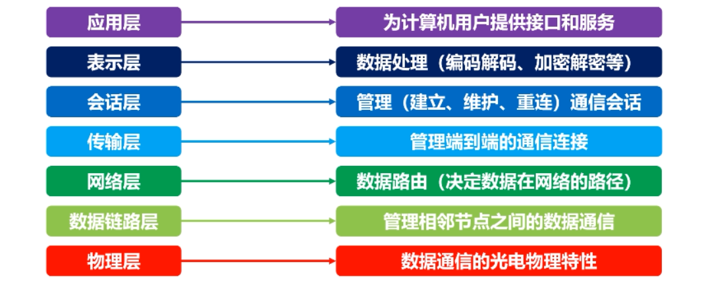
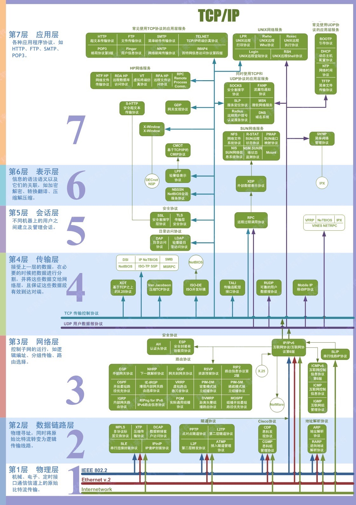
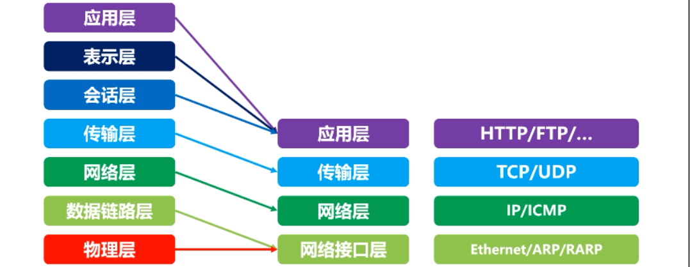

# 计算机网络概述

 ## 计算机网络分类

按照作用范围

- 广域网wan  跨省国
- 城域网man 城市间
- 局域网lan 地区内

按照使用者

- 公用网络
- 专用网络：军队铁路银行

## 计算机网络层次

- 层次结构设计的基本原则

### 层次结构设计的基本原则

- 各层相互独立，各层之间完全解耦
- 每层都有足够的灵活性

### OSI七层模型

- osi想成为全球计算机遵循的标准
- 但是OSI市场化很困难，TCP/IP在全球范围成功运行

### TCP/IP四层模型

## 现代互联网的网络拓扑

