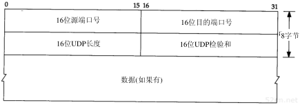

# 传输层

## 传输层概述

传输层给应用层提供通信服务，面向用户的最底层。

传输层工作于计算机内，主要**管理端到端的通信连接**。

分为UDP协议和TCP协议

也就是解决浏览器和网站后台进程进程间的通信

- 使用端口标记不同进程
- 端口0-65535。

## UDP协议详解

### UDP协议

- UDP(User Datagram Protocol:用户数据报协议)
- UDP协议是很简单的协议。

数据报(Datagram):UDP协议不会进行合并和拆分。

UDP首部：

### UDP特点

UDP特点:

- **UDP是无连接协议**。通信前不需要先建立连接，不会握手
- **UDP不保证可靠的交付数据**。因为他没有连接，所以无法保证是否有丢失，也无法感知是否有丢失
- **UDP面向报文传输**。他不会对数据进行处理，面向数据报。
- **UDP没有拥塞控制。**无法感知网络是否拥塞，不管是否拥塞都会发给这个网络。
- **UDP首部开销小。**只有源端口号，目的端口号，数据报长度和校验和8字节

## TCP协议详解

### TCP协议

- TCP 传输控制协议。位于传输层。

### TCP协议特点

- TCP是面向连接的协议。
- TCP的一个连接有两端(点对点通信)
- TCP提供可靠的传输服务
- TCP提供全双工的通信。 双方都可以收发。
- TCP面向字节流的协议。 TCP里不看成一块完整的数据，而是对一个字节一个字节来处理，所以他传输的数据不一定是连续的。他可能对用户数据块进行合并或者分拆。这里也

### TCP首部

seq序号:

- 0-2^32-1。因为有32位
- 一个字节一个序号。
- 代表TCP数据报首字节序号。

ack确认号:

- 0-2^32-1。因为有32位
- 一个字节一个序号。

- 期待收到的首字节序号。 我期望你下一个传递给我数据的序号。
- 需要配合首字节、
- 确认号为N，则表示N-1序号的数据都收到了

数据偏移

- 占4位，0-2^4-1=15。单位为32位字
- 数据偏离首部的距离。
- 比如头部20个字节，最大15*4 = 60个字节，所以TCP头部为20-60个字节

TCP标记

- 占6位
- URG:Urgent:紧急位，URG=1,表示紧急数据
- ACK:Acknowledgement:确认位，ACK=1,确认号才生效，确定收到了。
- PSH：Push,推送位，PSH=1，尽快的把数据交付给应用层
- RST:Reset:重置位，RST=1,重新建立连接
- SYN:同步位，SYN=1表示请求建立连接
- FIN：Finish，终止位，FIN=1,表示释放连接。

窗口

- 站16位，2^16-1
- 允许对方发送的数据量
- 确认号为501，窗口1000，那么501-1500都可以接收到

校验和

- 和UDP一样的

紧急指针

- URG=1启用，会优先插队。

TCP选项

- TCO选项最多40个字节
- 支持未来的拓展，类似预留

## TCP可靠传输原理

### 停止等待协议

- 通过超时重传保证可靠传输

- 超时定时器。
- 停止等待协议是最简单的可靠传输协议
- 停止等待协议对信道利用率不高。

无差错情况：

- 发送方发送消息后停止发送消息，等待接收方返回一个确认接收的消息。
- 接收方发送确认接收消息。
- 发送方接收确认消息后，发送消息2给接收方。

有差错情况：

- 发送的消息丢失了。
- 确认的消息丢失了。
- 确认的消息很久才返回。
- 这三种都会超时重传。

### 连续ARQ协议

- ARQ:自动重传请求。

单个发送和确认效率低，可以批量发送和确认。

发送时批量发送数据，前面的数据确认消息到达，就**滑动窗口**，然后把窗口内没有发送的数据发送出去。

不需要对每个报文都确认，采用**累计确认**，比如同 时发送1-6个报文，发送方收到5的确认消息，说明1-5的消息都被收到了，就把窗口推动，发送7-11

## TCP协议可靠传输

- TCP可靠传输基于连续ARQ协议(滑动窗口、累计确认)
- TCP的滑动窗口以字节为单位。

特殊情况：某一时刻，25,27字节的确认号收到，但是23,24没收确认号，所以

